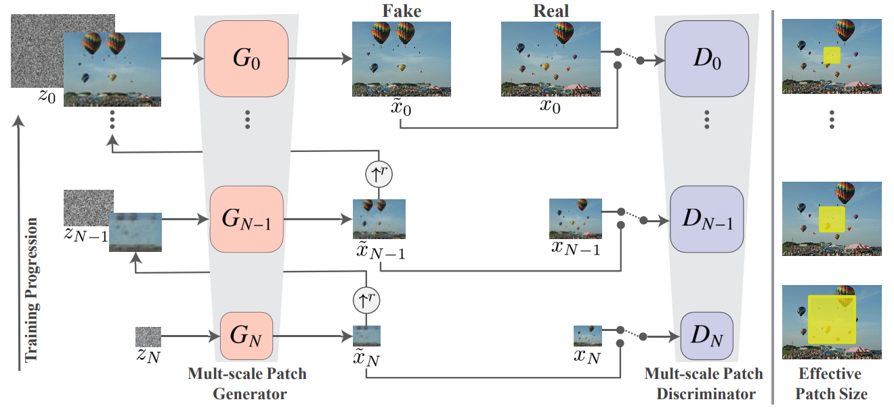
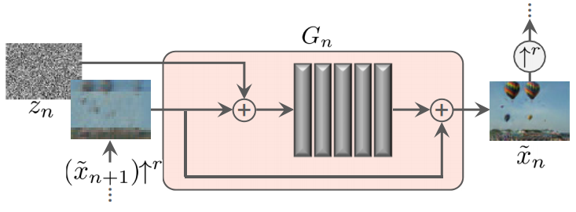

posted by [kozistr](http://kozistr.tech)

## tl;dr

이번 포스팅에서는 ICCV 2019 에서 [Best Paper Awards](https://syncedreview.com/2019/10/29/iccv-2019-best-papers-announced/) 에서 선정된 papers 중에 하나인 **SinGAN** 을 리뷰해 보겠습니다.

개인적으로 정말 재밌게 본 논문이고, ICCV 2019 논문들 중 최고였던거 같아요. 그래서 저도 간략한 overview 와 technical review 를 해 보려고 합니다.

소개 전에 간단하게 SinGAN 으로 뭘 할 수 있는지 보면, **단 한 장의 이미지로 realistic 한 image manipulation 들을 생성**할 수 있어요.


paper : [arXiv](https://arxiv.org/pdf/1905.01164.pdf)

official implementation : [code](https://github.com/tamarott/SinGAN)

## Introduction

기존 GAN 들을 대부분의 연구들을 보면 얼굴, 침실, 풍경 등 한 가지 종류에 focus 한 게 대부분이고, 주로 많은 데이터를 요구했습니다.

다양한 종류의 object 를 생성하는 것은 여전히 잘 못하고 있고, 이런 문제를 해결할려고 conditional 하게 생성을 하거나 (e.g. cGAN), task 를 특정하는 등의 방법으로 문제를 해결하려 했습니다.

왜냐면 이전 방법들로는 적은 수의 데이터와 여러 종류의 데이터의 distribution 을 잘 학습하기엔 엄청 어려웠어요

그럼 이런 문제들을 어떻게 하면 해결할 수 있을까에서,

> '단 1 장'의 이미지로 GAN 을 훈련할 수 있을까??

이런 이번 논문인 **SinGAN** 이란 concept 이 나오게 됐습니다. (멋지죠?)

물론 이전에 이런 노력을 안한건 아니에요. 정확히 논문 이름들은 기억이 안나는데, 대부분이 input 에 대해서 conditional 한 method 를 사용하고 있었습니다.

또한 이전에 Unconditional Single Image GAN 이라고 하면 Texture Generation 이란 task 로 유일하게 문제를 풀고 있었는데, 이 task 의 한계는
texture image 에 대해선 결과가 reasonable 한데, non-texture image 에 대해서는 별로 였어요.

하지만 이번에 소개할 논문에서는 

* unconditional 하게, noise 로 부터 image 생성
* general purpose 로 natural image target (non-texture) 에도 적용 가능한 방법 제안

합니다.

물론 결과는 이전 method 들 보다 훨씬 general 하고 결과도 outperform 합니다!

## Technical Review

**SinGAN** 에 소개된 novelty 를 1 가지로 요약 해 보면 아래와 같아요

**Multi-Scale Architecture (# 2.1)**

완전 새로운 concept 는 아니고, multi-scale architecture 에 대해서는 이전에 LAPGAN 이란 GAN 에서 한 번 비슷하게 소개가 되었는데,
궁금하시면 한번 봐도 좋을 것 같습니다.

### Multi Scale Architecture

SinGAN 의 ultimate goal 이라고 하면, single image 의 internal distribution 을 잘 배우는 unconditional generative model 를 만드는 겁니다.

이런 것을 하려면 다음과 같은 것들을 잘 해야 할텐데,

* many different scales 로 복잡한 image structure 의 distribution 을 capture 하기
    * global properties : 이미지 내 큰 objects 들의 모양과 배열 e.g.) 하늘 위치, 땅 위치
    * local properties : global properties 의 details 

그래서 multi-scale architecture 를 선택했습니다.



위 그림에서 x_0 가 original training image 이고, x_1 ~ x_N 가 x_0 에서 r 배 (r > 1) 씩 down-sampled image 입니다.

각 scale 에서...

#### Generator
noise (z_n) 와 이전 단계에서 생성된 image (~x_n-1) 를 받아서 image (~x_n) 을 만듭니다.

#### Discriminator
real image 와 (x_n) fake image (~x_n) 를 구분.

하나 차이(?)점이 있다면, 맨 아래 scale stage 에서는 only noise (z_N) 를 사용해서 image 를 생성합니다.

논문에서 coarse-to-fine fashion 이라고 소개를 하는데, 좀 쉽게 설명 해 보면,

아래 단계에서는 down-sampled image 를 학습하니, 상대적으로 detail 보단 global 한 feature 에 집중을 하면서 학습을 하고,
위 단계일 수록 fine feature 에 더욱 집중하게 됩니다. 동일한 receptive field 에 생성하는 image scale 이 다르니,
위 그림에 **Effective Patch Size** 가 달라지면서 coarse-to-fine fashion 으로 학습이 된다 입니다.

#### Single Scale Generation

각 G_N 부분에 해당되는 block 인데, 구조는 아래와 같습니다.



% 이전 stage 에서 up-sampled image : x_n+1

1. z_n + x_n+1 가 conv 연산을 통과
2. x_n+1 가 residual 하게 마지막에 연결

가 간단한 구조인데, conv block 부분을 더 자세하게 설명하면,

``` Conv (3x3) - BatchNorm - LeakyReLU ``` 

이 convention 으로 5 층을 쌓았네요.

처음엔 32 kernel 

## Experiment Result

## Conclusion

이번에 SinGAN 이란 
