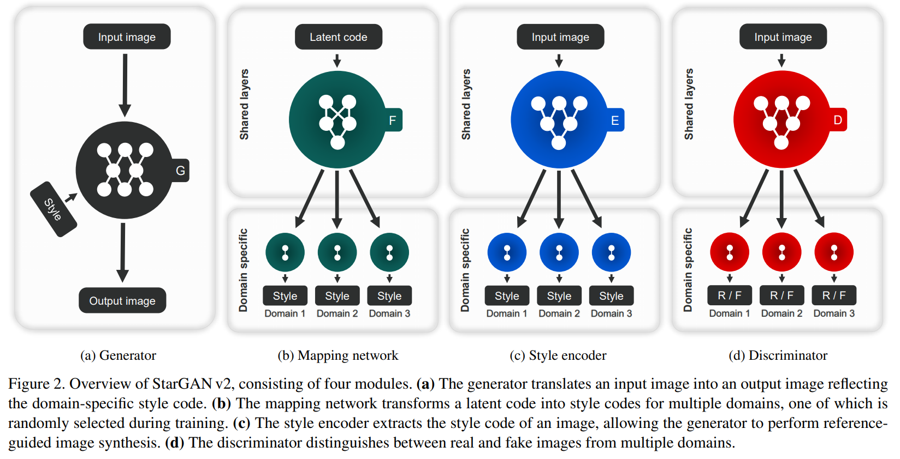

posted by [kozistr](http://kozistr.tech)

## tl;dr

이번 포스팅에서는 I2I translation 를 푼 **StartGAN v2** 을 리뷰해 보겠습니다.

평소에 Multi-Domain I2I translation task 에 관심이 많았는데, 작년에 나온 StarGAN 후속작인 StarGAN v2 가 나와서 한번 리뷰해 보려고 합니당

아래는 StarGAN v2 demo 인데, 아래와 같은 느낌입니다.

paper : [arXiv](https://arxiv.org/pdf/1912.01865.pdf)

official implementation : [code](https://github.com/clovaai/stargan-v2)

## Related Work

아래는 관련 task 논문들인데 한번 읽어 보세요!

CycleGAN : [arXiv](https://arxiv.org/pdf/1703.10593.pdf)
DiscoGAN : [arXiv](https://arxiv.org/pdf/1703.05192.pdf)
StarGAN : [arXiv](https://arxiv.org/pdf/1711.09020.pdf)
MUNIT : [arXiv](https://arxiv.org/pdf/1804.04732.pdf)
DRIT : [arXiv](https://arxiv.org/pdf/1905.01270.pdf)
MSGAN : [arXiv](https://arxiv.org/pdf/1903.05628.pdf)
RelGAN : [arXiv](https://arxiv.org/pdf/1908.07269.pdf)

## Introduction

기존의 여러 Multi-Domain I2I translation 연구들로 대표적으로 Pix2Pix, CycleGAN, DiscoGAN, MUNIT, StarGAN 등등이 있어요.
그런데 요런 2 가지를 만족하지는 못하는 한계가 있었습니다.

1. 한정된 domain 들 내에서만 translate (눈, 코, 입, 턱수염, 표정)
2. 한 번에 1 가지 domain 에 대해서 translate (A->B, B->A)

즉, 기존의 Multi-Domain I2I translate task 에서는 generator 에 *one-hot* or *multi-hot* attribute vector 를 input 에 합쳐주는 방식이였습니다.

이번 논문에서는 이러한 한계들을 극복하고자 다음과 같은 목표를 제시했는데,

1. 여러 domain 에 대해서 모두 translate 가능
2. 특정 domain 에 대한 여러 가지 style 에 대해서 translate 가능

요런 것들을 가능하게 합니다.

## Architecture

먼저 아래는 StarGAN v2 architecture 간단한 overview 인데, 
아래 목적을 간단하게 설명하면 *image x* 와 *image y* 가 있다면, Generator 로 *image x* 에 대응되는 *image y* 의 각 domain 의 다양한 이미지들을 생성하는 겁니다.

각 Network 들의 역할을 알아보면 다음과 같아요.

### Generator (G)

*image x* 가 입력으로 들어오고 중간에 *domain-specific style code s* vector 가 들어와서 output image 를 만듭니다.

> *output image = G(x, s)*

여기서 *s* 는 *mapping network* 나 *style encoder* 에서 만들어진 *style vector* 입니다.

즉, 이미지 한 장을 받고 어떤 style 을 받으면 해당 style 을 반영한 결과물 무언가를 만들어 내는 아이입니다.

### Mapping Network (F)

*mapping network*, *F* 는 *latent code z* 와 *domain y* 에 대해서, *style code*를 만드는 network 인데, 대충 공식은 이렇게 됩니다.

> *s = F_y(z)*

즉, *domain y* 를 represent 하는 *latent code z* 를 *style code s* 로 mapping 해 주는 역할을 합니다.

*F* 는 간단한 여러 FC layers 들의 combination 인데, 모든 multiple-domains 에 해당하는 style codes 를 주기 위해서, multiple-outputs 를 가지는 구조랍니다.

### Style Encoder (E)

*image x* 와 *domain y*가 있다면 *E* 는 *image x* 에서 style information 을 추출하는 역할을 해요.

> *s = E_y(x)*

*E* 는 reference image 에 대해서 다양한 style code 들을 생성하는 역할을 해요. 이렇게 생성된 style code 들을 *G* 에서 이미지를 생성할 때 사용됩니다.

% *E* 도 위의 *F* 와 똑같은 multi-task scheme 을 따릅니다.

### Discriminator (D)

*D* 도 위와 같은 scheme 으로 multi-task wise 한 구조를 가집니다. 즉, multiple output branch 를 가집니다.

## Technical Review

### Adversarial Loss

L_adv = 

## Experiment Result

### 정량적인

### 정성적인

#### Single Image Animation

