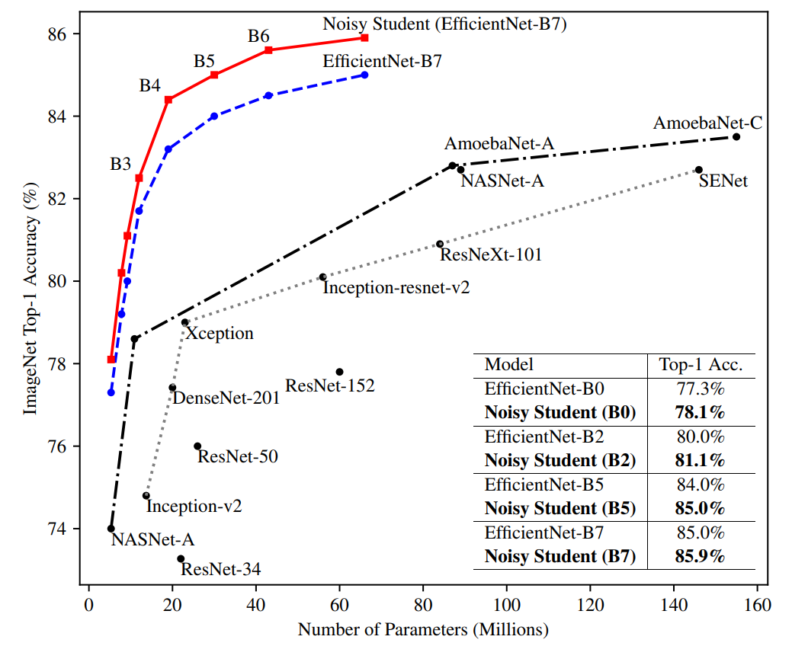
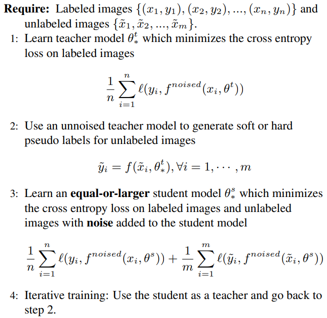
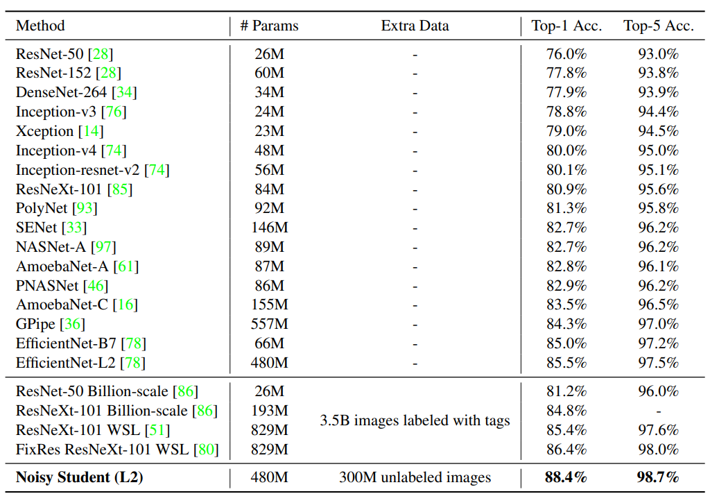
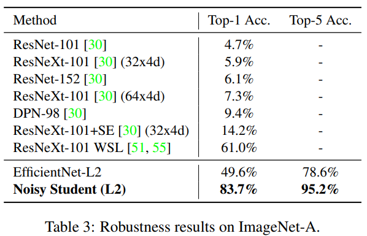
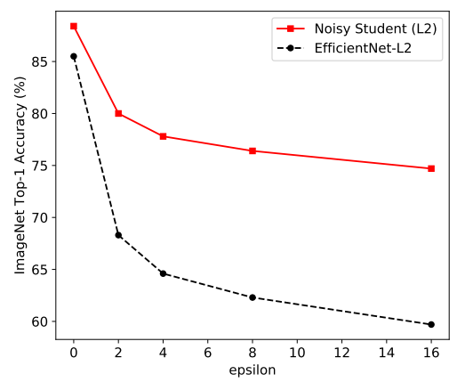

## TL;DR

이번 포스팅에서 리뷰할 논문은 EfficientNet 기반으로 새로운 techniques 를 적용해서 ImageNet dataset 에서 SOTA 를 찍은 논문입니다.
나온지는 꽤 됐지만, 최근 TPU 에서 돌아가는 요 코드를 짜다가 생각나서 리뷰하게 됐어요.

아래는 이번 approach 가 달성한 성능인데, 이전 SOTA 에 비해서 Accuracy 가 약 2% 정도 올라갔네요.

해당 이미지에는 *L2* performance 가 안올라와 있는데, *Noisy Student + Random Augment* 로 훈련한 *L2* 모델 top-1 accuracy 가 *88.4%* 입니다.
올해에는 90% 가 넘는 architecture 가 나오지 않을까 생각이 드네요.

paper : [arXiv](https://arxiv.org/pdf/1911.04252.pdf)

code : [code](https://github.com/tensorflow/tpu/tree/master/models/official/efficientnet)

## Related Work

EfficientNet : [arXiv](https://arxiv.org/pdf/1905.11946.pdf)

## Introduction

이전 Image Classification 연구 동향들에서도 간단하게 설명은 다음에 다른 포스트로 다뤄볼께요. 양이 좀 많이 질 듯 해서 (~~귀찮네요~~)

## Architecture

### Self-Training w/ Noisy Student

학습은 다음과 같은 process 로 이뤄지는데,

1. Labelled dataset 인 ImageNet 으로 **Teacher Model** 을 학습
2. un-labelled dataset 인 JFT-300M 를 **Teacher Model** 로 pseudo labelling 하기
3. `2` 에서 생성된 data + ImageNet 으로 **Student Model** 학습 w/ noise
4.  다시 `2` 으로 가서 반복 (iterative training)

위 과정이 knowledge (self) distillation 과 비슷한 과정인데, 주로 요 목적은 compression 으로 사용되는데, 여기는 
해당 목적 (not compression) 으로 사용하지 않는다는게 차이점 입니다.

### Training

데이터 셋이나 구체적인 training recipe 들이 있지만, 적용한 technique 가 있어서 이걸 설명 해 보면,

#### fix train-test resolution discrepancy

처음 몇 epoch 은 low resolution image 로 훈련을 하고 후에 high resolution image 로 fine-tuning 하는 기법입니다.

논문 실험에서는 처음 350 epochs 는 낮은 해상도 이미지로 훈련하고, 1.5 epochs 는 더 큰 해상도로 unlabelled image 에 대해서 훈련했다고 하네요.

unlabelled image data 는 학습할 때 labelled image 보다 14 배 큰 batch size 를 사용했다고도 하네요.

#### Iterative Training

논문에서는 총 3 steps 의 iterative training 을 했다고 소개합니다.

1. `EfficientNet-b7` 을 ImageNet 으로 훈련 `(as Teacher)`
2. `EfficientNet-L2` 를 JFT-300M + ImageNet 으로 훈련 `(as Student)` (batch size 비율은 labelled : unlabelled = 1 : 14)
3. `EfficientNet-L2` 를 새롭게 훈련 `2` 에서 만든 모델을 `Teacher` 로 사용 `(as Student)`
4. `3` 과 비슷한 scheme 으로 진행하는데, (batch size 비율은 labelled : unlabelled = 1 : 28) 로 훈련

#### Noisy

Student Model 을 학습할 때 논문에서 `Noisy` 하게 훈련한다고 했는데, 이 때 `Noisy` 에 해당하는 부분은 크게 3 부분 입니다.

1. Data Augmentation w/ RandAugment
2. Dropout
3. Stochastic Depth
4. other techniques (data filtering, balancing)
  * OOD (Out-Of-Distribution)
  * unlabelled data 에 대해선 class 별 samples 수가 biased 돼있으니, 적은 sample 들 duplicate 하기
  * pseudo label 시, soft or hard pseudo 한다고 했었는데, soft, hard 둘다 좋은 결과를 보였지만, soft 가 더 좋았다

요런 기법들은 이전에 소개된 기법들이니 설명은 pass

## Experiment Result

### ImageNet Benchmark

역대 ImageNet architecture 들 정확도를 benchmark 한 table 인데, 다른 구조보다 

1. 더 적은 params 수
2. 상대적으로 적은 extra data 수
3. 더 높은 성능

을 달성했다는 점에서 의미가 있을 것 같네요.

### Robustness Results on ImageNet-A, ImageNetC and ImageNet-P

해당 dataset 은 이 모델이 정말로 noise 에 robust 한지 체크하는 task 입니다.

예를 들어서, (일반적인 corruptions, perturbations)

1. blur 섞인 이미지
2. fogged 이미지
3. rotated 이미지 
4. scaled 이미지

등등이 데이터에 섞여 있어요.

ImageNet-A dataset benchmark table 만 하나 보면, 확실히 `The Noise` 가 robustness 에 큰 도움을 주고 있네요.

### Adversarial Robustness

이번 실험은 adversarial attack 에도 robust 한지 확인하는 겁니다. 주로 FGSM Attack 을 해서 테스트를 하는데, 성능은 아래와 같습니다.

FGSM 보다 더 강력한 attack 인 FGD Attack 시에도 꽤괜 성능을 보였다고 캅니다.

## Conclusion

요즘 경향들은 이전처럼 deep 한 architecture 를 설계하거나 AutoML 을 이용한 NAS 를 만드는 것 보다는,
training recipe (~ techniques) 에 집중을 하고 있는데, 이런 trend 에서 재미있는 approach 들이 많이 나오고 있는 것 같네요.

또 현재 상태에서 CutMix 등등 여러 또 다른 기술들이 적용되면 최고 performance 가 어느 정도 될지도 궁금해 지네요.

결론 : 굳
