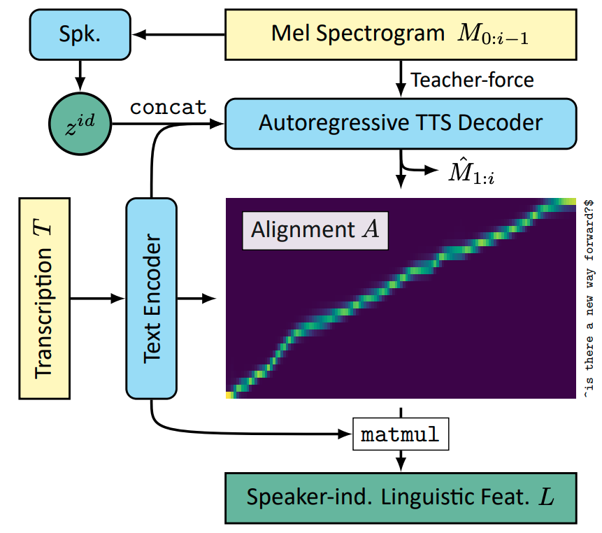
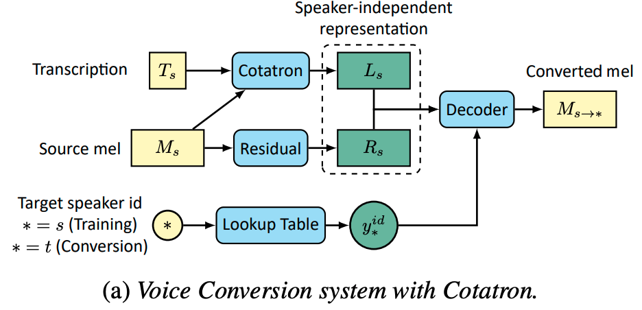
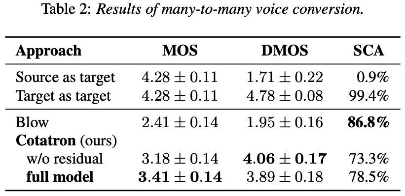

## TL;DR

최근 mindslab 에서 VC (Voice Conversion)관련 논문이 나와서 오랜만에 요 쪽 domain 도 볼 겸 해서 논문을 읽게 됐습니다.

간단하게 요약하면, 유명한 google 의 TTS model 인 *tacotron2* 기반으로 given transcription 와 mel alignment 를 활용해서 speaker-independent linguistic representation 을 뽑는 concept(?) 입니다.

결론은 VCTK dataset 에서 최근 paper 인 *Blow* 보다 높은 MOS, DMOS 를 달성했습니다. 아래 링크에 들어가면 모델이 생성한 sample 들을 들어볼 수 있어요.

paper : [arXiv](https://arxiv.org/pdf/2005.03295.pdf)

demo : [link](https://mindslab-ai.github.io/cotatron/)

code : 아직 official code / pre-trained model은 없는데, 곧 나올 예정인 듯합니다

## Related Work

이전 SOTA 였던 paper

* Blow : [arXiv](https://arxiv.org/pdf/1906.00794.pdf)

## Architecture

*Cotatron*의 전체적인 architecture 는 아래와 같습니다.

### 1. speaker-independent linguistic features from TTS

이번에 제안한 *cotatron* 은 google 의 *tacotron2* 를 기반으로 합니다. 

> $\hat{M_{1:i}} , A_i = Decoder (Encoder(T), M_{0:i-1}, z^{id})$

*T* 는 Transcription, *M* 은 log mel-spectogram, *z* 는 speaker representation.

요거로부터 mel alignment + given transcription + speaker representation 으로 새로운 speech 를 생성합니다.

이 이후가 중요(?)한데, TTS 훈련 후에, 
Decoder output 으로 transcription 과 mel-spectogram 사이의 *Alignment* 가 나오는데, 요 부분을 training 할 때 *teacher-forcing* 기술을 사용해서 훈련했다고 합니다.

그래서 최종적으로 Speaker-Independent linguistic features 는 다음과 같습니다.

> $L = matmul(A, Encoder_{text}(T))$

그런데 한 가지 짚어야 할 점은, 
*T* 는 speaker 에 대한 정보가 없는 text 고, 
*A* 는 간단히 text 와 mel spectogram 과의 coef 라 할 수 있는데,
즉, *L* 이 speaker 에 대한 정보를 담고 있지 않다는 점이다. 이 부분은 아래에

*Cotatron*은 이미 *Tacotron2* 기반의 모델이라 multi-speaker speech synthesis 에 well-optimized 됐을 거지만,
조금 더 잘해 보려고(?) 기존의 embedding table 을 걷어내고, speaker representation encoder 를 하나 만들어 넣었다고 합니다.

해당 encoder 구조는 2d cnn 6 layers + gru 구조로 구성.

#### speaker disentanglement issue ?

그래서 이런 speaker disentanglement 에 대한 issue 를 해결하기 위해 speaker classifier 를 추가로 붙여 줬다고 캅니다.

이 때 사용된 모델은 간단한 1d cnn 4 layers + temporal max-pooling + fc 로 구성.

### 2. voice conversion

위 이미지처럼 voice-conversion system 인데, 전반적인 pipeline 이 그려져 있습니다.

#### 2.1 residual encoder

speech 를 decoding 하는 과정에서 아무리 transcription + speech 에 정보가 잘 있어도 speech 자체 만에 대한 정보도 다양하고 중요하여서,
해당 정보를 따로 encoding 해서 decoder 에서 사용한다고 합니다.

residual encoder 의 특징은 

* 위에 한 번 언급된 speaker encoder 와 비슷한 구조
* temporal information 보존을 위해 time-wise 하게는 stride 적용 x
* 특정 speaker feature 에 overfit 을 막기 위해 작은 channel size 를 사용. 
* 결론적으로 single channel output 이 위 문제를 막으면서 잘 동작했다고 캅니다.
* plus) Hann 으로 smoothing 함 ($k = 21$)

#### 2.2 VC decoder

위에 image 처럼, Cotatron feature 와 mel encoded feature 가 concat 돼서 들어가고 target speaker id 도 같이 들어갑니다.

> $M_{s \to *} = Decoder_{vc} (concat(L_s, R_s), y^{id})$

VC decoder 구조는 *GAN-TTS* 란 paper 와 유사합니다. head, tail 에 1d conv 가 1 layer 씩 있고, 중간에 GBlock w/ CondBN 4 blocks 있는 형태 입니다.
물론 CondBN 에 Condition 으로 target speaker feature 가 들어갑니다.

요 decoder 에 대한 모델적인 여러 시도를 했는데 결론적으로 성능 향상은 없었다고 하면서 future works 로 남기며 턴을 종료했습니다.

### 3. training recipe

은 논문 참고해 주세요 (~~귀찮~~)

## Experiment Result

### VCTK Benchmark (many-to-many)

기존 SOTA 인 Blow 보다 훨 높은 MOS, DMOS 를 보여줍니다. SCA 는 Blow 를 넘진 못헀네요.

### Speaker Disentanglement

그냥 Cotatron feature 만 쓸 때와 mel spectogram 만 따로 encoding 해서 쓴 경우와 비교했을 때,
SCA 가 훨씬 높은 걸 보여주네요.

## Conclusion

간단한 concept 으로 꽤괜 성능이 나오고,
transcript 를 주지 않아도 성능이 준 것과 comparable 하다는 점도 재밌고, 
Cortatron encoder 를 다른 task 에 적용해 봐도 재밌는 결과 볼 수 있을 것 같네용

결론 : 굳
