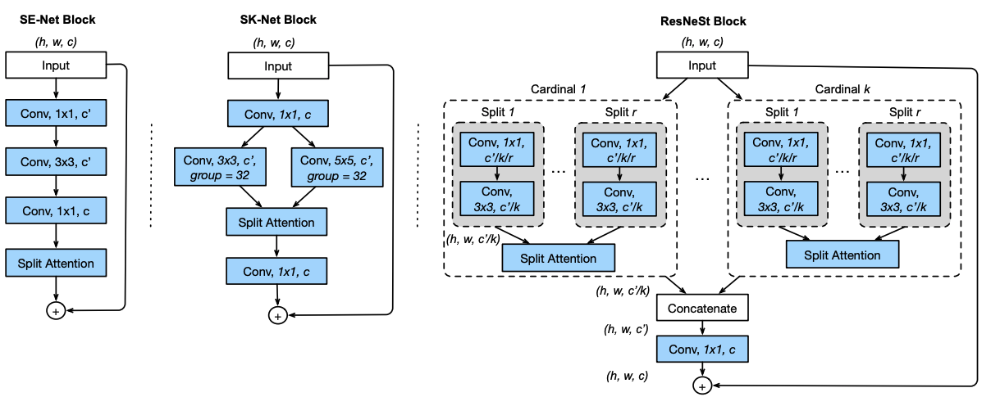
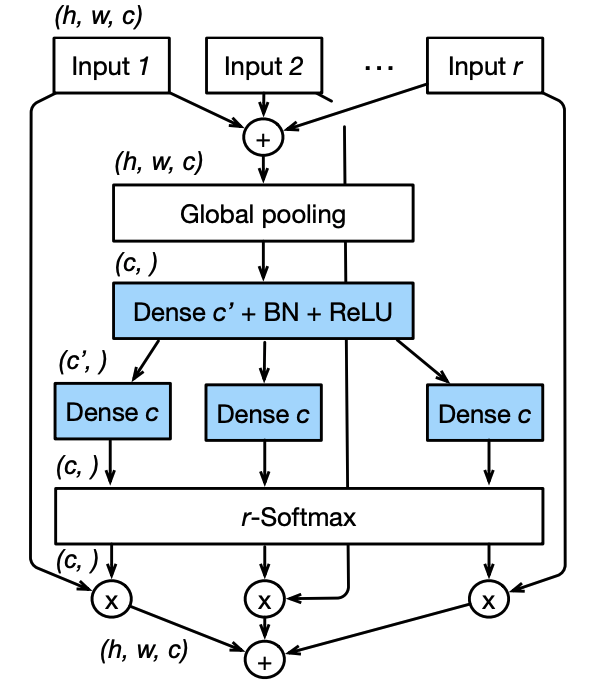
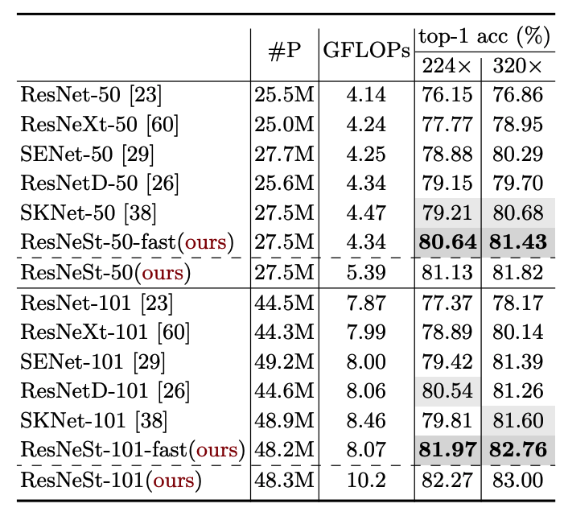
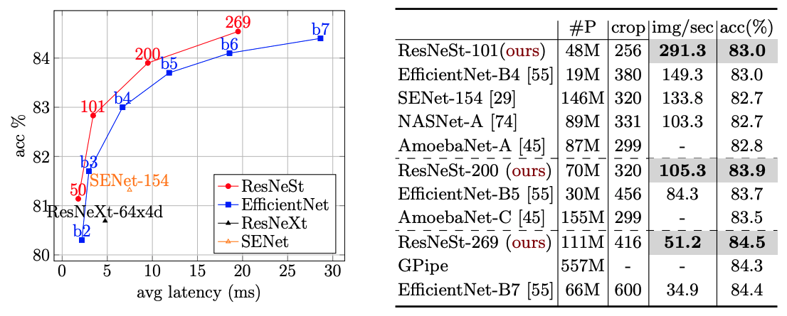
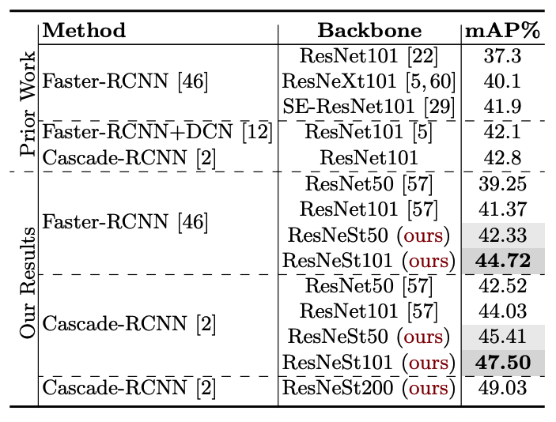
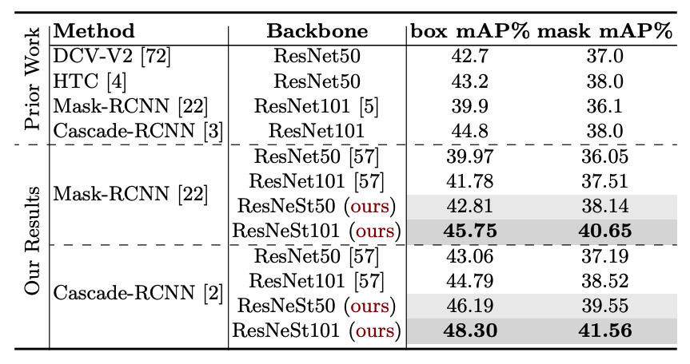
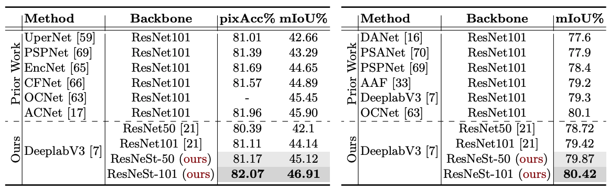

## TL;DR

Amazon 에서 지난달에 재밌는 논문이 나왔는데요, 새로운 image classification architecture 를 제안했는데, 
EfficientNet 보다 더 좋은 성능을 보이는 human-made architecture 를 선보였습니다. 멋지죠?

핵심은 *Split-Attention* 을 사용하는것 인데요, 자세한 건 본문에

결론은 ImageNet 에서 새로운 SOTA 를 찍었습니다.

paper : [arXiv](https://arxiv.org/pdf/2004.08955.pdf)

code : [github](https://github.com/zhanghang1989/ResNeSt)

## Related Work

ResNet 계열 논문들

* ResNet : [paper](https://www.cv-foundation.org/openaccess/content_cvpr_2016/papers/He_Deep_Residual_Learning_CVPR_2016_paper.pdf)
* ResNetV2 : [paper](https://arxiv.org/pdf/1603.05027.pdf)
* ResNeXt : [paper](https://arxiv.org/pdf/1611.05431.pdf)

## Introduce

introduction 에서는 크게 2가지 문제점들을 들면서 소개하는데요,

### Computation

최근에 EfficientNet 같은 architecture 들을 보면 ImageNet 에서 정말 높은 acc 를 보여주고 있는데요,
그런데 성능은 정말 좋지만, AutoML 로 architecture search 를 하다 보니, accuracy 는 고려돼도, training efficiency 는 고려하지 못해서, 실제로 이걸
training 하려고 하면 **computation cost 가 꽤 많이 듭니다**.

### Transfer Learning

위 architecture 들을 backbone 으로 하는 downstream task 들을 훈련할 때도 한계점으로 듭니다.

주로 ResNet 기반의 architecture 를 사용했는데, 요런 backbone 들은 해당 downstream task 에 optimal 한 구조가 아니기 때문에 (lack of receptive field, cross-channel interaction)
해당 task 들에 맞게 구조를 바꿔야 한다고 합니다.

또한, 실제로 EfficientNet 을 backbone 으로 사용할 때 다른 architecture 보다 성능이 고만고만한 경우도 꽤 있어요. (기대한 만큼 x)

요약하면, **cross-channel representation 을 잘 뽑아주는 구조**가 필요하다 입니다.

## Architecture

아래는 이번 논문에서 제안한 *Split-Attention* 이 적용된 block 입니다.

왼쪽부터 순서대로 *SE-Net block*, *SK-Net block*, *ResNeSt block* 입니다.

*ResNeSt* 는 *ResNeXt* 와 *SK-Net* concept 을 합친 거라 보시면 될 듯 합니다.

### Split-Attention Networks

*Split-Attention* block 은 크게 2가지 part 로 구성되어 있는데, *feature-map group*, *split-attention operation* 입니다.

*feature-map group* 은 ResNeXt 에 나오는 concept 이니 핵심인 *split-attention* 부분만 다뤄 보겠습니다.

1. 각 cardinal group 에서 $r$ 개의 splits 들에 대해 element-wise 하게 sum 해줍니다.
> $\hat{U}^k = \sum_{j=R(k-1)+1}^{R_k} U_j$ , $\hat{U}^k \in \Bbb{R}^{H \times W \times C / K}$ for $k \in 1, ..., K$
2. GAP 로 spatial features 를 squeeze 해 줍니다.
3. *Dense $c'$ + BN + ReLU* -> *Dense $c$* 로 excitation 하고
5. attention feature 와 original feature 하고 element-wise 하게 mul 해 주고
6. 마지막으로 element-wise 하게 sum 해 줍니다.

### ResNeSt Block

위 *Split-Attention* block 들이 각 cardinal group 별로 적용된 후에 모두 concat 후에 conv 1x1 되고 skip connection 이 element-wise sum 되는 형태 입니다.

만약 down-sample 되는 block 이라면 
skip-connect 부분이 channel size alignment 를 위해 strided convolution or convolution + pooling 이 될 수 있다고 하네요.

### Etc (computation, etc)

network 디자인을 봤을 때 computation 적으로 training 시 이전 구현체들 보다 효율적이다 등등을 말하네요

## Training Recipe

요약

1. average down-sampling : 이전 ResNet 들은 strided conv 3x3 w/ (zero padding) 로 pooling 함 -> avg pool 3x3 으로 pooling (zero-padding boundary 처리는 dense prediction task 에 sub-optimal 함)
2. tweak ResNet-D : stem conv kernel size 가 7x7 -> conv 3x3 3층 (same receptive field 가지며, 더 computation 효율적으로)
3. learning rate : lr = 0.1 로 5 epochs warm-up, cosine scheduling, $lr = B/256 * lr_base$
4. BN : $\gamma$ = 0 으로 init
5. label smoothing 함
6. AutoAugment 씀
7. MixUp 씀
8. Large Crop Size
9. Regularization : DropBlock (p = 0.2) 씀, l2 weight decay

## Experiment Result

### ImageNet

#### ResNet based Benchmark

ResNet 계열 architecture benchmark 결과인데 제일 좋은 top-1 acc 를 보입니다.

#### SOTA Benchmark

이전 다른 SOTA 들하고 비교해 봐도 latency / accuracy 둘다 더 좋은 성능을 보여주네용

### Transfer Learning Task

Downstream tasks 에서도 좋은 결과를 보이고 있습니다.

#### Object-Detection Benchmark

#### Instance Segmentation Benchmark

#### Semantic Segmentation Benchmark

## Conclusion

요즘 architecture 들은 주로 baseline 구조에 AutoML 를 이용한 architecture search 가 이뤄지고 있는데,
이렇게 아직도 사람이 만든 architecture 에 대한 연구가 나오고 있고, 더 좋은 성능을 냈다는 게 정말 인상적이네요.

또 전에 구글에서 나온 논문 무언가에서 ResNet 의 모든 convolution 을 attention 으로 교체했더니 더 좋은 성능이 나왔다는 걸 본 적이 있는데,
여기서도 뭔가 더 아이디어를 얻어 볼 수 있을 것 같네요.

아마 제가 못 찾아본 거일 수도 있지만, Amazon 연구를 별로 본 기억이 없었는데, 이번 연구는 꽤 재밌었어요.

결론 : 굳굳굳
