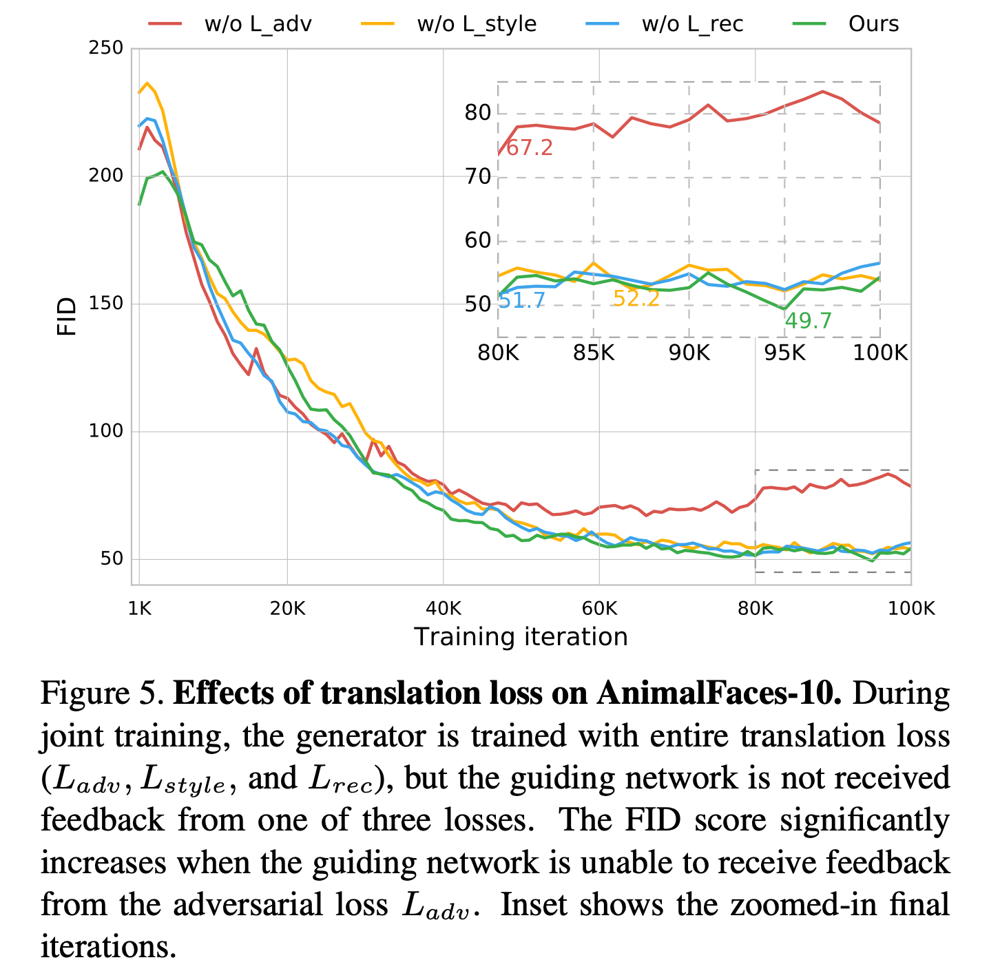

## TL;DR

최근에 Clova AI 에서 unsupervised image 2 image translation 관련 논문이 나와서 한번 빠르게 봤습니다.

일단 제목부터가 재밌는데 TUNIT, **Truly** Unsupervised Image to Image Translation 의 약자입니다. 
요즘 unsup, semi-sup 이라 하면서, 사실은 supervised 인 approach 들이 있어서 그런지, 이거는 **찐**이다 라는 걸 제목부터 보여주고 싶었나 보네요.

~~헛소리였고.~~,  reproducible 가능한 코드도 논문 공개와 같이 돼서 좋네요. 

paper : [arXiv](https://arxiv.org/pdf/2006.06500.pdf)

code : [github](https://github.com/clovaai/tunit)

## Related Work

Image-to-Image Translation 쪽 papers 이 정도만

* CyCleGAN : [paper](https://arxiv.org/pdf/1703.10593.pdf)
* UNIT : [paper](https://arxiv.org/pdf/1703.00848.pdf)
* MUNIT : [paper](https://arxiv.org/pdf/1804.04732.pdf)
* FUNIT : [paper](https://arxiv.org/pdf/1905.01723.pdf)
* StyleGAN-v2 : [post](http://kozistr.tech/deep-learning/2020/02/29/StyleGANv2.html)
* StarGAN-v2 : [post](http://kozistr.tech/deep-learning/2020/02/10/StarGANv2.html)

## Introduce

이전에도 여러 i2i translation approaches 가 존재했지만, 
주로 연구들이 set-level 에서 multimodal translate 할 때, domain label 이 필요하다는 점이 있었고,
이런 문제를 해결하기 위해 pre-trained classifier 를 adopt 해서 domain info 를 extract 하는 방식들의 접근이 있었어요.
또 self-supervised 방식으로 mutual information maximization 를 통해 각 이미지들을 잘 cluster 하려는 시도도 있었습니다.

하지만 real-world data 들은 label 들을 주로 구하기 힘든 문제들이 존재하니, 
그럼 어떻게 unlabelled data 로 (unsupervised) i2i translate 를 잘 할 수 있을지를 해결한 논문입니다.

## Method

위 이미지가 전반적인 TUNIT architecture 인데요, 크게 3 종류의 network 로 구성돼있습니다.

* Network E : Guiding Network
* Network D : Discriminator
* Network G : Generator

### Guiding Network

이 논문의 핵심(?)인 network 인 guiding network 인데요, 
해당 network 에서는 input image 를 입력받으면, *pseudo label* 과 *style code (embedding)* 을 줍니다.

*pseudo label* 은 network 가 예측한 해당 domain 의 class 가 되겠고, *style code* 는 해당 image 의 style 을 담고 있는 embedding 일 겁니다.

#### Unsupervised Domain Classification

하지만, 여기선 image domain 에 대한 label 을 구할 수가 없는데요, 대략 임의의 class 수 ($K$, e.g) 5, 10, 20)를 잡습니다. (K 잡는 게 NetVLAD 비슷한 느낌 하네요)

그리고 다른 unsupervised method 에서 주로 사용하는 방식인 augmentation (e.g) random cropping, horizontal flip, ....)을 통해서 각 domain 의 cluster 를 학습하는데, 
여기서 mutual information (MI) 를 maximize 하는 방식으로 진행하게 됩니다.

> $I(p,p^+) = H(p) - H(p\|p^+)$, $p = E_{class}(x)$

여기서 image $x$ 라 하면, $x^+$ 는 augmented image $x$ 이고, $p$ 는 K domains 에 대한 확률값이라 볼 수 있겠습니다. (softmax 가 정확히는 확률값은 아니지만)

entropy $H(p)$ 가 maximize, cond entropy $H(p\|p^+)$ 가 minimize 되면서, 
결과적으로 해당 MI 가 maximize 되면, 모든 samples 들이 K domains 에 골고루 분포되면서,
augmented 된 domain 들에 대해선 같은 domain 으로 묶겠죠?

위 공식을 entropy loss scheme 으로 다시 써 보면 아래처럼 됩니다.

> $L_{MI}$ = $I(p,p^+)$ = $I(P)$ = $\sum_{i=1}^{K} \sum_{j=1}^{K} P_{ij} \log \frac{P_{ij}}{P_{i}P_{j}}$, $P_{ij} = P(p = i, p^+ = j)$

#### Improving Domain Classification

image 가 higher-resolution & complex 하고 diverse 하는 문제를 극복하기 위해 
domain classification 이외에 auxiliary branch 로 style code 를 뽑아 여기에 contrastive loss 를 붙였습니다.

> $L_{style}^E = - log \frac{exp(s \cdot s^+ / \Gamma)}{\sum_{i=0}^N exp(s \cdot s_{i}^- / \Gamma)}$

이런 식인데, contrastive loss 목적처럼 positive pair 는 가깝게, negative pair 는 멀리 보내는 역할을 합니다.

이 method 적용으로 위 method 하나만 사용했을 때 보다 약 35% 정도 AnimalFaces 에서 classification accuracy 가 증가했다고 하네요.

### Discriminator & Generator

두 개 다 특별한 거 없이, discriminator 는 multi-task discriminator (K classes) 고, 
generator 도 guiding network E 에서 오는 style code 기반으로 이미지를 생성하는 network 입니다. 

adv loss 도 simple 한 vanilla gan loss 를 사용하네요.

#### Style Contrastive Loss

> $L_{style}^G = - log \frac{exp(s^{'} \cdot s^~ / \Gamma)}{\sum_{i=0}^N exp(s^{'} \cdot s_{i}^- / \Gamma)}$

$s^{'} = E_{style}(G(x, s^~))$, $s^{'}$ 는 생성된 이미지에 대한 style 이고 (positive), - 는 negative style.

위 loss function 을 사용하면 ref image x 에 대해 생성된 이미지가 유사해지니 (positive 는 유사, negative 는 안 유사),
guiding network E 가 모든 이미지를 하나의 style code 로 뽑는 것도 막을 수 있겠죠. (여기서 only recon loss 만 사용할 때 문제)

#### Reconstruction Loss

여기도 특별한 건 없고, image x 와 해당 style s 에 대해 생성된 이미지와의 L1 loss 를 minimize 합니다.

### Total Loss

> $L_{D} = - L_{adv}$
> $L_{G} = L_{adv} + \lambda_{style}^G L_{style}^G + \lambda_{rec} L_{rec}$
> $L_{E} = L_{G} - \lambda_{MI} L_{MI} + \lambda_{style}^E L_{style}^E$

## Experiment Result

### Translation Loss on AnimalFaces-10

$L_{style}$, $L_{rec}$ 없을 때 하고 풀버전(?) 하고 거의 유사하긴 하지만, 모두 적용했을 때가 제일 FID 가 좋네요.

### t-SNE visualization of the style space

$K = 10$ 설정일 때, style code 들이 얼마나 cluster 별 domain style 을 뽑고 있나 봤을 때, 
잘 분리하고 있는 걸 보여줍니다.

## Conclusion

재밌는 approach 들을 사용했고 (arbitrary K classes, MI maximization, style contrastive learning), 
결과도 이전 연구 성능보다 outperform 해서 좋았습니다.

결론 : 굳
