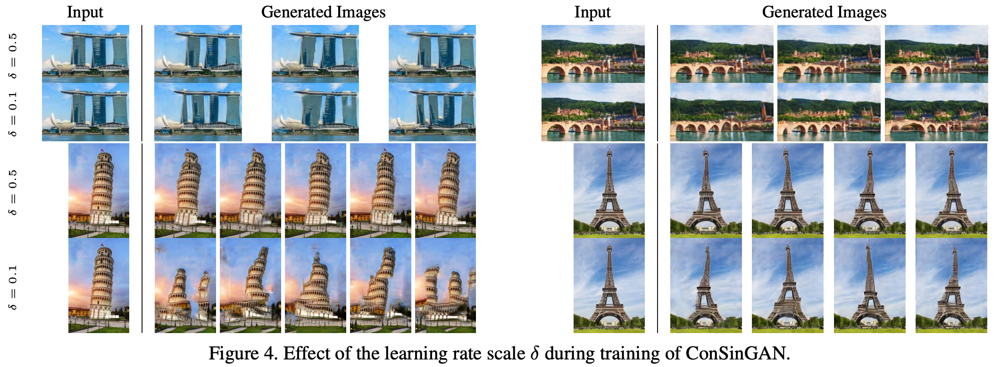

## TL;DR

이전에 리뷰했던 SinGAN 후속 논문이 나왔는데, 우연히 github 메인 페이지 오른쪽에 보면 Explore repositories가 있는데, 여기에 추천 repo로 떠서 우연히 보게됐습니다.

저자분께서 짧은 요약을 블로그에 정리해서, 논문대신 아래 글을 읽어도 충분할 듯 하고, SinGAN 이랑 비교/대조하는 부분이 있어서 SinGAN 논문도 읽어보시는 걸 추천드려요.

official summary : [blog](https://www.tobiashinz.com/2020/03/24/improved-techniques-for-training-single-image-gans.html)

paper : [WACV21](https://openaccess.thecvf.com/content/WACV2021/papers/Hinz_Improved_Techniques_for_Training_Single-Image_GANs_WACV_2021_paper.pdf)

code : [github](https://github.com/tohinz/ConSinGAN)

## Related Work

요 논문과 관련높은 references

1. SinGAN : [paper](https://arxiv.org/pdf/1905.01164.pdf), [my review](https://kozistr.tech/SinGAN/)
2. ProGAN : [paper](https://arxiv.org/pdf/1710.10196.pdf)

## Introduction

논문을 읽기 전, 전반적인 느낌은 논문 제목부터 Con**SinGAN**인 것 처럼, SinGAN에 여러 techniques를 추가해 성능을 improved 한 느낌입니다.
또, Con (Concurrent)라 명칭한걸 보니, 각 generators 를 concurrent 하게 학습한다는 느낌을 받았는데, 자세한 건 논문을 읽어봐야 겠어요.

이 논문에서, 크게 **3 가지의 main contributions** 이 있습니다.

1. architecture & optimization
2. 이미지 rescaling (for multi-stage training)
3. fine-tuning

## Methodology

### Multi-Stage Training

#### Random Noise

model architecture 같은 경우 **SinGAN**과 대조를 하는데, 
**SinGAN**도 multi-stage generators 를 가지고 있는데, 가장 낮은 resolution에 해당하는 generator만 unconditional generator 라고 말하고 있습니다.

즉, **SinGAN** 은 최초에만 noise (~= z latent vector)로 부터 이미지를 생성하고, 이후 stages 는 random 한 요소가 들어가지 않는다는 말입니다.

위는 ConSinGAN 의 model architecture 인데, **diversity**를 높히기 위해 매 stage 마다 이전 stage 의 생성 결과와 random noise가 같이 합쳐서 들어가고 있습니다.

#### Freeze Previous Generator

그리고, 현재 (n) stage를 훈련할 때 이전 (n - 1) stage의 generator를 freeze 한다는 차이도 있습니다.

이런 방식으로 concurrently 하게 한 번에 여러 stages 의 generator 를 학습하는데, 한 번에 모든 stages의 generator를 학습하면 overfitting 가능성이 커지니, 
**적당히 한 번에 3 stages** 를 훈련한다고 합니다.

#### Learning Rate

또한, 한 번에 3 개의 generators 를 훈련하는데, 각 stage 마다 다른 learning rate 를 사용했습니다.

예를 들어, Generator (n - 2), (n - 1), (n) 을 학습한다면, (0.01 * lr), (0.1 * lr), (lr) 식으로 (10배 씩 decay 해) 사용했다 합니다.

물론, 이렇게 learning rate 를 사용하는 것에대한 이야기도 했는데, 

1. lower generators 에서 higher learning rate 사용 : training image 에 더 similar 한 image 를 만들겠다.
2. lower generators 에서 lower learning rate 사용   : 더 높은 diversity 를 가져가겠다 (~= maybe leads to worse quality) 

이렇게 말하면서, learning rate 란 artifact 에 대한 sample 변화도 보여줬습니다.

#### Discriminator

Discriminator로 Patch Discriminator 를 사용하는 것에 대해, 이미지의 일부로만 판단하면 global perspective 에서 real or fake 확인이 어렵다는 점을 언급합니다.

### Rescaling Image

각 generators 에 들어가는 image resolution 에 대한 내용인데, multi-stage scheme 으로 여러 resolution 으로 progressive 하게 generate 하는 것은 좋은데,
그럼 이걸 얼마나 해야하냐? 라는 의문을 제기합니다.

SinGAN 같은 경우엔 주로 8 ~ 10 stages 를 통과하는데, 아래와 같은 formulation 으로 써 볼 수 있습니다.

> $x_{n} = x_{N} × r^{N−n}, r = 0.75$

논문에선 8 ~ 10 stages 는 좀 많다라고 이야기 하면서, 적절한 scaling factor & stages 를 찾는 시도를 합니다.

1. scaling factor 가 높고 stages 가 많아지면, 훈련의 안정성이나 (image) global coherence 가 높은 장점이 있겠지만, 그 만큼 학습이 느려지고,
2. scaling factor 가 낮고 stages 가 적어지면, 학습이 빨라지는 대신, global coherence 를 잃는 문제가 발생하겠죠.

또한, high resolution 에서는 많은 stages 가 필요하지 않다는 점을 언급하면서, 이런 요소를 반영해 다음과 같은 formulation 을 제안했습니다.

> $x_{n} = x_{N} × r^{((N - 1) / log(N)) * log(N - n + 1)}, n \in [0, N)$

차이는 아래와 같습니다. (scaling factor 0.55 <- 논문에서 언급한 값)

1. old scaling : 25×34, 38×50, 57×75, 84×112, 126×167, 188×250
2. new scaling : 25×34, 32×42, 42×56, 63×84, 126×167, 188×250

% 개인적인 생각

scale factor 를 0.55 로 논문에선 설정했는데, 계산해 보면 scaling factor 값이 조금 이상하네요.

### Fine-Tune

마지막으로, image harmonization task를 위한 fine-tuning에 대해서도 언급합니다.

간단하게 설명하면, 먼저 source image에 대해 학습을 하고, 이후에 reference image 에 대해 학습을 하면 더 좋은 성능을 낼 수 있다고 캅니다.

## Benchmark

### Confusion & SIFID

SinGAN 하고 비교했을 때, SIFID 가 더 좋아진 걸 볼 수 있었고, 훈련 시간, 학습해야하는 모델 파라메터 수도 2배 정도 줄었음을 확인

### Diversity

논문에서 중요하게 생각하던 Diversity 도 보면, SinGAN 대비 comparable 하거나 low 한 diversity score 가 나왔습니다.

| DataSet\Model | SinGAN | ConSinGAN |
| :---: | :---: | :---: |
| Place | 0.52 | 0.50 (0.43) |
| LSUN  | 0.64 | 0.54 |

Place dataset benchmark 중 괄호는 learning rate scaling factor 를 0.1 에서 0.5 로 올렸을 때, diversity 감소가 발생했다는 걸 보여주고 있습니다.

LSUN dataset 에선 global structure 를 catch 하지 못한 게 낮은 diversity score를 얻었다는 것으로 해석합니다.

### Image Harmonization

## Conclusion

개인적으로 새로운 idea를 제안하는 논문도 좋아하지만, 이런 training recipe 튜닝하는 걸 좋아해서 개인적으로 가볍고 재밌게 읽었습니다.

결론 : 굳굳
