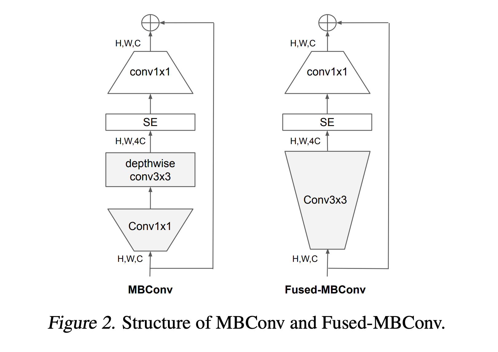
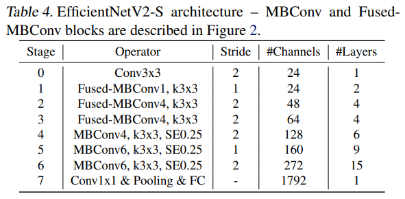
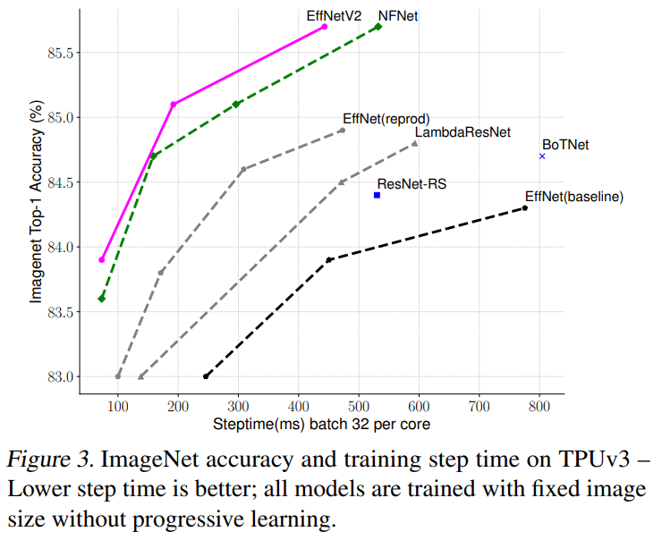
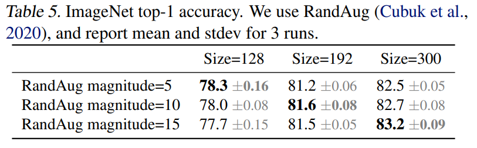
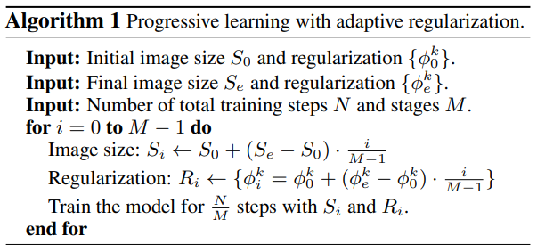
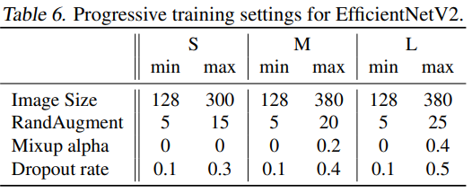

## TL;DR

EfficientNet 의 2번째 논문이 나왔네요. 저자는 EfficientNet 을 쓴 두 분이 쓰셨네요.

이번에 나온 논문은 **효율성**을 목표로 한 연구인데, NAS로 모델 훈련 속도와 파라메터 수를 엄청나게 줄이면서 성능도 comparable 하거나 더 좋은 성능을 달성했다고 합니다.

paper : [arXiv](https://arxiv.org/pdf/2104.00298.pdf)

code : [github](https://github.com/google/automl/tree/master/efficientnetv2)

## Related Work

요 논문과 관련높은 reference

1. EfficientNet : [paper](https://arxiv.org/pdf/1905.11946.pdf)

## Introduction

최근에 나온 convolution 기반 architectures 를 보면 (e.g. ResNet-RS, NFNet), 
성능은 좋지만, 모델 파라메터가 너무 많고 FLOPs 도 엄청나게 커서 웬만한 장비 아니면 훈련하기도 빡센 문제가 있어요.

## Training Efficiency

### Training with very large image sizes is slow

큰 크기의 이미지를 사용하면 작은 batch size를 사용해야 하는 점이 속도 저하의 원인임을 언급하면서,
훈련 시에 progressively 이미지 크기를 조정하는 방향으로 이런 문제를 개선했다고 합니다. 

### Depthwise Convolutions are slow in early layers

EfficientNet architecture에는 *MBConv* 라는 block 이 있는데, depth-wise convolution 이 사용되죠.
그런데, 요 연산이 tpu/gpu 에서 제대로 가속을 못 받아서 일반적으로 사용하는 convolution 연산보다 파라메터나 FLOPs 는 작지만 속도가 느려요.

최근 연구들에는 이런 문제때문에 *Fused-MBConv* 라는 걸 만들었는데, 
아래 그림처럼 `Conv 1x1 + depthwise Conv 3x3` -> `Conv 3x3` 으로 replace 한게 더 좋다는 연구를 언급하면서

EfficientNet-B4 에 gradually *Fused-MBConv* 를 적용해 봤는데, **early layers** (1 ~ 3 stages) 에만 적용하는게,
속도도 빠르면서 성능도 제일 좋게 가져갈 수 있었다고 합니다.

### Equally scaling up every stage is sub-optimal

EfficinetNet 에선 compound scaling rule 에 따라서 scaling 하는데, 만약 depth coef 가 2라면, 모든 stages 에서 2로 scaling 합니다.
그런데, 각 stages 에서 훈련 시간과 파라메터 수는 equally contributed 안하는 문제점을 들면서, *non-uniform* 한 scaling 전략을 선택하겠다고 합니다.

이미지 사이즈 같은 경우도 훈련 시간과 memory 에 큰 영향을 주기 때문에, (image size에 대한) scaling rule 도 변견했다고 합니다.

## Training-Aware NAS and Scaling

### NAS Search

모델 훈련 속도를 위한 best combination 을 찾기위해, training-aware NAS 을 제안합니다.

EfficientNet에서 사용한 NAS 기반을 했는데, 아래와 같은 목표를 joinly optimize 했다고 합니다.

1. accuracy
2. parameter-efficiency
3. training-efficiency (on modern accelerators)

구체적인 settings 은 논문에

### EfficientNetV2 Architecture

NAS를 사용해서 찾은 architecture (EfficientNetV2-S, baseline) 가 아래와 같은 구조라 합니다. EfficientNet 과 크게 4가지 차이점이 있다 하는데,

1. *MBConv* 와 *Fused-MBConv* 를 섞어서 씀
2. 더 작은 expansion ratio (for *MBConv*) 를 사용 -> 더 적은 overhead 를 가지기 때문
3. 3x3 kernel sizes 를 선호. (하지만 작은 receptive field를 사용하는 만큼 layer를 더 쌓게 됨)
4. EfficientNet 에 있던 맨 마지막 stride-1 stage 를 제거. -> 이것도 메모리 때문에

### EfficientNetV2 Scaling

위에서 만든 EfficientNetV2-S 기반으로 M/L 버전도 만들었는데, 몇 가지 제한을 두고 scaling 했다고 합니다.

1. maximum inference image size to 480
2. add more layers to later stages (stage 5, 6)

## Progressive Learning

훈련 시 image size 를 dynamic 하게 사용하는데, 이전 연구들은 accuracy drop 이 발생했다고 합니다.
이번 논문에선 그런 accuracy drop이 *imbalanced regularization* (다른 이미지 크기로 학습하면 거기에 맞는 regularization strength를 사용해야 한다)에서 오지 않을까 추측합니다.

아래와 같이 regularization strength를 실험해 본 결과, 추측한 대로 image size 가 작을 땐 weak augmentations, 클 땐 strong augmentations이 성능향상에 더 도움됐다고 합니다.

Progressive Learning 을 하기 위해서 fomulation을 세웠는데, 아래와 같습니다.

전체 훈련을 $N$ steps를 하고 훈련 과정을 $M$ stages로 나눴고, $k$ 는 regularizations 종류 (e.g. RandAugment, MixUp, Dropout, ...)

각 모델은 아래와 같은 recipes 로 훈련했다고 합니다.

## Benchmark

## Conclusion

새로운 아이디어보단 여러 가지를 조합하고 training recipe 실험에 가까웠지만, 
갠적으로 이런 튜닝 성격의 연구도 좋아하고, 엄청난 개선이 있어서 재밌게 읽었습니다.

결론 : 굳굳
