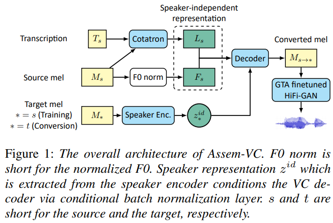
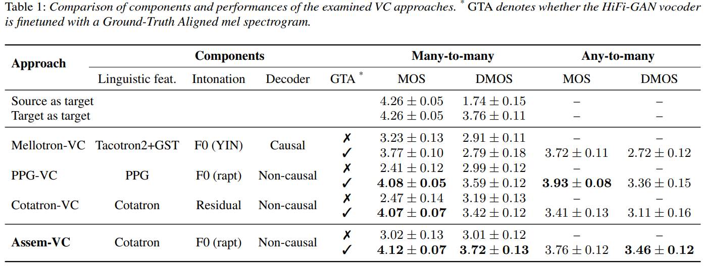

## TL;DR

최근 mindslab 에서 Cotatron에 이어 새로운 VC (Voice Conversion) 논문이 나와서 논문을 읽게 됐습니다.

code는 곧 나올 예정인 듯합니다. [issue](https://github.com/mindslab-ai/assem-vc/issues/1)를 보니 mid-june 에 release 할 가능성이 있다고 카네요.

paper : [arXiv](https://arxiv.org/pdf/2104.00931.pdf)

code : [github](https://github.com/mindslab-ai/assem-vc)

demo : [demo](https://mindslab-ai.github.io/assem-vc/)

## Related Work

요 논문과 관련높은 reference

1. Cotatron : [paper](https://arxiv.org/pdf/1905.11946.pdf), my review : [review](https://kozistr.tech/Cotatron/)

## Introduction

논문 제목부터 보면 *Assem-VC* 인데, 가존에 제안된 여러 VC 모델들의 장점들을 잘 조합해 하나로 만들어 둔 느낌입니다. 
*2. Approach* 를 보면, `Cotatorn-VC`, `Mellotron-VC`, `PPG-VC` 이렇게 3개의 모델을 baseline으로 해서 만들었다고 합니다.

그리고 3가지의 components로 나눠 살펴보는데, 다음과 같습니다.

1. linguistic encoder
2. intonation encoder
3. decoder

% `PPG` : phonetic posteriorgrams

`Auto-VC` 논문에서 저자가 source speaker의 linguistic, intonation 정보가 bottleneck 부분에 들어가게 되면 self-reconstruction 퀄리티를 떨어트린다고 합니다.
즉, **speaker independent** 하게 학습해야 양질의 conversion 이 가능하다고 합니다.

`Auto-VC` 논문을 읽어보진 않았지만, speaker specific 한 정보가 reconstruction 과정에 들어가면, speaker-biased 된 학습이 이뤄질 수 있어 speaker-overfitted, not generalized 한 모델이 만들어 짐을 유도하는 맥락같다는 생각이 드네요. (저도 이런 argument에 동의합니다)

쨋든, 이런 이유로 encoder design 을 speaker independent하게 만들었다고 합니다.

## Architecture

구체적으로 하나하나 보기 전에 전체적으로 한번 훑어보면, 
`Cotatron-VC` 와 `Normalized-F0` 로 linguistic, intonation features (speaker-independent)를 생성하고, 
이 정보들과 target speaker를 encoding한 정보와 같이 decoder에 넣어 mel-spectrogram 을 뽑고, 마지막으로 `HiFi-GAN` 으로 raw audio를 생성하는 방식입니다.

### Linguistic Encoder

결론부터 말하자면 `Cotatron-VC` 에 있는 linguistic encoder 를 채택했습니다. 

`PPG-VC` 같은 경우엔 time-frame 별로 phoneme 의 posterior probability를 *pretrained speaker-independent ASR* 베이스로 주는 방식인데, 
일단 ASR 를 훈련하려면 많은 양의 transcription 으로 학습한 ASR이 있어야 하고 (-> 어렵), output이 각 phoneme 의 확률만 주는 친구라서 사용하기 흠터레스팅하다 언급합니다.

### Intonation Encoder

이 부분도 결론부터 말하자면 `Cotatron-VC` 에 있는 intonation encoder에 개선점을 추가해 사용했습니다.

`Cotatron-VC`에서 intonation encoder에 해당하는 residual encoder가 **unseen** speakers or noises 에 대해서 잘 하는지는 여전히 의문이라고 합니다.

그래서 `PPG-VC` 와 `Mellotron-VC`에서 채택해 사용하던 `Normalized-F0` 를 사용했다고 합니다.

speaker voice 를 time frame 별로 log f0를 뽑고 mean/std normalize 후, unvocied segments는 *constant -10*으로 채우는 작업을 했다는데, 구체적인 구현 사항은 논문을 참고하세용.

이런 작업을 해서 pitch contour는 speaker independent해 지면서 decoder 는 speaker 의 pitch range를 잘 잡아 학습 가능하다고 캅니다.

### Decoder

결론은 non-casual decoder를 채택한 듯 합니다.

3개 baseline 중 `Mellotron-VC`만 autoregressive casual decoder 를 사용하는데, 이런 구조가 non-casual decoder 들 보다 더 좋은 퀄의 mel-spectrogram 을 뽑을 수 있다고 합니다.

하지만, teacher forcing method 로 학습하는 과정이 source-speaker에 대해 cheating할 수 있다는 점을 언급해, 실제로는 speaker disentanglement 를 못 지킬수도(?) 있다고 합니다.

논문에선 non-casual decoders (`PPG-VC`, `Cotatron-VC`) 차이도 설명하는데, 논문 참조~

### Vocoder

최근 VC methods를 보면 raw audio 만드는 부분에서 `WaveNet` 기반 vocoder를 사용하는데, 논문에선 real-world 에서는 `WaveNet` 기반 vocoder 는 latency가 나오지 않기 때문에 `HiFi-GAN` 기반으로 생성한다고 합니다.

이 중 포인트는, Ground Truth Alignment (GTA, 왠지 차 훔쳐야 할 거 같은 이름) mel-spec을 finetune시 사용했다고 하는데, 
이 논문에선 GTA mel-spec 부분을 reconstructed mel-spec으로 해석해서 튜닝을 했다고 하네요.

## Train Recipe

훈련 방식에도 차이가 있습니다. 3개의 baselines을 모두 훈련하는데,

먼저, `Cotatron-VC`를 *LibriTTS train-clean* 으로 훈련 후 *LibriTTS* + *VCTK* 로 progressively 훈련헀다고 합니다. 
그리고 `Cotatron-VC` 는 freeze하고 `Assem-AC` 전체 pipeline 을 훈련했다고 합니다.

다른 recipes는 논문에

## Performance

### VC

## Conclusion

결론 : 굳
