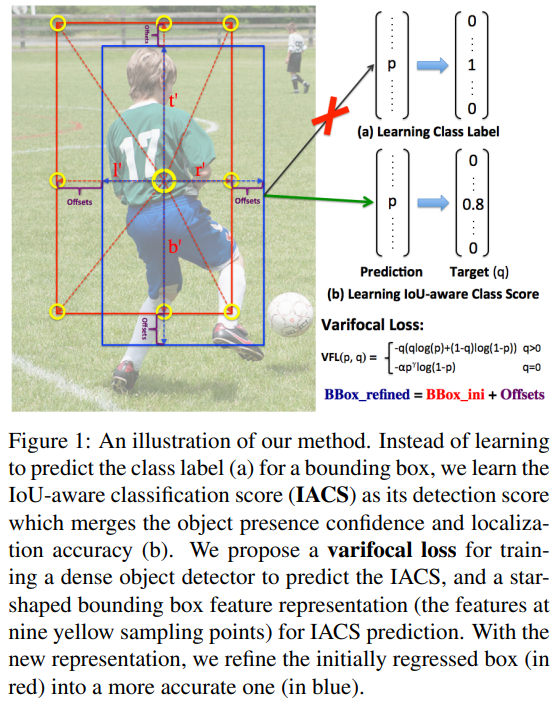
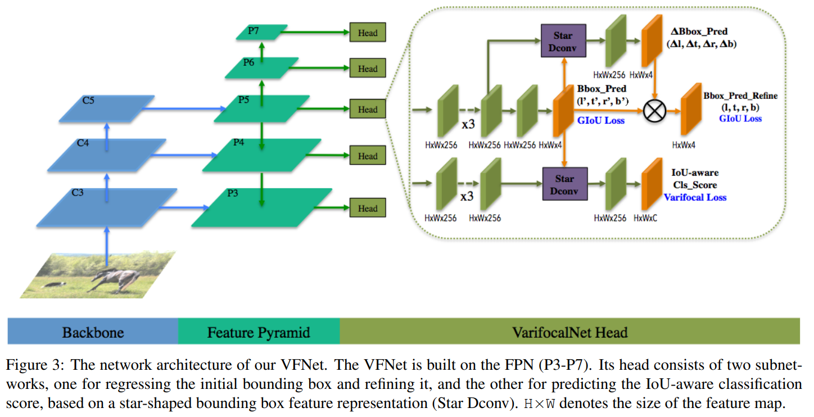
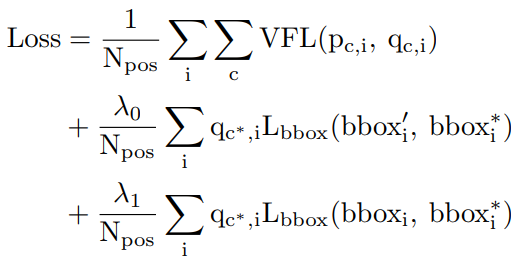
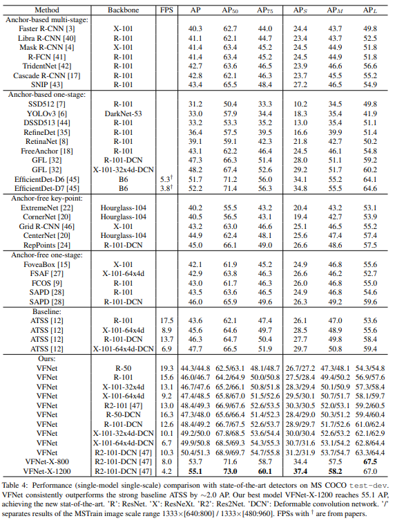
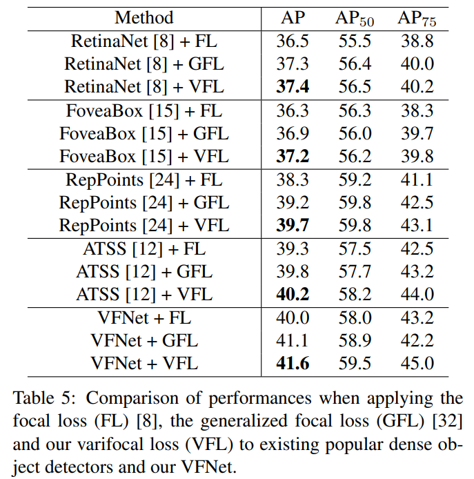

## TL;DR

최근에 Object Detection (이하 OD) task 관련 kaggle challenge를 하다, 비슷한 대회 solutions들을 보다가 상위 랭크 solution에 `VertiFocalNet` (이하 `VFNet`)을 사용한 걸 발견해서, 요 논문을 더 자세하게 공부해 보고 싶어서 정리해 봅니다.

OD 쪽을 오랜만에 공부해 보니 그동안 공부 안 했던 스택이 쌓였는지, 볼 것도 많지만 대회에도 써 보면서 재밌게 공부했습니다.

* `VertiFocalNet` papepr : [arXiv](https://arxiv.org/pdf/2008.13367.pdf)
* `VertiFocalNet` official repo : [github](https://github.com/hyz-xmaster/VarifocalNet)

## Related Work

논문에서 제시하는 novelty들에 직/간접적으로 영향을 주거나 관련있는 논문들.

* Deformable Convolution : [arXiv](https://arxiv.org/abs/1703.06211)
* FCOS : [arXiv](https://arxiv.org/abs/1904.01355)
* ATSS : [arXiv](https://arxiv.org/abs/1912.02424)
* FocalLoss : [arXiv](https://arxiv.org/abs/1708.02002)

## Introduction

OD task에서 높은 성능을 얻으려면 candidate detection를 rank 하는 게 중요한 것 중 하나인데, 이전 연구들은 classification or localization score 등을 candidates를 rank 하는데 사용해 **reliable 하지 못하다**는 점을 짚으며, 요걸 joint learn 할 수 있는 reliable 한 method, IACS (IoU-Aware Classification Score)를 제안합니다.

이 논문에서 제시하는 novelty는 크게 3가지입니다.

1. IACS (IoU-Aware Classification Score)
2. VertiFocal Loss
3. Star-Shaped Box Feature Representation

## Architecture

### IACS (IoU-Aware Classification Score)

`IACS`는 classificaiton score vector 인데, 각 값들은 gt and predicted bbox 의 IoU 값이 됩니다. 위에 첨부한 `Figure 1` 과 같습니다.

### VertiFocal Loss

`IACS`를 탐지하기 위해 `VertiFocal Loss`를 설계했는데, idea는 `Focal Loss`에서 가져왔습니다. 이유는 IACS를 regress할 때 imbalance 문제를 해결하기 위해서라고 합니다.

> $VFL(p, y) = -q(qlog(p) + (1 - q)log(1 - p)), q > 0$
>
> $VFL(p, y) = -\alpha p^{\gamma}(1 - p), q = 0$

$p$ = predicted IACS, $q$ = target score

fg (foreground)일 때는, $q$ = gt 와 generated bbox 의 IoU
bg (background)일 때는, 모든 classes에 대해 target $q$ = 0

논문에서 bg 일 때 ($q$ = 0)는 negative examples에 대해서**만** factor ($p^{\gamma}$)로 scale 하는 이유는, positive exmaples ($q$ > 0)에선 negative exmaples에 비해 rare 하게 등장하기 때문에 scale 하지 않았다고 합니다. 그리고 $q$ = 0일 때, $\alpha$를 scale 해 positive, negative losses 사이에 balance를 잡아줬다고 합니다.

### Star-Shaped Box Feature Representation

`IACS`를 에측하기 위해서 Star-shaped Box Feature Representaion을 개발했다는데, 요약하면 deformable convolution
로 9 개의 bbox points (= `Figure 1`에 노란 점들)를 표현하는 무언가다.

구체적인 과정은,

1. initial bbox, 4 points (x1, y1, x2, y2)를 fixed kernel size의 3x3 convolution으로 찾는다.
2. By `FCOS`, points들이 4d-vector로 encoded됨. ($l`$, $t`$, $r`$, $b`$).
    * $l`$ : distance from sample location (x, y) to left side of the bbox.
    * $t`$ : distance from sample location (x, y) to top side of the bbox.
    * $r`$ : distance from sample location (x, y) to right side of the bbox.
    * $b`$ : distance from sample location (x, y) to bottom side of the bbox.
3. 요 것들로 9 points를 `Figure 1` 그림처럼 생성

끝으로 추가적인 예측으로 요런 points들을 생성하지 않아 computation-efficient 라고 캅니다.

### Bounding Box Refinement

bbox refinement 과정도 있는데, 기존 dense od에선 비효율적이라 잘 쓰이지 않았지만, 위에 제안한 Star-shaped Box Feature Representation 덕분에 효율적으로 refine이 가능하다고 합니다.

아래 이미지는 전체적인 architecture 입니다.

## Train Recipe

### Loss

전체 로스는 다음과 같이 정의했습니다.

## Performance

### COCO

MS COCO에서 AP metric 기준 SotA 달성했다.

### VFL

다른 dense od에 VFL를 적용해 봤을 때, 전반적으로 성능이 올라가는 점도 확인할 수 있었습니다.

## Conclusion

20년 기준 SotA AP를 달성했고, 제안한 VFL만 다른 구현체에 적용했을 때 promising 한 performance를 보여줘서 성능적 측면에도 좋아 보였다. 논문에서 제안한 novelty들 설계도 make sense하고 재밌게 봤다.

결론 : 굳굳
