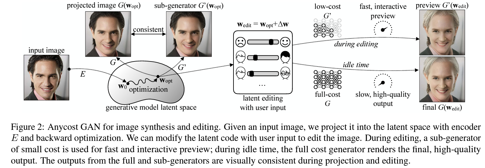
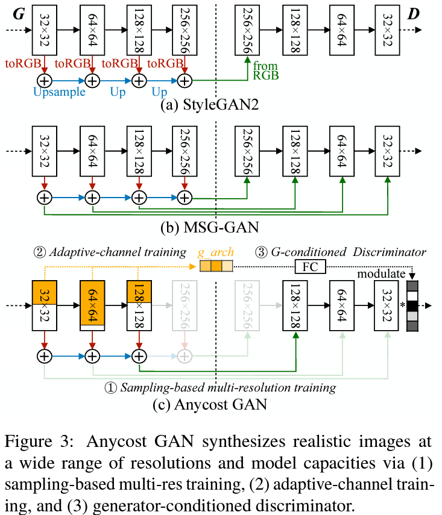
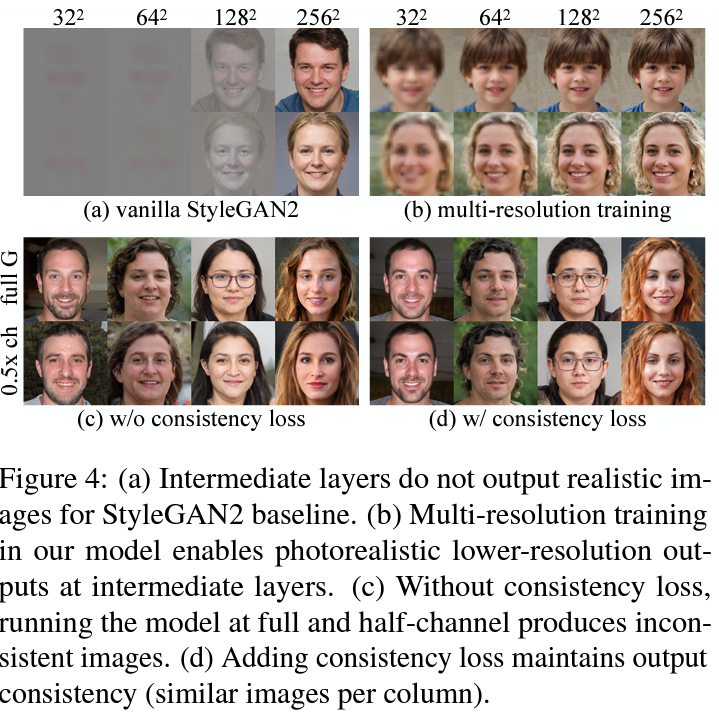
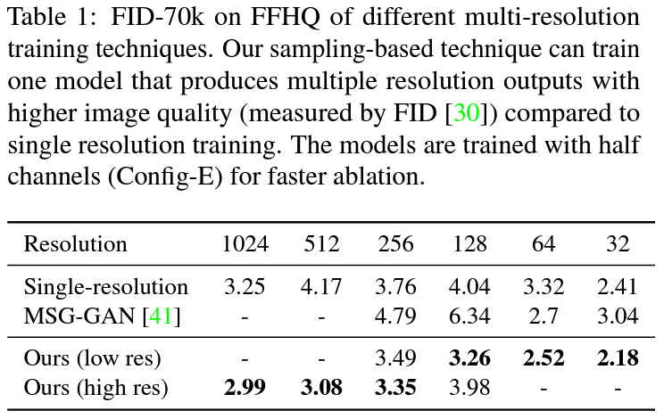
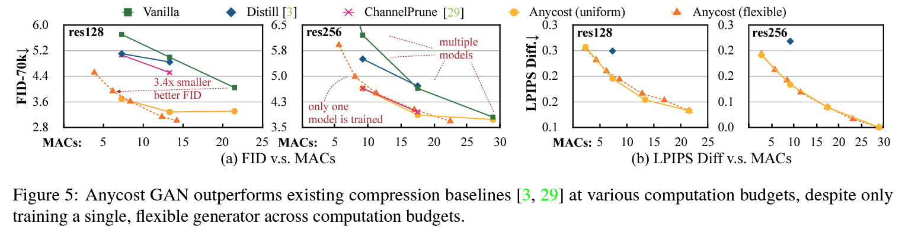
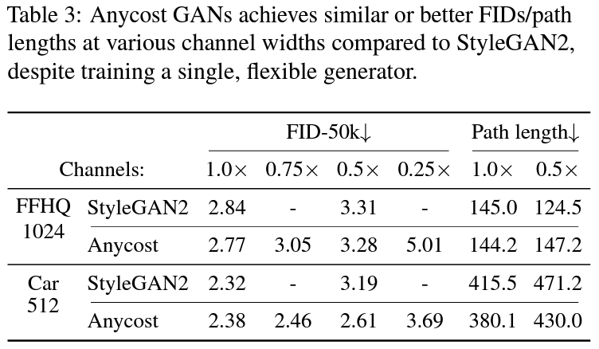
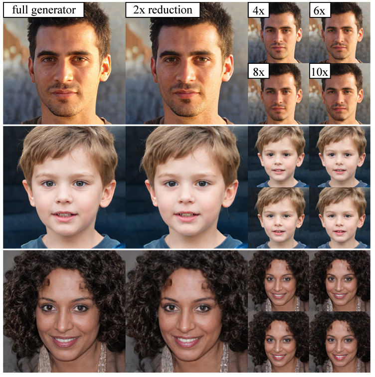

## TL;DR

Github에 들어가면 우측 상단에 `Explore repositories`에서 종종 재밌는 repositories를 추천해줘서 자주 구경 중인데, `AnycostGAN`도 이렇게 보다 논문까지 읽어보다 재밌어 보여서 짧게 정리해 보려고 합니다.

* paper : [arXiv](https://arxiv.org/abs/2103.03243)
* github : [repo](https://github.com/mit-han-lab/anycost-gan)

## Related Work

* StackGAN : [paper](https://arxiv.org/abs/1612.03242)
* ProGAN : [paper](https://arxiv.org/abs/1710.10196)
* StyleGANv2 : [paper](https://arxiv.org/pdf/1912.04958.pdf)
* MSGGAN : [paper](https://arxiv.org/pdf/1903.06048.pdf)

## Introduction

대부분의 이미지 synthesis하거나 editing 하는 모델들을 보면 엄청나게 커서 computation cost가 꽤 드는 편인데 (e.g. StyleGAN2, ...), 고성능 GPU에서 inference 해도 몇 초가 걸리기도 하다는 점을 issue 합니다. 유저들이 실시간이나 edge-device에서 사용하려면 빠르고 computation cost가 낮아야 하는데, 이런 점들을 이번 논문에서 이미지 퀄을 비슷하게 유지하면서 x6 ~ 12 빠르게 생성이 가능한 무언가를 제안합니다.

논문의 목표는 `run at diverse computational costs`라고 하며, 넓은 범위의 computational costs에 따른 계산(~= 이미지 생성)이 가능하다는 점 입니다. editing 같이 빠르게 수정해야할 니즈가 있는 건 low-cost(sub) generator를 사용해 preview를 보여주고, 최종 결과물을 render할 때엔 high-cost(full) generator를 사용할 수 있다고 합니다.

아래와 같이 크게 `3개의 특징`으로 정리해 볼 수 있습니다.

1. `stage-wise training` to stablize the process
  * a generator가 여러 configurations에 대해 minmax optimization하는 건 pretty challenging한 일
2. two types of `channel configurations`
  * uniform channel reduction ratio
  * flexible ratios
3. `consistency-aware` encoder & `iterative optimization` for image projection
  * optimize reconstruction loss for the both generators

## Architecture

위에는 AnycostGAN의 전반적인 flow.

### Learning Anycost Generators

아래는 다른 구현체들과 AyncostGAN architecture를 diff한 이미지

#### Multi-resolution training

이미 이전에 StackGAN, StyleGANv2처럼 diverse resolutions 이미지를 생성하는 연구가 있었지만, low-resolution과 output (high-resolution) 이미지가 자연스럽지 못하다는 문제를 듭니다.

그래서 `multi-scale objectives`를 추가해서, gradually 여러 해상도의 좋은 퀄 이미지를 얻을 수 있다고 합니다.

multiple-resolutions로 학습할 때, MSG-GAN에서 채택한 방식처럼 학습하면 (주로 large-scale datasets에서) fidelity degradation이 발생할 수 있다고 합니다 (single-resolution으로 하는 방법 보단).

그래서 `sampling-based` objective를 제안했는데, 한 step에 하나의 resolution에 대한 imsage를 sample해서 사용한다고 합니다. 또한, `low-resolution` image를 생성할 땐 $G$ network의 중간 layer를 output으로 사용했다고 합니다.

아래는 multi-scale objectives를 추가했을 때 해상도 별 이미지 퀄리티를 확인할 수 있는데, 확실히 각 resolution-level(?)별로 퀄리티가 훨씬 좋아지는 점이 있습니다. 또한, consistency term도 추가해 low/high resolution 간 perceptual도 훨씬 좋아진 걸 확인할 수 있네용

#### Adaptive-channel training

computational cost를 줄이기 위해 channel 부분도 variable 하게 만듭니다. 각 layer 마다 다른 channel multipliers를 가지게 하는데, `uniform` or `flexible`한 전략을 소개합니다.

각 training iteration에, channel multiplier을 sample하고, sample한 부분만 update한다고 합니다.

마지막으론, 모델을 초기화할 떈 이전 stage에서 학습한 weight를 사용하고, magnitude of kernel에 따라 conv layer의 channel을 sort했다고 합니다.

요 정도로 학습하면 어느 정도 잘 학습하지만, 논문에서 목표하는 정확한 preview (full image와 consistency가 있어야 함)를 생성하는데 문제가 있다는 점을 언급하며 `consistency loss` term을 추가합니다.

* `consistency loss` = `MSE loss` + `LPIPS loss`

#### Generator-conditioned Discriminator

각각 다른 sub-generators의 channels과 resolutions을 한번에 학습해야 하는데, single discriminator를 사용하는건 성능에 영향을 줄 거라 생각해서 `generator-conditioned` discriminator를 만들었다고 합니다.

여러 직관적인 방법이 있겠지만, 설계 및 성능상 영향을 줄수 있어서 `learning-based` 접근 방식으로 `conditioning`을 구현했다는데, 위에 이미지 Figure3(c)에 4차원 짜리 vector (one-hot encoding한) *g_arch* (for the ratios)을 concat해 준다고 합니다.

#### Searching under different budgets

한 줄 요약으로 `evolutionary search`로 적절한 budget내에서 configuration을 찾을 수 있다고 캅니다.

### Image Projection w/ Anycost Generators

#### Consistency-aware image projection

editing task를 진행하려면 먼저 image를 latent space로 projection해야 하는데, 2 가지 방식이 있을 수 있습니다.

* Encoder-based projection
  > $E^{*} = argmin_{E} L(G(E(x)), x)$
  >
  > $L = MSE + LPIPS$

* Optimization-based projection
  > $w^{*} = argmin_{w} L(G(w), x)$ with iterative gradient descent
  >
  > $L = MSE + LPIPS$

하지만 랜덤하게 sampled된 latent code로 부터 이미지를 생성하면, predicted/optimized $E(x)$는 prior distribution을 follow하지 못할 수 있습니다.

그래서, full generator에서도 동작해야하고 randomly sampled된 latent code에 대해서도 잘 동작할 수 있게 objective를 수정했다고 합니다.

> $E^{*} = argmin_{E} [L(G(E(x)), x) + \alpha E_{k,c^{\lambda}}(G_{C}^{k}(E(x)), x)]$
>
> $w^{*} = argmin_{w} L(G(w), x) + \alpha E_{k,c^{\lambda}}(G_{C}^{k}(w), x)$
>
> $\alpha = 1$

#### Image-editing with anycost generators

latent code를 edit하기 위해서 간단하게 $\Delta w$를 $w$에 더해줍니다. 즉, 다음곽 같이 새로운 이미지를 생성합니다.

> $G_{C}^{k}(w + \Delta w)$

## Performance

### single vs multi-resolution on FFHQ

FFHQ dataset에서 FID-70k를 측정했는데, sampling-based multi-resolution으로 학습을 하니 single resolution method보다 좋은 FID를 얻었네요.

### Budgets

다음은 성능대비 costs를 benchmark한 plot인데, 다른 methods들 보다 가성비가 좋다는 것도 보여줬습니다.

### StyleGANv2 vs AnycostGAN

성능도 comparable하게 가져가고 있다는 점도 흥미롭네요

### Generated samples

## Conclusion

결론 : 굳굳굳
