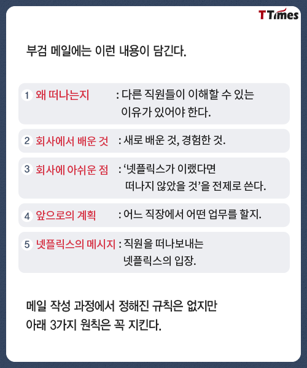
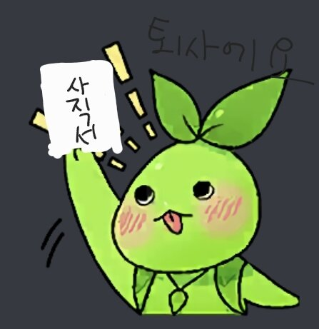

## TL;DR

올해도 여러 큰 사건(?)들이 있었지만, 그 중 **또 한 번의 이직**이 가장 큰 사건이 아닐까 싶습니다. 지난 2년 동안 회사를 알아보고 이직하는 과정을 매년 하니 지치고 병특이라 총알(이직 선택지)이 많이 없어서, 일단 환경이 어떻든 버텨봐야 지란 마인드로 살아왔는데, 어느 순간 돌이킬 수 없는 현타가 왔고 결국 이직을 하게 된 거 같습니다.

Netflix에는 퇴사 문화로 [postmortem e-mail](https://content.v.kakao.com/v/5e54ead52007421c9da29a4b)라는게 있습니다. 퇴사하는 직원이 퇴사 당일 동료에게 메일 한 통을 보내는 문화인데, 갠적으로 회사에서도 퇴사자가 왜 퇴사를 하는지 알 수 있고 퇴사자도 자기 생각을 정리할 수 있는 좋은 문화라 생각합니다.

마침 배민 기술 블로그에 올라온 [퇴사 부검](https://techblog.woowahan.com/2723/)글도 보면서, 올해는 Netflix 퇴사 부검 문화에 맞춰서 회고해 볼까 합니다.

## 퇴사 부검

### 1. 왜 떠나는지

개인적으로 개발을 취미로 할 정도로 무언갈 공부하고 개발하는 걸 정말 좋아하는 일상이 개발인 개발자인데요, 여담으로 벌써 개발 공부를 중1 때 시작했으니 시작한 지도 10년이 넘었네요.

가끔 주위 사람들이 "개발이 취미고 직업도 개발자니, 덕업일치네~" 라는 말을 하는데, 사실 이 말은 **50%는 맞고 50%는 틀린 말**이라 생각해요.

개발하는 게 정말 좋아서 **업무 자체에서 오는 스트레스는 거의 없고** 그 순간순간이 재밌다 느껴지는 부분에서 50% 맞지만, 50% 틀린 이유는 **내가 하고 싶은 재밌는 개발**을 했을 때 재밌지, 내가 원하지 않는(직무와 관련이 없는) 스텍이나 좋지 않은 개발문화에서 일하는 건 정말 스트레스인 거 같아요.

예를 들면 회사에서 `이상과는 다른 개발`을 했다면 퇴근 후엔 `이상적인 개발`을 하면서 힐링하는 느낌이에요. (물론 회사에서도 재밌는 일을 하고 있어요)

그래서 회사를 고를 때 연봉이나 다른 조건보다 더 중요하게 보는 게, **정말 내가 재밌게 일할 수 있을까?**, **나중에 돌아봤을 때 남는 게 많을까?** 에요.

저는 지금 Data Scientist/Machine Learning Engineer 연관 직무에서 일하고 있고 현재까진 **재밌게**란 기준이 다음과 같은데

1. 지금까지 경험하지 못한 주제
2. 주제 자체가 너무 매력적이고 재밌어 보이거나
3. 해당 주제로 해볼 만한 게 많은 곳

% 주제 : 서비스, 회사가 가진 데이터

이번에 떠나는 이유는 **다른 이유가 더 크기도 하고 3번에 가까운 거** 같아요.

처음엔 추천시스템이란 주제가 전에 경험해본 적 없는 새롭고 재밌어 보이는 주제였고 서비스에서 유저들에게 추천시스템을 개선해서 좋은 사용자 경험을 주고 싶은 생각으로 입사를 하게 됐는데, 개인적으론 시간이 지날수록 추천이란 한 가지 주제에 집중하기엔 어려웠고 추천 이외에 해볼 수 있는 주제들도 한계가 느껴졌습니다.

정리하면 **회사에서 내가 재밌게 할 일이 더 있나?** 란 질문에 저도 답을 찾지 못했고 회사도 답을 주지 못해서 결국 떠나게 된 거 같습니다.

#### 바로 떠나지 않은 이유?

사실 작년 말 ~ 올해 초부터 퇴사 고민을 시작했는데,

* 정말 내가 현재 상황을 개선하기 위해서 많은 노력을 했나?
* 그런 노력 없이 그저 더 좋은 환경만을 바라는 도피성 이직인가?

**무언가만 바라거나 도망쳐서 도착한 곳은 절대 행복할 수 없는** 걸 알기에, 적어도 내가 할 수 있는 노력은 다 해야 후회 없이 후련하게(?) 떠날 수 있을 거 같아서 그 시점부터 기술적이나 문화적으로 더 노력해 봤던 거 같아요.

### 2. 회사에서 배운 것

1년 반이라는 짧다면 짧고 길다면 긴 시간이지만 그래도 다양하고 많은 일을 했습니다.

다양하고 많은 일을 하고 성과도 냈지만, 사실 배운 것이 제일 아쉬운 부분입니다. 좋게 말하면 **내가 알고 있는 지식을 정리하고 팀 문화에 정착/기여**했다고, 나쁘게 말하자면 **없다**인 거 같아요.

주로 팀에서 제 역할은 기술을 팀에 적용하고 팀원들을 기술적으로 케어해 주는 그런 역할이었던 거 같아요. (물론 이 과정에서도 배운 게 있다고 생각합니다).

이번 회사까지 경험을 통해 확실하게 나에 대해 깨달은 것들이 있는데 하나만 적어보자면,

#### 너! 내 동료가 제발 되어주세요

직무적인 부분에선 주로 혼자 일을 했고 처음에는 일에만 몰입하느라 잘 몰랐는데, 혼자 일을 할 때의 장점도 있지만 내가 하는 일에 feedback을 줄 수 있는 동료가 없고 서로 대화하면서 문제를 푸는 즐거움을 느끼지 못하는 부분에서 시간이 지날수록 정말 힘 빠지는 걸 느꼈습니다. 그래서인지 회사를 구할 때 가장 먼저 확인하는 부분이 같은 직무에 동료가 있는지를 1순위로 확인하곤 합니다.

### 3. 회사에서 아쉬운 점

물론 아쉬운 점은 있지만, 입사했을 때 업무에 집중하고 일하는데 필요한 것들을 물어봤을 때 답했던 것들이 결국엔 현실적이거나 여러 문제로 이뤄지지 않았지만, 개인적으로 일부는 내가 더 적극적으로 노력했다면 어쩌면 해결할 수 있었을 텐데 생각이 들어 저에게 아쉬운 점이 남아있긴 하네요.

### 4. 앞으로의 계획

새로운 회사에 12월 6일 입사를 하는데, 다시 핀테크 회사로 가게 됐습니다. 사실 앞으로의 생활(?)이나 업무가 어떻게 될지 아직도 잘 모르겠어요 ㅋㅋㅋㅋ. 그래도 재밌는 경험할 수 있을 거 같아서 기대되는데, 이전에 할 수 없었던 새로운 경험을 할 수 있으면 좋을 거 같습니다.

### 5. 회사의 메시지...?

(아마 누군가 어딘가에 남겨 주시겠죠...?)

## 정리

여러 분들과 여러 이야기하면서 제 생각과 입장을 존중해주셔서 감사하고, 개인적으로 느꼈던 팀에 아쉬웠던 점들이나 더 잘되기 위해서 어떻게 하면 좋을지 피드백 남기면서 (저는) 잘 마무리했다 생각하는데, 쨋든 올해도 새로운 곳에서 새로운 도전하게 됐고, 잘해 나아갈 수 있으면 좋겠습니다.

