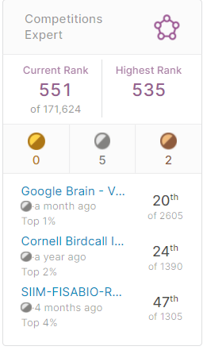

## TL;DR

2020년도 회고한 지 얼마 안된 거 같은데 벌써 2021년이 끝나가네요. 올해에도 심경의 변화나 많은 events가 일어나진 않았지만, 최근에 쓴 [퇴사부검](https://kozistr.tech/%ED%87%B4%EC%82%AC%EB%B6%80%EA%B2%80/)글도 그렇고 일어난 일 하나하나 **굵직**했던 거 같아요.

## Kaggle

작년에 세운 목표가 `Competition Master`를 달성하자란 목표를 세웠는데, 올해 정말 아쉽게 목표를 달성하지 못했습니다. `Google Brain`에서 주최한 `Ventilator Pressure Prediction`라고 lung ventilator의 데이터로 `pressure` sequence를 예측하는 대회가 있었는데, 아쉽게 `20th / 2605`을 하면서, 금메달을 얻지 못했습니다.

그래도 올해 했던 일 중 가장 뿌듯하고 재밌었던 일이었는데, 작년 `Birdcall Identification Challenge`처럼 다른 분과 team up 해서 대회를 진행했습니다. 그 과정에서 서로 아이디어와 전략을 내고 토론하는 과정이 정말 재밌었고 이렇게 열심히 열정적으로 일한 적이 언제였지? 란 생각도 들면서 회사에 대한 현타도 동시에 들더라고요.

그래도 CV에 적어둔 실적들을 보니까 매년 성장하고 있는 느낌이 들어서 뿌듯하네용

쨋든 아쉽지만 올해는 달성하지 못 했으니 내년에도 다시 열심히 해 봐야 겠어요. 물론 `Compeition GrandMaster`가 되는 날 그 이후에도 열심히 할 거에요!

## 회사

이직 했습니다. 몇 주전에 쓴 [퇴사부검](https://kozistr.tech/%ED%87%B4%EC%82%AC%EB%B6%80%EA%B2%80/) 글에 이직한 이유에 대해 적어봤지만, 요약하면 정말 제 분야에서 토론하고 가슴뛰는 일을 다시 해 보고 싶어서인데, `Kaggle` 이나 2년 전 `VoyagerX` 회사에서 경험을 잊지 못해선지 계속 **그런 환경**을 찾으려 돌아다니는 거 같아요. 하지만, 이상만을 바라는 것은 잘못된 거고 힘들다는 걸 알지만, 여러 팀하고 이야기하고 경험해 볼 수록 원하는 게 너무 이상적인가? 타협하고 버텨야 하는 건가? 란 생각도 들고 여러 생각이 들면서 힘들더라고요.

이런 생각을 작년부터 쭉 해 왔고, 지금은 어느 정도 타협하고 기준과 관점을 조금 바꿔봤습니다. 이번에 이직한 회사를 선택한 이유도 그렇고요.

아직 2주 밖에 안됐지만, 새로운 기준으로 고른 곳이 내가 정말 바라는 이상적인 환경과 거리는 있지만 이상적이라 생각하는 환경을 내가 주도해서 만들기엔 좋은 곳이라 생각해요. 이제 막 팀 빌딩하고 문화를 만들어 나가는 단계인데, 이번에도 열심히 해 봐야 겠습니다!

## 운동

운동도 꾸준히 하고 있습니다. 집에서 열심히 홈트를 하고 있는데요, 올해 초만 해도 헬창 마인드로 빡세게 했는데 요즘엔 전보단 시간 없거나 목표가 분명하지 않아서 조금 느슨해진 감이 있어요. 그리고 살찌는 음식을 전보다 많이 먹어서인지 복근이 점점 사라지고 있는데, 유산소도 다시 열심히 하고 당장 목표도 분명하게 세워서 열심히 해야 할 거 같아요. 운동 시작할 처음에 [`4년 안에 풀 플란체`](https://namu.wiki/w/%ED%94%8C%EB%9E%80%EC%B2%B4) 하는 걸 목표로 잡았었는데, 더 단계적이고 구체적인 목표를 세워야 할 거 같아요.

그래도 확실한 건 운동을 시작하고 난 후부터, 몸도 더 가벼워지고 사람같이 건강해진 느낌이 들어서 만족하고 있습니다.

## 취미

취미가 운동 말고는 너무 정적이라 야외에서 하고 동적인 취미를 하나 가져보고 싶긴 했습니다. 천체 관측하는 걸 좋아해서 고등학교 때 동아리도 했었는데, 언젠가 여건이 된다면 꼭 해보고 싶어요.

요리하는 것도 좋아해서 전엔 자주 했었는데, 요즘엔 또 귀찮아져서인지 안 하게 되더라고요. 연말엔 맛있는 요리 해서 가족이나 친구들하고 연말파티도 하고 싶었는데 코시국 때문에 뭔가 애매해 졌네요.

## 훈련소

올해 5월에 3주 동안 논산에 있는 훈련소도 다녀왔습니다. 3주 동안 외부망 안되는 sandbox에 가만히 앉아있으니 멍한 것처럼 아무 생각도 들지 않더라고요. 마침 코로나 때문에 훈련소 극단적인 규제 등이 기사에 떠돌던 때라 걱정도 많이 했는데 (실제로 들어가기 전에 식사를 거의 안 함), 다행히 기사가 나온 직후라 규칙이나 그런 것들이 많이 풀려서 편하게 갔다 왔습니다.

## 계획...?

* 좀 활동적인 취미 가지기
* Kaggle Competition Master
* 팀 문화 잘 만들어 나가기
* 운동 꾸준히 열심히 하기
