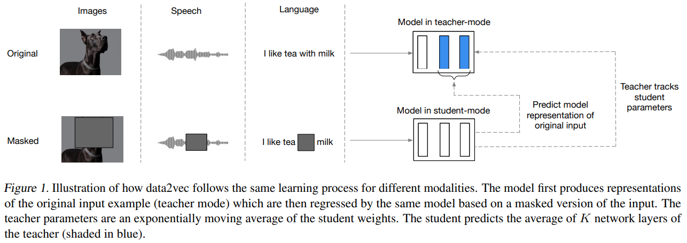
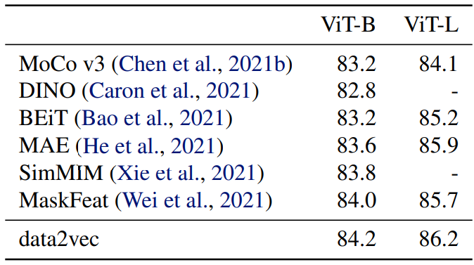
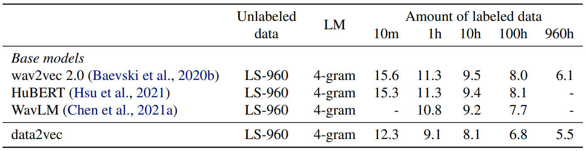
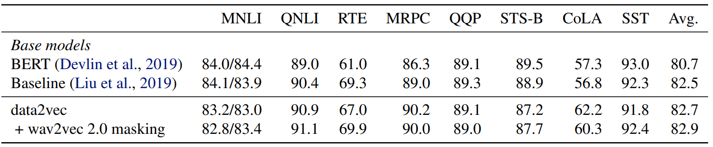
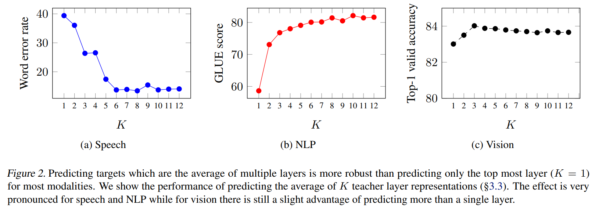

## TL;DR

FAIR에서 `Data2Vec`이란 논문이 나왔는데, multi-modal SSL paper라 해서 흥미가 생겨서 읽게 됐습니다. 읽기 전 궁금했던 points는 modality마다 feature extraction methods가 다를텐데, 어떤 methods를 썼는지 새로운 SSL method를 사용한지 등이 궁금한 points 였습니다.

* github : [repo](https://github.com/pytorch/fairseq/tree/main/examples/data2vec)
* paper : [arXiv](https://scontent-ssn1-1.xx.fbcdn.net/v/t39.8562-6/271974914_483120576492438_4239522333319653600_n.pdf?_nc_cat=107&ccb=1-5&_nc_sid=ae5e01&_nc_ohc=9HtSivaeiYUAX_1c9_p&_nc_ht=scontent-ssn1-1.xx&oh=00_AT8HvfocQusNWG2UUeuUs-uPCgg1CowqROfH2TBtN4W8PA&oe=61FBE0D1)

## Related Work

related works가 많은데, 요약하면 각 domain에서 SSL을 하던 방식에 대한 related works가 많다.

* image domain SSL 자료 많은 곳 : [github repo](https://github.com/facebookresearch/vissl)
* BERT : 대충 BERT 논문 (MLM)
* Wav2Vec 2.0 : [arXiv](https://arxiv.org/abs/2006.11477)
* HuBERT : [arXiv](https://arxiv.org/abs/2106.07447)

## Introduction

논문에서 말하는 목표는 `modality 상관없이 general하게 잘 되는 SSL 방식을 제안`이라고 합니다. (`modality-free` SSL)

## Architecture

architecture는 다음과 같습니다. (standard) Transformer 구조를 사용했고, modality 별로 encoding 방식을 특정해 적용해 넣었다고 합니다.

같은 구조 (Transformer)의 TS (Teacher & Studnet) mode가 존재하고, full input representation & partial input mask prediection task를 학습하는 방식입니다.

Teacher는 Student model의 weights를 EMA로 update하고 Studnet는 그대로 사용합니다.

### Encoding

#### Image Domain

ViT 하듯 합니다. 16x16 patches 로 이미지를 나누고 sequence로 다룹니다.

#### Speech Domain

Wav2Vec 2.0 하듯 합니다. 16kHz sampling 된 waveform을 1d-cnn에 태워서 50Hz representations으로 바꿔 사용합니다.

#### Text Domain

BPE 씁니다. subword 기반 tokenizer로 tokenized 된 token들의 representation을 사용합니다. 구체적인 방법은 논문 chapter 4에 있습니다

### Masking

masking 방식도 modality 마다 다른 방식을 적용합니다.

image는 patch-wise masking, speech는 (latent) speech representation masking, text는 token-wise masking

### Training Targets

모델의 학습 방식은 masked input (contexualized representation)만 predict 하는 방식으로 학습합니다. 논문에선 기존 method들은 contextual information 을 놓쳤다는 점에서 다른 점이라 말하네요.

### Teacher Parameterization

위에서 Teacher model의 weight를 EMA update했다 했는데, 구체적으로는 다음과 같이 update 했다고 합니다.

EMA 하면 formula는 아래와 같을텐데,

> let $\delta$ = the weights

> $\delta = \gamma \delta + (1 - \gamma) \theta$

논문에서 $\gamma$는 constant 가 아닌 dynamic 하게 schedule 해서 사용했다고 합니다.

첫 $n$ steps는 linear하게 $\tau_{0}$ to $\tau_{e}$ 증가시키고, $n$ steps 이후에는 쭉 유지시킨다 합니다. 이렇게 한 이유는 학습 초반에 teacher update 를 더 많이 시키려 했다고 합니다. ($\tau_{0}$ = 0.999, $\tau_{e}$ = 0.9999)

더 디테일한 실험에서는 feature encoder하고 PE 부분은 EMA 하지 않는 편이 더 좋다고 합니다.

### Targets

Transformer architecture에서 representation을 뽑을 때 주로 마지막 Transforemr block을 mean 하는데, 여기선 last K blocks의 masked 부분만 뽑아서 mean 했다고 합니다. 아래에 나오겠지만 K에 따른 performance benchmark를 헀을 때, 6 (base 기준 절반)이 가장 잘 됐다고 합니다.

formula로 쓰면 아래와 같습니다.

> $y_{t}$ : time-step $t$에 대한 representation $y$,
> $K$ : last K (Transformer) Blocks,
> $L$ : L (Transformer) Blocks,
> $\alpha_{t}^{l}$ : time-step $t$ $l^{th}$ block,
> $\hat{}$ : normalized

> $y_{t} = {1 \over K} \sum^{L}_{l=L - K + 1} \hat{\alpha_{t}^{l}}$

위와 같은 targerts을 생성하면서 collapsing issue가 있다고 했다. 문제와 해결책으로는 아래와 같습니다. 한 줄 요약은 normalization 만 하면 적당히 잘 된다.

1. normalization
   * For speech domain, utilizing instance normalization
   * For text, vision domain, utilizing parameter-less layer normalization
2. regularizer 변경
   * variance-invariance-covariance regularizer
3. do not use high learning rate & short warm-up
   * do tuning
4. low EMA decay value
5. longer span masking for speech domain

### Objective

Smooth L1 loss를 사용했다. $\beta$는 튜닝이 필요하다고 하더라.

## Performance

### Computer Vision benchmark

기존 vision domain SSL 성능보다 좋은 것을 보여주고 있습니다.

### Speech benchmark

### Text benchmark

추가로 wav2vec 2.0 masking method (연속으로 4 tokens masking 하는)도 테스트 했는데, 더 좋은 성능을 보였다고 합니다.

### K benchmark

$K$ blocks 에서 $K$를 어디까지 쓸까에 대해서도 도메인 별 benchmark를 했는데, 6이 가장 무난한 값이라고 하네요.

## Conclusion

여러 modality를 한곳에 모아 유의미한 결과를 보였다는 점에서 재밌는 시도였다고 생각합니다. 하지만 새롭다기보단 기존의 방법론들을 채용해와 조립했다는 점에서 novelty가 약하지 않느냐란 생각이 들었다. 또한, hyper-parameters에 robust 하지 못한 점도 아쉬운 거 같다.

결론 : 굳
