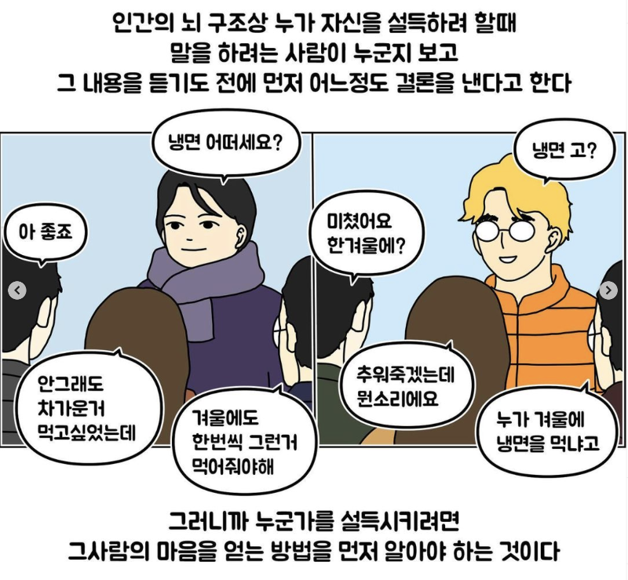

## TL;DR

벌써 토스로 이직한 지 3달이 됐네요. 사실 블로그에 글로 쓸 생각은 없었는데, 짧지만 정말 여러 가지를 생각하고 느끼기도 했고 입사 당시에는 토스 문화에 대해서 잘 알지 못했는데, 여기에 남겨보면 어떨까 해서 글을 씁니다.

토스 문화에 관심 있으시거나, 저랑 같은 고민을 하신 분들 등 분들에게 정보나 공감이 되지 않을까 생각했어요. 어쩌면 나중에 다른 곳에서 같은 고민을 하고 있을 때 도움이 될 거 같기도 합니다.

## 회사 고르는 기준

작년 21년 회고에서도 말했듯, `회사를 고르는 기준`에 큰 변경이 있었어요. 전/후로 차이를 비교하면 아래와 같은데, 3년 동안 많이 바뀐 거 같아요 **180도 달라진 기준**이라 생각해요. (~~그래도 GPU는 못 참습니다~~)

As-Is (2019년)

1. 내가 (직무에서) 기술적으로 성장할 수 있는 환경
2. 같은 background가 있는 동료와 재밌게 일 할 수 있는 환경
3. GPU 많은 곳 (진심)

To-Be (2021년)

1. 내가 주도할 수 있는 환경 (기술, 문화 모든 것을)
2. 나와 다른 background를 가지고 있는 사람들과의 협업
3. 현업 (기술적인 부분)이나 이외에서 직접 설득하는 일이 많은 곳
4. GPU 많은 곳 (진심)

사실 아직 **As-Is** 기준을 선호하긴 하지만, 제가 더 성장하려면 새로운 환경이 필요했고 단순히 개발 잘하는 사람이 아니라 사람들을 설득하고 공감을 얻고 팀 규모의 문화나 기술을 정착하고 관리하려면 **To-Be** 경험이 필요하다 판단했어요.

## 입사전

들은 이야기가 하나 없는 회사니 면접 전에 팀원 분과 tea time 가지면서 여러 이야기도 나눴고 면접 때도 어떤 회사와 팀일 거 같다는 예측(?)을 했는데, 이전에 ML/DL 서비스를 시도한 적 없는 신생 회사/팀이고 계신 분들도 ML/DL 쪽으로 background가 크게 없는 등 큰 장애물이 있다 생각했지만, 이런 환경도 극복하고 직접 문화를 만들어 나가는 과정에서 배우는 점이 있을 거라 생각했어요. 결국 **To-Be**에는 토스가 적합하다 생각해서 합류하게 됐습니다.

## 입사후

입사전 우려와 같이 **제가 생각한 방향과 전혀 맞지 않았어요**. 하지만, 바로 제가 생각하는 방향으로 작업하거나 피드백을 주지 않았어요. 이유는 아래와 같아요.

### 공감

아마 토스 블로그나 여러 자료를 보면 토스에서 가장 중요하게 생각하는 것 중 하나가 있는데 바로 **공감, 신뢰** 입니다. 제가 동료의 신뢰나 하는 일에 공감 없이 진행한다면 그 일은 지지를 받지 못하고 결국 쓸모없는 일이 됩니다. 또한, 이전의 context 이해 없이 방향을 제시하는 건 대단히 조심해야 하는 행동이라 생각해요.

그래서 문제점이 보여도 바로 피드백하지 않고 처음 1달 정도는 팀과 회사의 context를 이해하는 데 노력하고 동료의 신뢰를 얻는 데 노력했어요. 물론 정말 침묵과 100% 수용만 하는 게 아닌 새로운 문화를 도입하기 위해서 문서를 통해서 회의 때 공유하거나 하는 등의 노력도 꾸준히 했습니다.

개인적으로도 **이 과정이 너무 답답하기**도 했어요. 빠르게 체계적인 팀 문화를 도입하고 효율적으로 제품을 만들어야 하는데, 이런 과정이 길어지면 제대로 속도도 내지 못하고 효율이나 퀄리티도 보장하지 못한다 생각합니다. **하지만**, 신뢰와 공감을 얻지 못하고 아무리 좋은 방향이라 해도 도입했다면, 어쩌면 다른 분들에게 상처를 줄 수도 있고 제 일도 잘할 수 없다는 점을 통해 이런 과정이 **필수적이다** 라는 것을 깨달았어요.

### 공감 & 신뢰 얻는 법

동료의 공감과 신뢰를 얻기 위해서 저는 다음과 같은 일들은 했어요.

1. 팀에서 비효율적인 부분 빠르게 개선 및 적용하기. 문서로 정리 & 공유하기
2. 빠르게 눈에 보이는 성과 내기
3. 팀원들 도와주기

이전 DS 팀에는 code convention이나 CI/CD 등 규칙 및 문서들이 존재하지 않았고, 퀄리티나 안정성, 문서화보단 일단 완성하고 보자 방식으로 업무를 진행해서 lagacy가 산재해 있었습니다. 저희 팀은 Notion을 주로 사용하는데, 저는 이런 convention이나 규칙들을 문서화하고 팀에게 공유해서 필요성과 우선순위에 대한 공감을 얻었습니다.

그리고 foramtter와 linter를 repository에 직접 적용하고 깔끔하고 좋은 코드를 구현하기 위해서 팀 전반적인 PR의 code-review에 참여 했습니다. 이외에도 MLOps 및 모델 연구관점에서 life-cycle, 여러 ML/DL 지식 등 많은 문서를 작성했는데 이 부분도 공감 받아 팀 문화적으로도 `필수적인 문서화`에 조금씩 기여하고 있는거 같아요.

이전에도 code-review 하는 문화가 있었지만, 제대로 이뤄지고 있지 않아서 이 부분도 손 걷어붙이고 제가 주도하면서 다른 분들도 그냥 LGTM이 아닌 건전하게 의견을 제시할 수 있게끔 했던 거 같아요. 아직도 개선하기 위해서 노력 중 입니당.

정리하면,

1. 팀이나 개인의 부채를 적극적으로 해결하고
2. 제 분야에서 성과를 보여주는 과정에서

신뢰를 얻게 된 거 같아요.

다만, 그 과정에서 가끔 저만의 아쉬움과 답답함이 나와서 부족한 모습도 있었는데, 앞으로 더 개선해야겠습니다. 처음엔 업무에서의 권한 없이 타인의 `공감과 신뢰`를 얻는 것에 대한 중요도를 잘 몰랐다면, 지금은 필요성을 알고 어려운 일이라는 걸 깨닫는 좋은 경험이었습니다.

또한, 토스에서 `권한`없이 제 실력과 방향에 대해 팀원들의 신뢰와 공감을 얻는 과정에서 많은 것을 배운 거 같습니다. 감사하게도 팀원 분들께서도 피드백 주시길 개인이나 팀 단위의 공감대를 잘 형성했다 말씀해 주셔서 제 방식이 잘 먹혔던(?) 거 같아요.

최근에 [회고](https://jojoldu.tistory.com/626)를 보면서 등장한 짤인데, 제 상황에 가장 알맞은 거 같아서 가져왔어요.

## 지금

작년까지만 해도 3달 수습기간이 있었지만, 지금은 사라졌습니다. 하지만 1.5 / 3 months review 문화는 그대로 남아있는데요, 피드백을 보면 제가 도입한 문화와 성과에 대해서 긍정적으로 생각하고 공감해 주셨다는 점에서, 토스에서 내가 목표하는 것을 잘 해내고 있다는 생각도 들고 더 좋은 팀을 만들어 나가야겠다는 생각도 드네요.

토스에서는 공감만 얻을 수 있다면 누구나 프로젝트의 DRI가 될 수 있는데, 그래도 드는 생각은 저나 ML 분야에 대한 background를 잘 이해할 수 있는 분이 계셨다면 어쩌면 더 빠르게 공감을 얻을 수 있고 더 좋은 문화와 체계를 이미 도입하고 사용하지 않았을까 하는 아쉬운 점도 남아 있어요. 어쩌면, 이런 부분에선 팀장 같은 `권한`이 있으면 어떨까란 생각도 들기도 합니다.

그래서 나중엔 팀장으로서 팀을 lead 하는 경험도 해 보고 싶네요.

## 미래

앞으로도 저는 0순위로 팀 문화를 잘 만드는 일에 기여하게 될 거 같아요. 이제 팀원들에 대한 신뢰도 얻었으니 제가 생각하는 방향에 대해서 더 적극적으로 제안하고 강하게 이야기해야 하는 부분은 이야기하게 될 거 같아요. 물론 그 중간 지점은 계속해서 잘 찾아 나가야할 거 같습니다.

## 한 줄 요약

처음엔 이게 맞나 생각했지만 배우는 부분도 많았고, 아직 해결할 문제가 많지만 하나씩 해결해 나가자!
