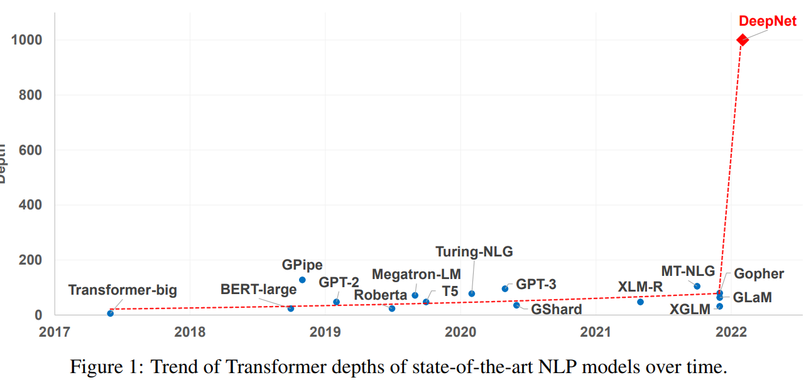
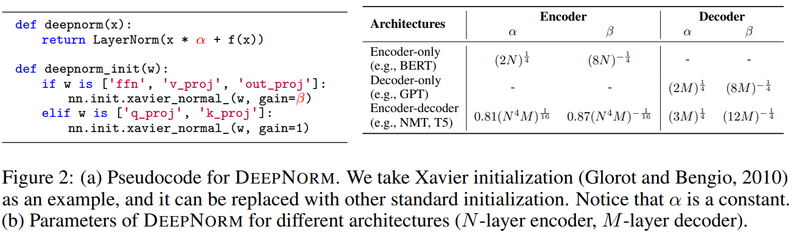
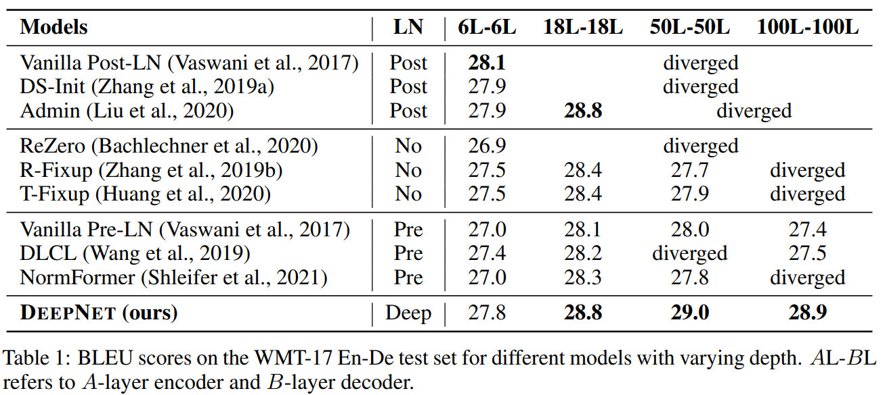

## TL;DR

최근 논문을 보면 complex 한 architecture를 design 하기보다는 training recipes을 제안하거나 large-scale 모델을 더 stable하게 학습하는 방법 등의 논문들이 많이 나오는 경향입니다 (개인적으로도 좋은 연구 방향이라고 생각함). 이번 microsoft에서 나온 `DeepNet`은 NLP에서 주로 `Transformer`를 쌓는데, `어떻게 하면 깊게 쌓아도 모델을 stable하게 학습할 수 있을까?`에 대한 연구를 진행했습니다.

아래는 시간에 따른 Transformers depths 변화인데, 최근 deepmind의 `Gopher`만 해도 ~ 200 depths 인 데 엄청나게 변화가 생겼네요.

* github : [repo](https://github.com/microsoft/unilm)
* paper : [arxiv](https://arxiv.org/pdf/2203.00555.pdf)

## Related Work

depth가 깊은 Transformer 를 학습할 때 학습을 stablize 하는 여러 논문들이 있는데, 관련있는 최근 논문 하나를 적어보면 `Gopher`가 있습니다.

* `Gopher` : [arXiv](https://arxiv.org/abs/2112.11446)

## Architecture

논문을 1장 요약하면 아래 이미지로 요약 가능합니다. 기존에는 `Post-LN` -> `Pre-LN` scheme을 통해 stability + performance 를 올리는 연구가 있었는데, `Pre-LN` 는 layer depths가 뒤로 갈 수록 앞 layer보다 gradient norm이 커지면서 performance degradation이 올 수 있다는 점을 이야기합니다.

`DeepNet`에서는 이 부분은 `initializations`을 잘해서 해결합니다.

### initialization

더 구체적으로 보면 크게 2가지인데,

1. residual connection 하는 부분에서 input 에 대해 scaling
2. 거의 비슷한데 (기존과 같이 xavier normal), 일부 layer에 gain 수정

$\alpha$ 는 depth가 깊어질수록 커지고, $\beta$ (gain) 은 작게 사용하네요.

## Performance

다양한 NLP task와 benchmarks를 진행했는데, large-scale 에서 diverge하지 않고 더 깊게 쌓았을 때 더 좋은 성능을 보여주고 있습니다.

### BLEU score

### BLEU score by depths

다른 methods 는 18 dethps (약 `large` recipe) 정도만 돼도 diverge 하네요.

## Conclusion

갠적으로도 training recipe 를 통한 성능 향상이나 이런 느낌의 연구들을 정말 좋아하는데, 1000 depths large-scale transformer 를 간단한 방법으로 stable 하게 학습할 수 있다는 점에 재밌는 거 같습니다.

결론 : 굳굳
