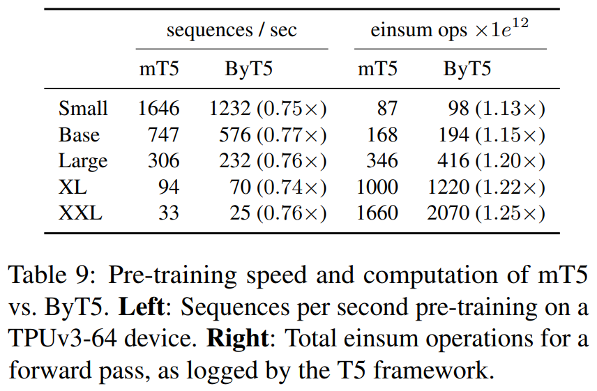

## TL;DR

* paper : [arXiv](https://arxiv.org/abs/2105.13626)
* code : [github](https://github.com/google-research/byt5)

## Related Work

* [CANINE](https://arxiv.org/abs/2103.06874)
* [mT5 paper](https://arxiv.org/abs/2010.11934)

## Introduction

기존 LM 에서는 tokenizer 를 사용하고 있어 여러 측면에서 단점이 있는데, 이런 문제를 해결하기 위해 `token-free` LM 모델을 제안했습니다.

`token-free` model 은 말대로 tokenizer 를 활용하지 않고 byte or character-level (utf-8 encoded) raw text 를 input 으로 받는 형태인데, 여러 장점이 존재합니다.

1. tokenize 하는 code or service 를 관리할 필요가 없다. (서비스 복잡도가 낮아지고 운영 부담 줄어든다.)
2. OOV (Out-Of-Vocabular) case 가 없다.
  * 특히 `T5` 같이 multi-lingual LM 인 경우에 더 유리
3. noisy-robust 하다.

그래서 이번 논문의 contributions 은 크게 3가지 입니다.

1. `token-free` model 시도
2. 기존 `token-based` model 에서 최소한의 수정으로 가능하게끔 구현
3. 여러 metrics, measurements 에서 `token-based` 에 comparable (or outperform) 한 architecture design

## Architecture

### Pretraining

위 이미지가 `PLM` 만드는 방법인데, `mT5` architecture 를 base 로 합니다. `mT5` vs `ByT5` 를 비교하는데, 다음과 같은 차이가 있습니다.

| architecture / features | text | mask | enc/dec |
| :---: | :---: | :---: | :---: |
| mT5 | SentencePiece | ~ 3 subword tokens | equal depth (`enc` = `dec`) |
| ByT5 | raw text (utf-8 encoded) | ~ 20 bytes | `enc` is **3x** deeper than `dec` |

recipe 에 주목할 만한 차이점이면, 기존 (mT5) 에는 ~ 3 tokens 를 mask 했다면 이번 연구에선 성능상 더 이점이 있어서 더 긴 길이를 (~ 20 bytes) mask 했습니다.

또한, encoder 가 decoder 보다 3x 더 깊은데 이것도 실험 결과 byte-level models 에선 encoder 가 더 깊은 게 좋다고 합니다.

### Design and costs

token 에서 byte-level character 로 바뀌면서 architecture design & recipe 에 차이가 생길겁니다. 크게 3가지가 변경점이 있을 텐데,

1. softmax-layer (output matrices) at the `Decoder`
2. sequence-length (~ attention)
3. data efficiency

#### softmax-layer at the `Decoder`

`mT5-base` 기준으로 decoder 에 output matrices 부분의 parameter 가 전체 모델의 parameter 대비 66% 를 차지합니다 (토큰 수가 많아서).
그런데, `ByT5` 는 byte-level output 을 주기 때문에 parameter 가 훨 작은데, 논문에서는 *동일한 parameter 규모를 가정*하면 transformer layer 를 더 쌓거나 hidden size 를 더 크게 가져가는 등 complexity 측면에서 이득을 볼 수 있다고 합니다.

#### sequence length

byte-level 로 가면서 token 보다 sequence length 가 길어질텐데, time & space complexity 가 heavy 해 질 수 있다. 무언가 이걸 해결하기 위한 가볍고 빠른 attention 을 utilize 하지는 않은 듯 합니다.

#### data efficiency

(mC4 dataset 기준) 언어 토큰 별 평균 byte 길이를 보여주는 건데, 2.5 ~ 9 bytes 에 평균 4 bytes 라고 합니다. 즉, 다른 모델과 같은 세팅으로 훈련하게 된다면 (fixed sequence length, training steps) 4 배 짧은 문장을 학습하게 됩니다. (e.g. 512 tokens -> 128 tokens)

## Performance

### GLUE benchmark

small, base 모델은 `ByT5` model 이 좋은데, 커 질수록 `mT5` 가 더 좋다. 그런데, 작은 모델에서 `mT5` 가 성능이 좋지 못한 이유가 decoder output layer 크기가 압도적으로 커서 다른 부분이 집중을 못 하는 issue 가 있다라고 해서, 사실상 그냥 comparable 하다라 보는 게 적절하다 생각함

### Generation benchmark

generation task 에선 잘한다.

### Inference Speed

train은 조금 느리고, inference는 더 많이 느리다.

## Conclusion

개인적으론 `token-free` model 접근은 재밌었지만 (`token-free` 개념 자체는 처음이 아니지만), utf-8 encoded bytes 를 input 으로 넣어주면서 다른 `token-based` model 대비 상대적으로 짧은 sequences 를 다루게 되면서 이 부분은 아쉬웠고, 일반적인 상황에서의 사용성을 생각하면 현재 연구 자체로는 너무 specific 하다고 생각한다. short-medium length 의 multi-lingual tranlsation 에만 적합한 느낌. 

그래도 후속 연구에서 generation & translation tasks 에 한정이 아닌 general manner 하면서 performance 도 comparable 한 무언가가 나오지 않을까?

결론 : 굳
