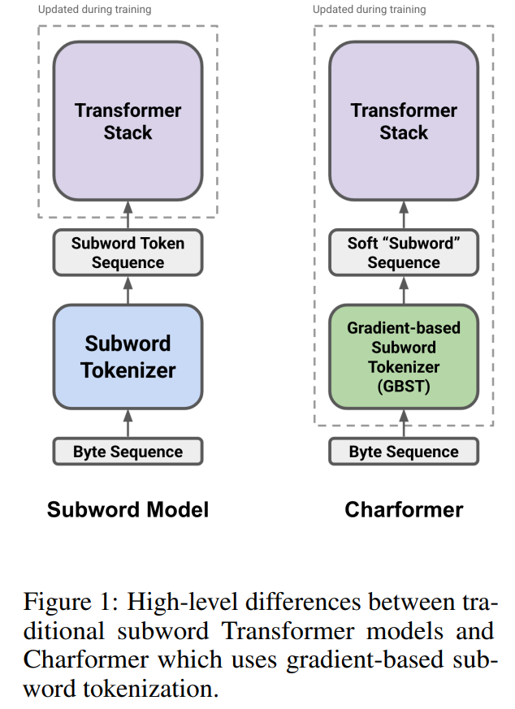
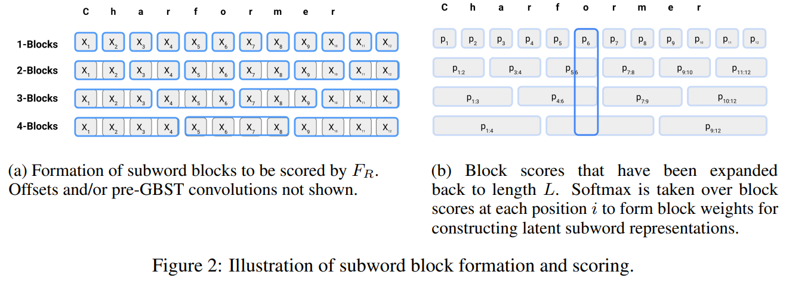
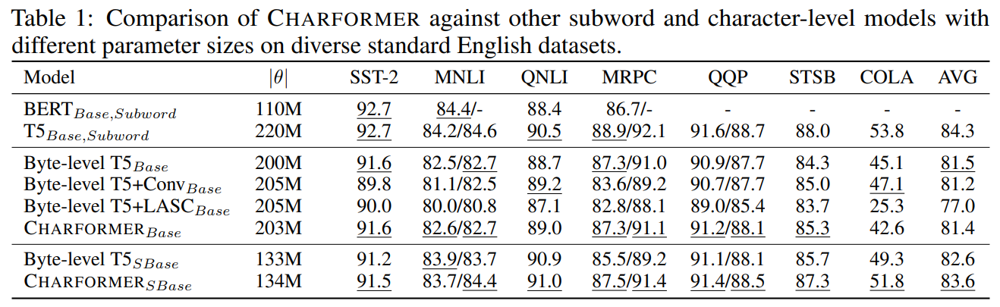
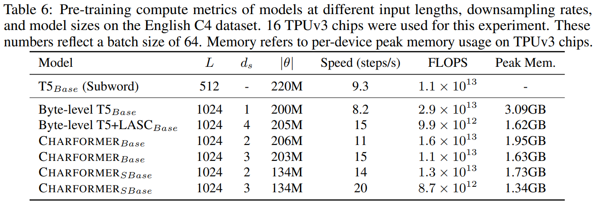

## TL;DR

* paper : [arXiv](https://arxiv.org/pdf/2106.12672.pdf)
* code : [github](https://github.com/google-research/google-research/tree/master/charformer)

## Related Work

* [mT5 paper](https://arxiv.org/abs/2010.11934)
* [ByT5 paper](https://arxiv.org/abs/2105.13626)

## Introduction

이번엔 gradient-based subword tokenization module (GBST) 를 만들었다. SentencePiece, WordPiece 나 raw text 를 받는 `token-free` 모델이 아닌 training 을 통해 subword representations 을 학습하는 무언가다. 연구에서도 강조하는 부분이 기존 `token-based` 보다 성능은 유지하며 속도 개선을 했다는 포인트다.

## Architecture

기존 pretrained token-based model 인 경우엔 왼쪽처럼 token 이 모델에 들어가고 Transformer model 만 학습하는데, `CharFormer` 는 tokenizer 부분까지 학습 대상입니다.

### Gradient-based Subword Tokenization (GBST)

input to GBST 는 $X \in \mathbb{R}^{L \times d}$, $L$ = sequence length (input characters, utf bytes), $d$ = character embedding dimension

학습을 통해서 최적의 subword segmentation 을 찾는다고 한다.

a subword (block) 은 다음과 같이 정의할 수 있다.

$X_{i:i + b}$ of length $b$ for $1 \leq i \leq L- b$

#### Constructing Candidate Latent Subword Blocks

$s$ = stride, $b$ = subword blocks of size for $1 \leq b \leq M$, $M$ = maximum block size, $F : \mathbb{R}^{b \times d} \in \mathbb{R}^{d}$ = (non-parameterized) strided pooling function

sequence of character embedding $X_{i:i + b} \in \mathbb{R}^{b \times d}$, single subword block representation $X_{b,i} \in \mathbb{R} ^ {d}$

subword blocks 는 다음과 같이 표현이 가능합니다.

$X_{b} = [F(X_{i:i+b});F(X_{(i+s):(i+s)+b});...]$

실제로는 stride $s$ 와 block size $b$ 를 같게 세팅해서, 다시 쓰면 $X_{b} \in \mathbb{R}^{\frac{L}{b} \times d}$ 요렇게 쓸 수 있습니다.

여기서 고민 포인트가 2가지 있을 수 있는데,

* strided implementation
* intra-blocks positions (ordering of characters)

strided implementation 이 어려웠던 이유가 모든 subwords 조합을 찾기가 현실적으로 어려웠기 때문에, $X$ 에 conv1d 연산을 해서 smoothing 느낌을 줬다고 합니다.

subword 내 character 간 positions 정보도 중요한데, 이런 정보를 살리기 위해서 각 subword 별 positional encoding 을 하려고 했지만, 이미 GBST layer 에 넣기 전 conv1d 를 하고 있고 mean-pooling function $F$ 를 사용하고 있어서 충분하다 판단했다고 합니다.

#### Block Scoring Network

모델이 어떤 block 을 선택할지를 학습하기 위해서 간단하게 block scoring network 를 만들었다고 합니다.
단순한 linear transformation 형태 $F_{R} : \mathbb{R}^{d} -> \mathbb{R}$

score 는 다음과 같이 쓸 수 있습니다.

$p_{b,i} = F_{R}(X_{b,i})$

그리고 각 position $i$ 별로 (모든 block size $b$ 에 대해) 가장 적합한 block 을 찾기 위해서 softmax 해서 ranking 하는데, 공식은 다음과 같습니다.

$P_{i} = softmax([p_{1,i},p_{1,i},...,p_{M,i}])$

아래 이미지와 같이 동작합니다.

#### Forming Latent Subwords

scoring 후에는 모든 subword blocks $X_{b,i}$ 에 대해서 sum 합니다. $\hat{X}_{i} = \sum_{b}^{M} P_{b,i}X_{b,i}$

한 줄 정리하면 position 별로 optimal subword block 을 학습하게 됩니다.

#### Position-wise Score Calibration

위와 같이 계산하면 각 position 별로 독립적인데, 각 position 별로 서로 봐 주는(?) 무언가가 있으면 더 좋지 않을까라 생각해서 모든 position 에 대해서 dot product 해서 score 를 구하는 module 을 만들었다고 합니다.

$\hat{P} = softmax(P\hat{P})P$, $\hat{P} \in \mathbb{R}^{L \times M}$

### Downsampling

마지막으로 candidate block 을 구한 후, sequence length 를 줄이기 위해서 downsampling 을 합니다.

downsampling function $F_{D} : \mathbb{R}^{L \times d}$, sequence of latent subwords $\bar{X}$

### Transformer Stack

T5 와 큰 차이점은 없고 (encoder-decoder architecture), 다만 character-level input 을 사용하다보니 `ByT5` 처럼 architecture design 이 달라지는데, 그래서 re-scaling parameters 를 했다고 한다 (구체적인 부분은 논문에...).

한 줄 요약하면 논문에서 비교 benchmark 가능하게끔 적절하게 조절했다고 한다.

## Performance

### Model benchmark

여러 모델 간 성능 비교를 했을때 기존 T5 와 comparable 한 성능을 보여주고 있다.

### Speed benchmark

기존 character-level 보다도 학습 속도가 빠르다는 것도 보여주고 있다.

## Conclusion

tokenizer 를 trainable 하도록 넣은 점에서 재밌는 연구였다. 아쉬운 점은 다른 architecture (e.g. encoder-only, ...) 와 task 에 대한 실험이 있었으면 좋았을 거 같고 inference 도 학습 연산량, 속도 이외에 더 다양한 자료가 있으면 실제로 얼마나 차이가 있는지 더 와닿지 않았을까 생각이 들었다.

결론 : 굳굳
