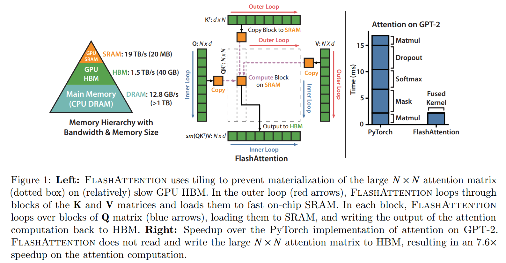

## TL;DR

대부분 memory & speed 관점에서 attention 연구를 보면, full attention 하지 않는 방식이나 유사(?) attention 을 만들거나 softmax 부분 연산을 줄이는 등의 시도들이 있었는데, 이번 연구는 hardware-level 에서 memory (종류) + kernel fusion 해서 속도 + 메모리를 잡은 연구라 재밌어서 읽게 됐습니다.

* paper : [arXiv](https://arxiv.org/abs/2205.14135)
* code : [github - official](https://github.com/HazyResearch/flash-attention)
* code : [github - triton](https://github.com/openai/triton/blob/master/python/tutorials/06-fused-attention.py)

## Related Work

* [Self-attention Does Not Need O(n2) Memory](https://arxiv.org/abs/2112.05682)

## Architecture

기존의 pytorch implementation 의 attention 은 모두 HBM 위에서 동작했는데, FlashAttention 은 한땀한땀 cuda 로 구현해 상대적으로 높은 대역폭을 가지는 SRAM 를 활용해서 memory 와 speed 를 빠르게 했다는 점이다.

크게 3 가지 부분에서 contribute 했다.

1. tiling 함 (increamental 하게 softmax redunction 진행)
2. softmax normalization factor 저장해 두기. (가지고 있다 on-chip 에서 다시 연산하는 편이 HBM 에서 attention matrix 읽는 것 보다 더 빠르다함)
3. block-sparse attention 구현

### Tilling

위 brief architecture 에 나온 것처럼 HBM 위에서 attention 이 연산되는 것을 빠르게 하기 위해서 tilling & recomputation 을 합니다.

1. $Q$, $K$, $V$ matrices 를 blocks 으로 split 후, HBM -> SRAM 으로 copy
2. (SRAM 위에서) 해당 block 에 대해 attention 계산

tilling 시, softmax 는 $K$ columns 에 대해서 연산하니 scaling + large softmax decomposition 합니다.

numericla statbility 확보를 위해, softmax vector $x \in \mathbb{R}^{B}$ 에 대해서,

$m(x) = \underbrace{max}_{i} x_{i}$, $f(x) := [e^{x_{1} - m(x)} ... e^{x_{B} - m(x)}]$, $\lambda(x) := \sum_{i} f(x)_{i}$, $softmax(x) := f(x) / \lambda(x)$

vectors $x^{(1)}, x^{(2)} \in \mathbb{R}^{B}$, $x = [x^{(1)}, x^{(2)}] \in \mathbb{R}^{2B}$ 에 대해선 다음처럼 decompose 가능합니다.

$m(x) = max(m(x^{(1)}) m(x^{(2)}))$, $f(x) = [e^{m(x^{(1)}) - m(x)} f(x^{(1)}) e^{m(x^{(2)}) - m(x)} f(x^{(2)})]$, $\lambda(x) = \lambda([x^{(1)} x^{(2)}]) = e^{m(x^{(1)}) - m(x)} \lambda(x^{(1)}) + e^{m(x^{(2)}) - m(x)} \lambda(x^{(2)})$, $softmax(x) = \frac{f(x)}{\lambda{(x)}}$

이렇게 $m(x), \lambda{(x)}$ 를 가지고 있고 (backward 할 때 recomputation 하려고), 모든 key, query 에 대해서 incremental 하게 진행합니다.

### Recomputation

backward 시엔 $Q, K, V$에 대해 $S, P \in \mathbb{R}^{N \times N}$ 를 저장하느라 $O(N^2)$ space complexity 가 필요한 건데, 위에서 저장한 $m(x), \lambda{(x)}$ 가 있으면 intermediate attention matrices 를 저장하지 않고 $S, P$ recompute 할 수가 있습니다. 그리고 SRAM 위에서 recompute 하는 편이 훨씬 더 공간을 아끼고 빠르다고 합니다.

### Kernel fusion

attention 연산은 다음과 같은 operations 을 포함하는데,

> matmul, dropout, softmax, mask, (another) matmul

### Kernel fusion

## Performance

## Conclusion

결론 : 굳굳
