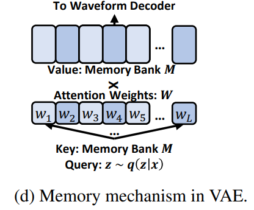
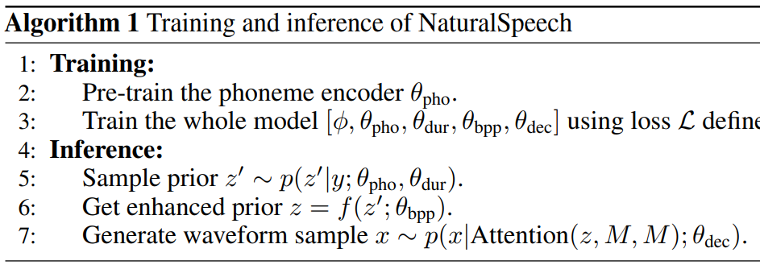

## TL;DR

오랜만에 speech-synthesis 쪽 논문을 보다가 (LJSpeech dataset 에서) MOS, CMOS metrics 에서 human-level 에 도달한 research 가 있는데, 거기에 최근 유행이었던 diffusion approach 가 아닌 점에서도 꽤 흥미로웠습니다.

* paper : [arXiv](https://arxiv.org/pdf/2205.04421v2.pdf)
* code : [github](https://github.com/microsoft/NeuralSpeech)

코드는 아직인가 보다

## Related Work

* [VQ-VAE paper](https://arxiv.org/abs/1711.00937v2)
* [Parallel Tacotron 2 paper](https://arxiv.org/abs/2103.14574)

## Architecture

이번 연구는 총 4가지 부분에서 contributes 했다.

1. pre-train large-scale langugae model on phoneme sequence
2. differentiable durator
3. bi-directional prior/posterior module
4. memory-based VAE (memory bank)

### Phoneme Encoder

phoneme encoder 는 말대로 phoneme sequence $y$ 를 encode 하는 module 인데, 이전 연구들은 일반 dataset 으로 학습하거나 phoneme 에 대해서만 학습한 LM 을 사용해서 phoneme domain 에 어울리지 않거나 capacity issue 로 positive boost 를 주지 못했다고 합니다.

그래서 이번 연구에선 phoneme 에 대해서만 학습하는게 아닌, mixed-phoneme (phoneme + sub-phoneme) pre-training 을 했다고 합니다.

또한, MLM 학습 할 때 phoneme tokens 과 sub-phoneme tokens 둘 다에 대해서 MLM 학습 합니다.

### Differentiable Durator

architecture 에 나온 것 처럼, 위 phoneme encoder 에서 나온 *phoneme-level phoneme representation* 이 durator ($\theta_{dur}$) 의 input 으로 들어오고 output 으로 priro distribution $p(z^{'}|y)$ 을 줍니다.

다음과 같이 쓸 수 있습니다.

$p(z^{'}|y;\theta_{pri})$ where $\theta_{pri} = [\theta_{pho},\theta_{dur}]$

구체적으로 durator 는 총 3가지 역할을 합니다.

1. each phoneme 에 대해 duration 예측
2. up-sampling module 에서 `phoneme-level` 을 `frame-level` 로 upsample 해 줌
3. priro distribution 의 mean/variance 를 calculate 하는 module (prior $p$ 는 standard isotonic multivariant Gaussian. VAE scheme 에 따라서)
    * train / inference time 에서 predicted duration mismatch 를 최소화 하려고

### Bi-Directional Prior/Posterior Module

bidirectional prior/posterior module 은 phoneme $y$ 으로 부터 오는 $p(z^{'}|y;\theta_{pri})$ 와 speech $x$ 로 부터 오는 $p(z|x;\phi)$ 의 information gap 을 줄이기 위해 만들었다고 합니다.

위 그림처럼 KL divergence 를 각 방향(?)에서 서로의 KL divergence loss 를 optimize 하도록 학습합니다.

module 은 flow model 을 채택했고 이윤 inverse 가능해야하고 optimize 쉬워야 하기 때문이라고 합니다.

reduce posterior $p(z|x;\phi)$ 와 backward mapping $f^{-1}$, enhanced prior $p(z^{'}|y;\theta_{pri})$ 와 forward mapping $f$ 간 KL 을 최소화 하는데, 구체적인 전개 수식은 논문에

### memory-based VAE

posterior $p(z|x;\phi)$ 는 원래 VAE 에서 speech waveform reconstruction 할 때 쓰여서 prior 보다 complex 한데, 요걸 간단하게 하기 위해 memory-based VAE 를 제안합니다.

$z ~ p(z|x;\phi)$ 를 speech reconstruction 에 그대로 사용하지 말고, $z$ 를 attention query 로 사용하고, attention output 를 waveform reconstruction 에 사용하자는 아이디어 입니다. 즉, posterior $z$ 는 아래 그림처럼 memory bank 에 attention weights 를 구할 때만 사용됩니다.

reconstruction loss 를 써 보면 다음과 같습니다.

$L_{rec}(\phi, \theta_{dec}) = -\mathbb{E}_{z~q(z|x;\theta)} [log p(x|Attention(z, M, M);\theta_{dec})]$

$Attention(Q, K, V) = [softmax(\frac{QW_{Q}(KW_{K})^{T}VW_{V}}{\sqrt{h}})W_{O}]$ 

* $\theta_{dec}$ = waveform decoder
* $M$ ($M \in \mathbb{R}^{L \times h}$) = memory bank
* $W_{Q}, W_{K}, W_{V}$ ($W_{*} \in \mathbb{R}^{h \times h}$) = attention parameters
* $L$ = size of the $M$, $h$ = hidden dimensions

### Training Recipe

전체 loss 는 다음과 같습니다.

$L_{e2e} (\theta_{pri}, \theta_{bpp}, \theta_{dec}) = -\mathbb{E}_{z^{'}|y;\theta_{pri})} [log p(x|Attention(z, M, M);\theta_{dec})]$

$L = L_{bwd}(\phi, \theta_{pri}, \theta_{bpp}) + L_{fwd}(\phi, \theta_{pri}, \theta_{bpp}) + L_{rec}(\phi, \theta_{dec}) + L_{e2e} (\theta_{pri}, \theta_{bpp}, \theta_{dec})$

gradient flow 가 수식으론 복잡한데, 아래 그림으로 보면 이해가 더 쉽습니다.

train & inference flows

## Performance

### MOS/CMOS on LJSpeech

MOS, CMOS metrics 에서 통계학 적으로 유의미한 분포 차이가 없음을 보여준다.

### Benchmark on LJSpeech

절대적 차이로도 꽤 큰 차이가 난다.

### Modules

이번 연구에서 제안한 ideas 중 하나 씩 빼고 학습했을 때, 모두 metric 에 큰 영향을 주고있다.

### Inference speed

RTF 도 FastSpeech 2 + HiFiGAN, VITS 와 comparable 하고 빠른 수준이다.

### Latency

## Conclusion

LJSpeech dataset 에서 human-level metrics 을 달성했다는 점에서 promising 했고, novelties 나 architecture 도 갠적으론 마음에 드는 구조였다. 다른 dataset 에서 benchmark 결과도 궁금한데, 포함해 주면 좋겠다.

결론 : 굳굳굳
