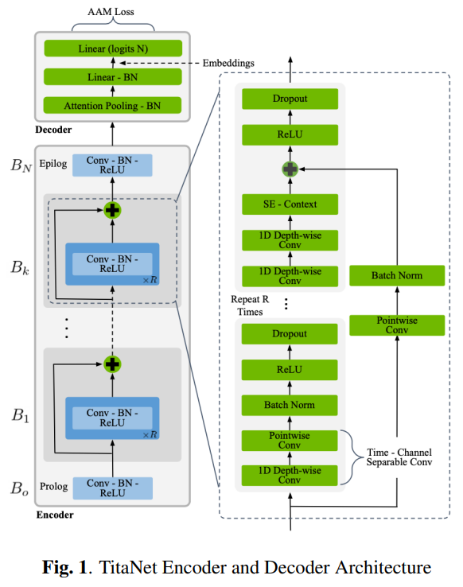
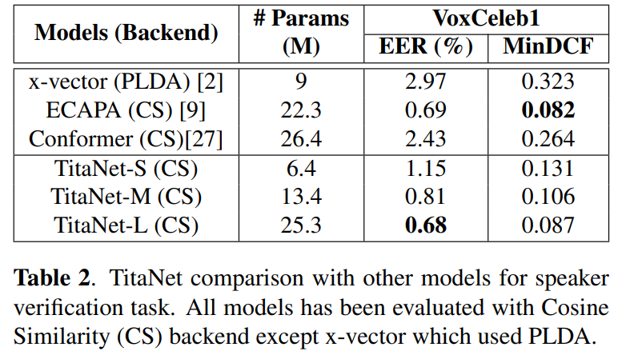
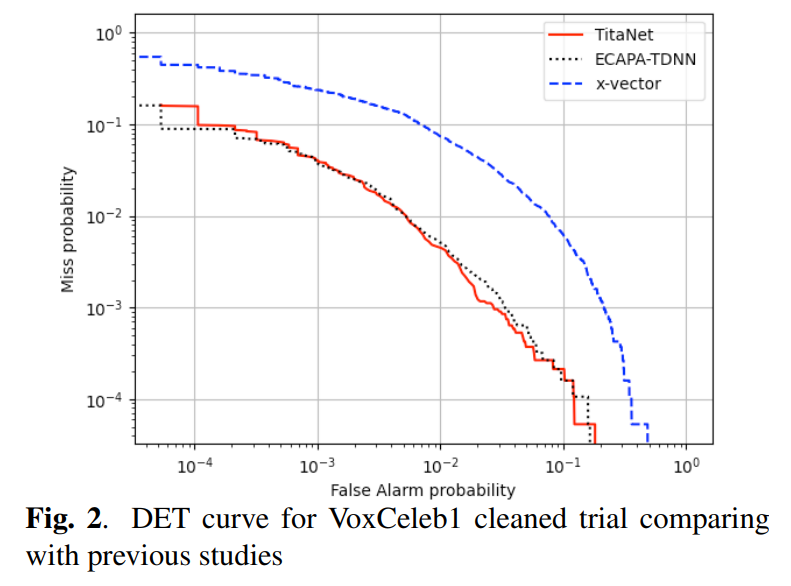

## TL;DR

* paper : [arXiv](https://arxiv.org/pdf/2110.04410v1.pdf)
* code : [github](https://github.com/NVIDIA/NeMo)

## Related Work

* [contextnet paper](https://arxiv.org/abs/2005.03191)
* [ecapa-tdnn paper](https://arxiv.org/abs/2005.07143)
* [angular softmax paper](https://arxiv.org/abs/1806.03464)

## Architecture

`ContextNet` architecture와 비슷한데, decoder 부분만 보면 attentive pooling에 2번의 projections 후 AAM (Additive Angular Margin) 한다.

### Encoder

차이점은 거의 없지만 특징만 써 보면 다음과 같습니다.

1. 1d time-channel depth-wise separable convolution 사용
   * 1d depth-wise conv + point-wise conv
2. residual connection 전 SE (Squeeze & Excitation) 함

### Decoder & Embeddings

decoder 도 이전 연구들에 비해 특별한 점이 없다.

1. attentive statistics pooling 함

### Recipes

recipe 에도 큰 특별한 점은 없다.

* 전처리로 SAD는 하지 않았다.
* 3 secs 이상의 audio는 1.5, 2, 3 secs의 chunk로 나눴다.
* frame window : 25 ms, hop window : 10 ms, mel features : 80, num FFT : 512
  * frequency-axis로 normalize 함
* augmentation 함
  * RIR impulse corpora
  * speed perturbation
  * spec augment

## Performance

### EER on VoxCeleb1

이전 연구 (`ECAPA`) 랑 거의 comparable 한 성능을 보인다.

### DET Cruve

이전 연구와 거의 비슷한 성능을 보여준다.

## Conclusion

이전 연구랑 큰 성능 차이도 나지 않고 architecture design 도 대부분 이전 연구들과 차이점이 없어서 연구 자체가 재미있진 않았지만, 요즘 speaker verification 모델 성능이 이 정도 나오는구나 하고 넘어갔다.

첫 회사 첫 프로젝트로 speaker diarization 모델을 만들었는데, 아쉬움이 많이 남은 프로젝트라서 아직도 애착이 가는 분야이자 프로젝트다. 그래서 아직도 speech domain 다루는 회사 (synthesis 도 좋지만 diarization 쪽)를 다녀보고 싶습니다 ㅋㅋㅋㅋ

결론 : 굳
