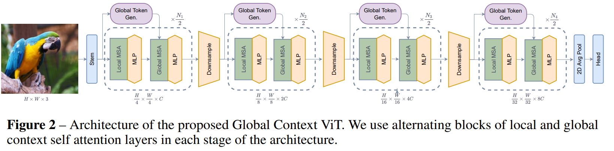
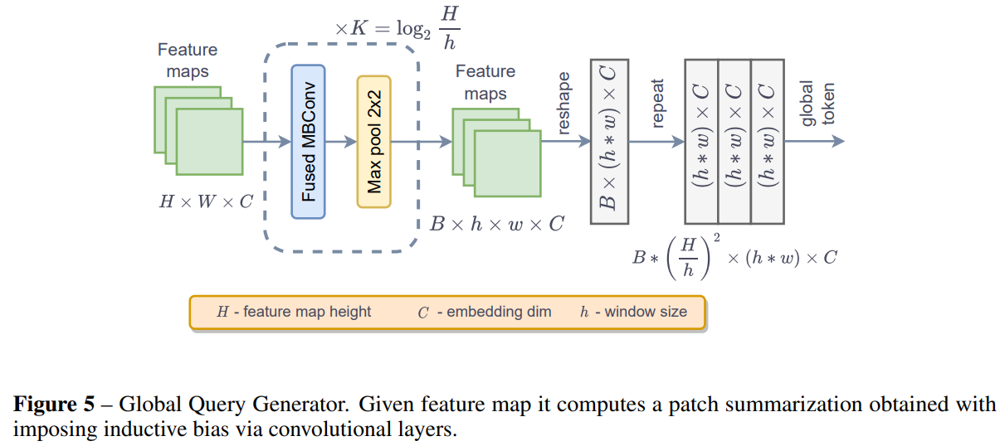
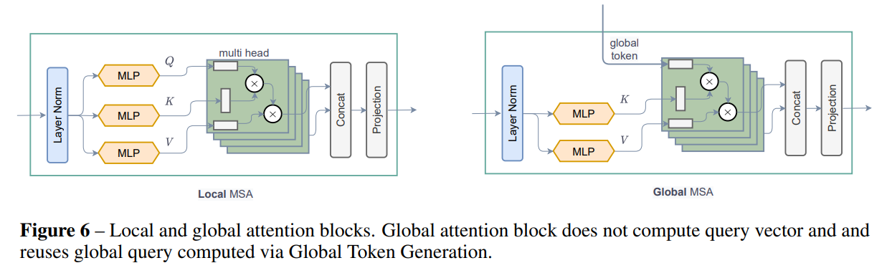
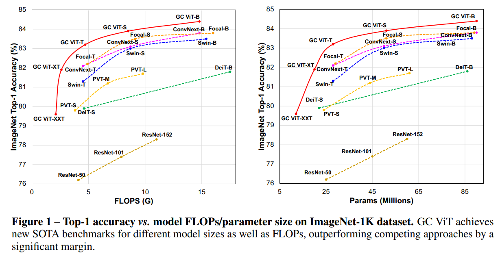

## TL;DR

최근 computer vision architecture 를 보면 image 만 사용하는 게 아닌 extra training data 로 text information 를 활용하면서 성능을 끌어올리거나 여러 models 을 ensemble 하는 `Model soups` 같은 approach 들이 나오고 있는데, 또 다른 hybrid 모델 + 제목부터 Global Context 를 고려한 ViT 라길래 기존 SwinTransformer 나 Focal 과는 어떻게 다를지 궁금해서 읽게 됐습니다.

* paper : [arXiv](https://arxiv.org/pdf/2206.09959.pdf)
* code : [github](https://github.com/NVlabs/GCVit)

## Related Work

* [SwinTransformer](https://arxiv.org/pdf/2103.14030.pdf)
* [Focal Transformer](https://proceedings.neurips.cc/paper/2021/file/fc1a36821b02abbd2503fd949bfc9131-Paper.pdf)

## Architecture

전반적은 design 은 FocalNet, SwinTransformer 느낌처럼 hierarchical 한 구조인데, 차이점만 보면 다음과 같습니다.

1. Global Token Generator module
2. Local / Global MSA
3. Downsample module

### Global Query Generator

이번 논문에서 Global Context 를 더 잘 이해하기 위해 제안한 Global Token 이란 개념인데, global context 를 잘 이해하기 위해 local patch 가 아닌 entire input feature 에 대해서 잘 compress 해서 global feature 를 생성합니다.

각 stage 초반에 compute 하고 아래 소개할 Global Attention 을 할 때 query 부분에 넣어주는 방식입니다. module design 은 간단한데, fused mbconv 후 max-pool 해 줍니다.

$x^{i} = FusedMBConv(x^{i - 1})$

$x^{i} = MaxPooling(x^{i})$

### Global Self Attention

architecture 를 보면 각 stage 별로 local attention 후 global attention 을 수행하는데, global attention 을 수행할 때 stage 초반에 `Global Query Generator` 가 생성한 query token 를 query 로 넣어주는 부분에서 차이가 있습니다.

### Downsample module

은 이전 연구 (EfficientNetV2)에서 사용하던 모듈과 큰 특별한 점이 없는데, pooling layer 를 max-pool 이 아니라 conv strided pool 한 점에서 차이가 있습니다. Fused-MBConv design 은 아래와 같습니다.

$\hat{x} = DW-Conv_{3 \times 3}(x)$

$\hat{x} = GELU(\hat{x})$

$\hat{x} = SE(\hat{x})$

$x = Conv_{1 \times 1}(\hat{x}) + x$

$x = Conv_{3 \times 3, stride 2}(x)$

$x = LN(x)$

% DW-Conv : Depth-Wise Convolution
% SE : Squeeze and Excitation
% LN : Layer Normalization

## Performance

### ImageNet benchmark

FLOPs, parameters 대비 GC VIT 가 가장 좋은 성능을 보여주고 있습니다.

## Conclusion

결론 : 굳
