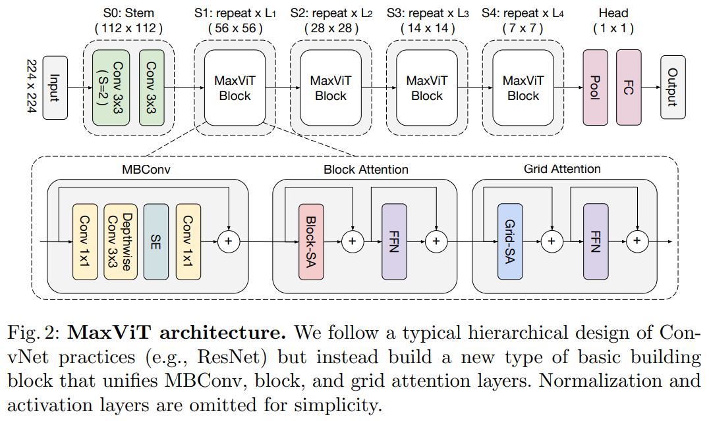
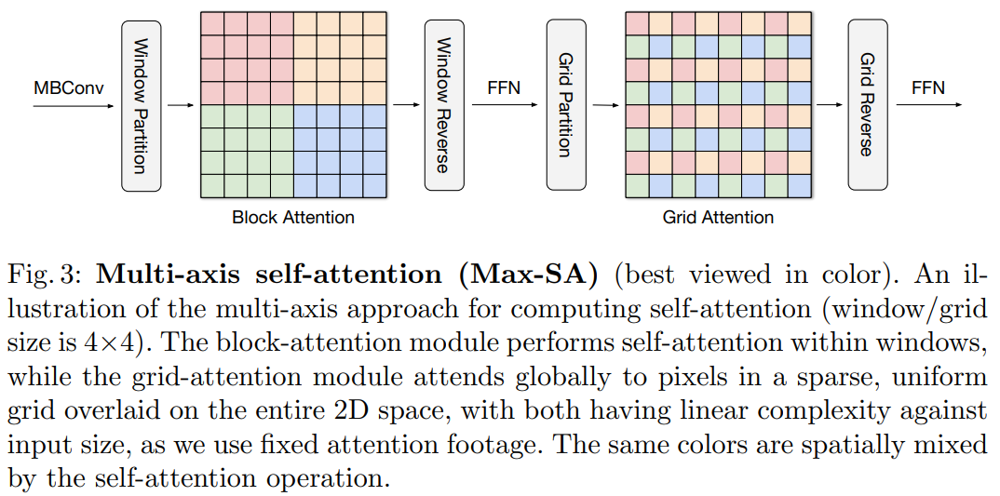
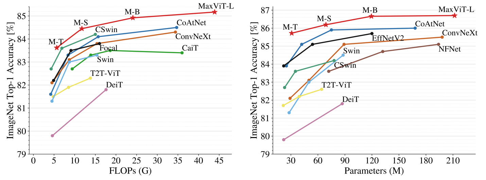
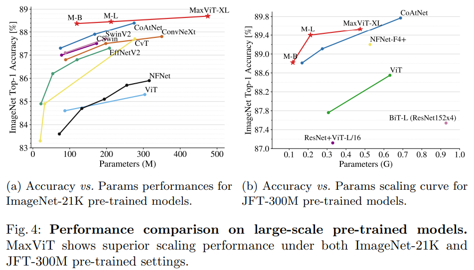

## TL;DR

* paper : [arXiv](https://arxiv.org/pdf/2204.01697.pdf)
* code : [github](https://github.com/google-research/maxvit)

## Related Work

* [GC ViT](https://arxiv.org/pdf/2206.09959.pdf)

## Introduction

최근 vision transformer연구 경향을 보면 global context를 잘 고려하는 ViT연구들이 많이 보이는데, 이번 연구에서는 efficient 하고 scalable 한 multi-axis attention이란 걸 개발해 arbitrary image size에 대해서도 linear complexity만에 연산이 가능하고 global context도 잘 잡는 무언가를 만들었다고 합니다.

## Architecture

architecture design은 다른 연구들과 큰 차이가 없는 hierarchical 한 구조인데, 차이점은 block module를 보면 크게 3 가지 components로 이뤄졌습니다. `MBConv` -> `Block Attention` -> `Grid Attention`.

간단하게 소개하면 `Block Attention`에선 local context, `Grid Attention`에선 global context를 위한 module입니다.

### Attention

self-attention 연산은 location-unaware (e.g. non-translation equivariant, inductive bias)한 특징이 있는데, 이런 걸 해결하기 위해 이전 연구들은 vanilla self-attention 대신 related self-attention를 사용해 이런 문제를 어느 정도 완화하고 있습니다. 이번 연구에서도 pre-normalized related self-attention module을 사용했다고 합니다.

### Multi-axis Attention

entire space(local patch)에 full self-attention을 하면 complexity가 빡세다는 단점이 있는데, 해결하기 위해서 2 개 (**local**, **global**)의 sparse forms으로 나눠 연산했다고 합니다.

input feature map $X \in \mathbb{R}^{H \times W \times C}$가 있을 때, 기존엔 flattened spatial dimension $HW$에 attention을 했다면 이번 연구에선 $P \times P$ size를 가지는 partition별로  $(\frac{H}{P} \times \frac{W}{P}, P \times P, C)$ attention을 합니다. -> 이렇게 local context를 잘하기 위해 block attention을 활용했다 합니다.

하지만, 이렇게 local attention만 사용하면 huge-scale datasets에서 잘 동작하지 않기 때문에 sparse global attention을 하는 간단하면서 효율적인 방법을 만들었다고 합니다. (`grid attention`)

local attention처럼 ($HW$에 대해) small window로 partitioning 하지 않고, grid에 대해 partitioning 합니다. input feature map $X \in \mathbb{R}^{H \times W \times C}$가 있을 때, $G \times G$ uniform grid로 $(G \times G, \frac{H}{G} \times \frac{W}{G}, C)$.

computational balance를 맞추기 위해 Swin Transformer처럼 $P$ = $G$ = 7을 채택했다고 합니다.

## Performance

### ImageNet-1K benchmark

비슷한 규모 대비 가장 좋은 성능입니다.

### Pretrained on the large-scale datasets

ImageNet-21K는 MaxViT가 더 좋은 성능을 보이는데, 더 큰 규모인 JFT-300M에선 CoAtNet이 앞섭니다. (더 큰 image resolution 에선 comparable 합니다.)

## Conclusion

(아닐 수도 있지만) 이전 연구들도 local attention처럼 $P \times P$ partitions에 대해 attention하긴 했지만, dilated global attention을 통해 global context를 해결했다는 점이 재밌었다.

결론 : 굳굳
