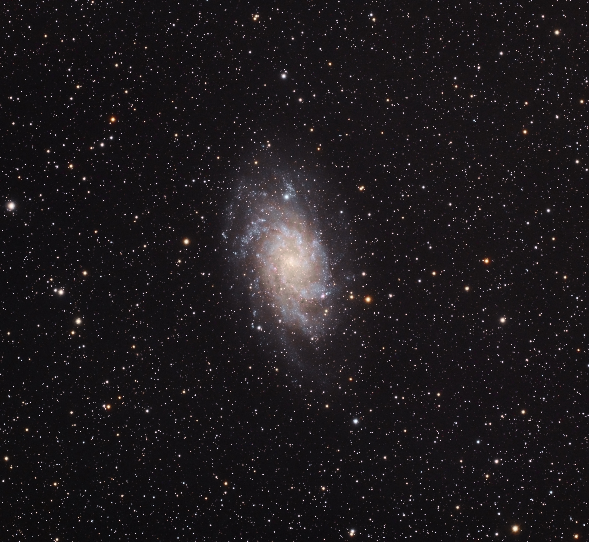
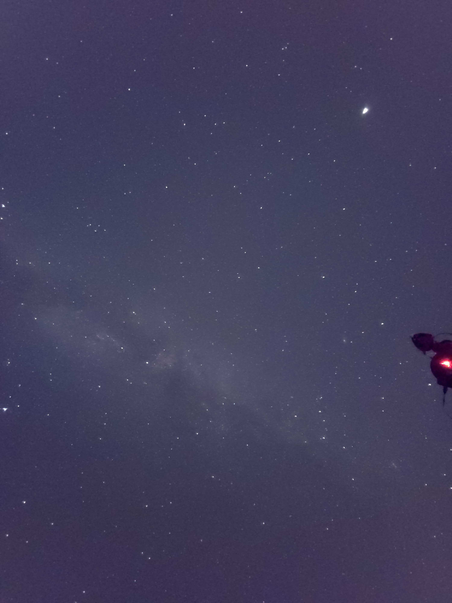

## TL;DR

올해 회고를 시작하기 전 작년 회고를 읽었는데, 첫 줄부터 희망한 대로 흘러가진 않았다. 병특도 정착했고 2022년은 조용히 지나가나 했지만, 회사 관련해서도 큰 변화가 있었고 여러 일들이 있었다. 우리가 `그 발언`이라 하는 것처럼 "이젠 괜찮겠지...?" 라 하면 안 괜찮은 게 정말 맞나 싶다. 그래서 올해 TL;DR은 여기까지만 적어볼 예정이다.

## Kaggle

상반기엔 회사 일에 시간을 많이 쓰느라 Kaggle을 거의 못했다가 최근에 여유가 생겨서 대회 하나를 진행 중이다. 중성자별 continuous gravitational-wave signal을 탐지하는 [challenge](https://www.kaggle.com/competitions/g2net-detecting-continuous-gravitational-waves) 인데, 주제가 재밌어서 진심을 담아 하고 있고, 내년 1월 3일에 끝나는데 남은 3 주 열심히 해서 gold medal를 노려봐야겠다. ~~역시 회사 일보다 100배는 재밌는 거 같다~~.

이외로 Kaggle을 하는 이유는 재미도 있지만 수련이 더 큰 목적인데, 매년 성장하는 게 등수나 아이디어, 속도로 보이는 점은 만족하고 있다. 하지만, 아직 모든 대회에서 안정적으로 gold medal zone에 안착할 수 있을 정도의 실력은 아니라서 더 노력해야 겠다.

## Programming

commit 수만 보면 올해도 작년과 비슷하게 약 1.7k contributions를 했는데, 솔직히 고백하자면 매일 commit 1개씩 push 하는 action이 있어서 365개는 날로 먹어서 실질적으로 1.3k commits 했다. commit 수가 줄어든 이유를 생각해 봤는데, `Rust` 공부하는 거나 `pytorch_optimizer` 작업하는 거 이외엔 크게 관심 가는 것이 없는 게 이유였고, 다른 이유는 경향이 바뀌었는데, 개인 project를 진행하기보단 open source를 둘러보고 contributions 하는 방향에 시간을 더 많이 쓴 듯하다.

많지는 않지만 5개 projects에 contributions을 했는데, 개인적으로 직접 package를 maintain 하는 거에서 이미 사용자가 많은 open source project에 기여하는 방향에 더 흥미가 생겨서 내년에도 계속할 생각이다.

### pytorch_optimizer

처음엔 매번 optimizer 구현해서 쓰기 귀찮아서 시작했고 벌써 시작한 지 1년이 됐는데, 12월 16일 기준으로 `total 41.6K downloads`와 `2.1k/month downloads` 를 달성했다. 버전은 `v2.0.1` 인데, major 버전도 `2`로 올렸다. repo에 code를 공유하는 거 이외에 쉽게 다른 사람도 사용할 수 있게끔 만들고 실제로 많이 사용하고 있다는 점에서 프로젝트를 계속 maintain 할 수 있는 동기부여가 되는 것도 있었다. 그리고, 감사하게도 PR 날려주신 분도 계셨는데 덕분에 사용성도 더 좋아졌고 조금 감동이었다.

하나 아쉬운 점이 있다면, documentation을 제대로 작업하지 못했는데, 이 부분은 높은 우선순위로 가져가서 작업해야겠다.

간단하게 앞으로의 계획을 적어보자면,

1. docstring format 정하기
2. documentation 하기
3. 더 많은 lr scheduler 구현

요렇게 작업할 예정이다.

### Gatsby Blog

작년? 재작년 겨울에 ruby + jekelly 기반에서 react + gatsby 기반 blog로 바꿨는데, frontend와는 거리가 먼 나였는데 하다 보니 소소하기 기능 추가하고 가꾸는 게 재밌어서 유지보수를 계속 해 왔다. 대충 작업한 내용을 생각해 보면, post에 `time to read` 달아주거나 댓글은 Giscus 사용, Gatsby v5로 migrate 하기, CI/CD pipeline 최적화, Lighthouse 100점 만들기 등등 다양한 시도를 했고 그 과정에서 많이 공부할 수 있어서 재밌었다. React를 대충 공부한 적밖에 없어서 아직도 코드를 완벽하게 이해하고 한 게 아니라 잘 돌아가는 걸 목표로만 개발했는데, 내년엔 front 쪽 지식도 넓힐 겸 React 하고 Svelte 같은 것도 공부해 봐야겠다.

### Rust

작년에 잠시 공부한 거 이외엔 써 볼 데가 없었는데, 회사 일 하다가 ML 모델 serving을 Rust + gRPC 기반으로 하면 빠르겠지? 생각이 들어서 CatBoost model 서빙하는 gRPC 서버를 [만들어봤다](https://github.com/kozistr/catboost-server-rs). 역시나 python bindings 도 아니고 gRPC 라서 확실히 RESTful API server보다 속도 차이가 큰 거 같다. Rust 약팔이(?)를 하고 다녔지만, 토스에서는 아직 real-time으로 tree 계열 model을 serving 하는 니즈가 많이 없기도 하고 jvm 친화적인 곳이라 production까지 ship 하긴 어렵겠지만, 언젠가 기회가 된다면 해 보고 싶다.

## 회사

이곳에서도 직무는 Data Scientist지만 업무의 경계는 크게 없었다. 데이터 분석이나 모델 개발뿐만 아니라 데이터 생성 pipeline 관리부터 데이터 분석, 모델 개발, 서버 개발까지 다양한 업무를 했다. 개인적으로도 모델 개발뿐만 아니라 engineering 부분도 직접 할 수 있어서 업무의 완성도나 여러 가지 공부할 수 있다는 점에서는 재밌기도 했지만, 시간이 갈수록 내가 가장 잘하는 능력을 쓸 기회와 공부 시간이 줄어드는 점에서 오는 두려움도 있었다. 사실 이전 회사들에서도 이런 고민을 계속해 왔었고 매번 해결하지 못한 난제였는데, 토스로의 이직은 이 답을 마무리하기 위함이었고 여러 회사와 조직을 경험해본 결과 이번에 그 답을 어느 정도 찾을 수 있었다.

그래서 위에서 말한 회사 관련한 변화가 바로 이 `선택`이다. 현재 다니는 회사 입사 전에 많은 고민과 가설을 가지고 입사했고 지난 1년 동안 많은 사건(?)을 보고 검증하면서 몇 년 동안 어려워했던 정답을 얼추 찾은 느낌이다. 더 구체적으로는 내가 원하는 것과 회사와 팀이 가지는 장/단점 trade-off를 내가 얼마나 어떻게 잘 버티고 타협할 수 있는가에 대한 답이다. 그럼, 정답을 알면 무엇이 달라지냐 하면, 위에 언급한 두려움에 대한 실질적인 해결책과 더 만족스러운 선택이 가능해질 거 같다. 구체적으로 적긴 힘들지만, 스스로 comfort zone에 빠지지 않게 더 노력해야 하고 risk가 더 큰 선택이지만 trade-off를 고려한 최선을 선택한 상황이고 새로운 팀으로 옮겨서 생활 중이다.

### 1년 느낀점

갑자기 주제가 바뀌는데, 1년 동안 다니면서 느꼈던 것 중에 가장 인상적인 점을 2개 적어 보자면,

지금 다니는 회사에서는 공감하고 가치 있다고 생각하면 `책임지고 빠르게 만들어서 보여주면 된다`라는 점이 매력적이었다. 개인적인 경험으론 전부는 아니지만, 대부분은 맞는 거 같다. 마치 해커톤 하듯 `이거 가능해요?`란 말이 들리자마자 그날 안에 좋은 모델 + 서비스를 개발해서 바로 보여줄 수 있는 경험은 정말 재밌었고 만족스러웠다. 그동안 다양한 프로젝트를 진행했는데, 대부분 PoC나 몇몇 제품은 하루 안에 개발이 끝났고 실제로 impact까지 볼 수 있던 점도 좋았다.

`전부가 아닌 대부분은 맞다`한 이유는 토스에서 `공감`이라 하는 부분인데, 이건 아직도 어려운 문제인 거 같다. 논리나 background가 필요한 경우에서, 긍정적이고 건설적인 `공감`보단 서로 간의 이해관계와 감정이 더 우선적인걸 개인적으로 느꼈다. 미래에 C-level도 생각하는 입장에서, 이런 engineering이 아닌 communication & management 평소에 잘하지 못해 겪어보고 싶었던 것도 입사 이유 중 하나였는데, 이 부분은 아직 나에겐 어려운 문제 같다. 기억에 같이 이야기 나눈 사회성 만랩 PM 분도 "여긴 정글이야"라고 하신 만큼 어쩌면 뉴비가 아무것도 모르고 만랩 던전에서 사냥하고 있는 느낌이 아닐까도 싶었다.

## 취미

### 운동

사실 생각도 못한 작년 목표였는데, 가을부터 지인 추천으로 클라이밍을 시작하게 됐다. 처음에는 별생각 없이 따라갔다가 볼더링 문제 푸는 재미도 있고 전완근도 잘 조질(?) 수 있어서 요즘엔 거의 매주 1번 출석하고 있다. 뭐든 한번 빠지면 끝을 보는 성격이라 요즘 유튜브마저 클라이밍 영상들을 찾아보는데, 주변에서 헬창에 이젠 클창(?)이라고 가지가지 한다고 한다.

주로 훅클라이밍 왕십리, 성수를 다니고 난이도는 남색 난이도를 풀고 있는데, 그다음 단계인 보라색은 넘사벽인듯 해서, 내년 목표를 보라클라이머로 열심히 다녀봐야겠다.

### 천체관측

마침 회사 같은 팀에 천체 관측하는 걸 취미로 하시는 분이 계셔서 가을에 홍천으로 따라서 관측하러 갔다 왔습니다. [M33](https://ko.wikipedia.org/wiki/%EC%82%BC%EA%B0%81%ED%98%95%EC%9E%90%EB%A6%AC_%EC%9D%80%ED%95%98) 아니면 [M45](https://en.wikipedia.org/wiki/Pleiades)를 찍으려 했다가 M33은 새벽쯤에 시야에 들어와서 당장 시야에 보이는 M45를 찍었는데, 당일치기 일정이라 노출을 100분 정도밖에 못 했는데도 대충 원하는 그림이 나와서 엄청나게 만족했다.

꼭 관측이 아니더라도 의자에 누워서 멍하니 하늘만 보고 있어도 육안으로도 별이 엄청 많이 보여서 불멍하는 것 처럼 별멍(?)하는 느낌이 들더라고요. 아래는 대충 아이폰으로 하늘 찍은 건데, 실제로 보면 훨씬 더 별들이 많슴다.

## 마무리

그래도 작년에 목표했던 것들도 이루고 개인적으론 성과 있었던 한 해였던 거 같다. 내년 가을이면 병특도 끝나는데, 학교도 그렇고 회사도 그렇고 고민하게 될 텐데, 내년에는 또 어떤 재밌는(?) 일 들이 벌어질지 궁금하지만 당장은 그만 알아보자.
