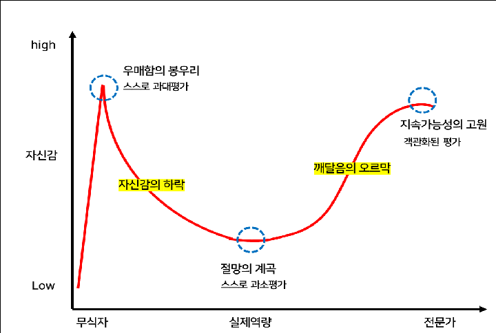
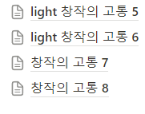

## Prologue

글을 쓰기 시작한 시점에서 올해가 1주일이 채 남지 않았는데, 올해를 돌아보면 중요한 사건이 끝나고 새로운 시작을 한, 그사이에 느낀 것들이 많고 놓친 것들을 되돌아보는 한 해였다. 나름 만족스러운 해였다.

큰 이벤트들을 먼저 떠올려보면, Kaggle과 병역특례 종료 (+ 퇴사)와 새로운 회사로 이직으로 크게 3가지 일이 있었다.

## Kaggle

최근에는 장비도 없고 일이 너무 바빠서 Kaggle을 못 하고 있지만, 올해 초에는 정말 열심히 했었고 꽤 좋은 성과를 거뒀다. 중단기 목표가 대회에서 solo gold medal을 따는 게 목표였는데, final submission 선택 차이로 눈앞에서 놓친 대회가 하나 있었고 나머지 대회에서도 gold medal zone에 가까운 rank를 달성했다. 그렇게 global ranking에서 200 등대를 찍으면서 highest competition rank **top 0.1%** 를 달성했다.

성적과 관련 없이 개인적으로 이전에는 나의 최대치가 2 ~ 30등이라면 올해는 짧은 시간 안에도 1 ~ 20등 결과물을 낼 수 있는 실력이 됐다는 점에서 성장했다는 걸 느꼈고 가장 의미 있다고 생각했다. 최종 목표는 10등 안의 결과물을 낼 수 있는 실력에 도달하는 것이고, 실질적인 성과로는 competition grandmaster를 달성하는 것으로 더 노력해야겠다.

## 드디어 병역특례 끝

### 다사다난한 병특

실 복무는 `2년 10개월`인데, 준비를 시작한 시간까지 합치면 거의 4년 가까이 복무한 느낌이 들 정도로 지인들도 "너 한 4년은 복무하지 않았냐?" 라고 할 정도로 끝나지 않을 것 같은 병특이 드디어 끝났다.

병특을 하기 마음먹은 시점부터 지금까지 다양한 일이 있었는데, 큰 사건들을 나열해보면 병특을 기대하고 간 회사가 갑자기 잘못된 내부고발로 병역특례 업체 취소되거나 인생이 크게 바뀔법한 업체(?)로 갈 뻔하기도 했고, 정말 감사하게도 옮긴 회사에서 *드래곤볼*을 모아줘서 TO를 받아 시작했고, 병특 중간에도 이직하는 등 정말로 주변에서도 인정하는 다사다난한 병특을 한 거 같다.

끝난 시점에서 돌아봐도 끝나서 다행이라는 생각밖에 들지 않는다 ㅋㅋ

% 드래곤볼: (21년 기준) 4급 병특 3명을 모으면 현역 병특 TO 하나를 주는 제도

### 느낀 점 (feat. 다녔던 회사들)

올해 9월 말 병특 끝나고 바로 퇴사했다. 이유는 적자면 길지만 새로운 걸 하고 싶어서 퇴사했고 아래에 적겠지만, 10월 말에 새 직장에 합류하게 됐다. 그동안 제대로 쉬어본 적이 없어서 1달 동안 집에서 쉬면서 지난날들을 돌아보면서 정말 많은 생각이 들었는데, 새삼스럽지만, 당시에는 알지 못했지만 돌이켜보니 분기점마다 내외적으로나 성장에 영향을 준 고마운 분들이 꼭 있었던 거 같다.

2019년 첫 회사인 VoyagerX 부터 적어 보면, 지금 생각해 보면 내 기준으론 거의 완벽한 회사였다. 모두가 똑똑하고 좋은 친구 같은 동료고, 솔직히 아직도 이때 멤버만 한 느낌을 주는 곳은 찾지 못했고 가장 그리운 곳이다. 당시에는 정말 내향적이고 사회성도 거의 없어서 걱정도 됐고 지금도 떠오르는 아쉬웠던 행동들이 있는데, 그런 부족함을 채워준 곳이었고 내면적으로 많이 성장했던 시기 같다.

다음은 본격적으로 병특을 위해 이직한 Banksalad인데 (~~결국, 못 했지만~~), VoyagerX 에선 내적인 성장을 주로 했다면, 여기에선 실리콘 밸리에서 근무하신 분들 주도로 팀 문화나 기술이 꾸려지면서 엔지니어링 전반적으로 정말 많이 배울 수 있었다.

이때 나의 실력과 마인드를 정확하게 사진 한 장으로 표현할 수 있는데, **우매함의 봉우리** 정점처럼 능력보다 자신감이 더 앞서 있었는데, 그 봉우리를 하산할 수 있게 만들어준 곳인듯하다.

특히 코드 리뷰 많이 해주신 겨울님에게 정말 감사하다. 덕분에 뱅샐에 있었을 때 배운 문화나 기술, 마인드가 지금의 나를 구성하는 데 큰 영향을 줬다고 생각한다.

다음은 병특을 위해 Watcha로 이직했다. 왓챠에서는 내 직무 역량을 많이 끌어올릴 수 있는 좋은 곳이었고, 더 중요한 건 *드래곤볼*을 모아주셔서 병특 TO를 얻어 주셨다는 거다. 부족했지만, CTO님과 팀원분들이 믿어주신 덕분에 내가 하고 싶은 일을 많이 펼쳐볼 수 있었던 거 같다. 정말 낭만 있는 회사고, 자유롭게 일할 수 있는 환경만큼은 좋았다.

마지막으로 토스로 이직하고 병특을 마쳤는데, 이직한 이유는 솔직하게 대기업은 어떤 회사일까? 가 가장 궁금했었다. 짧은 결론으론, 난 스타트업이 가장 잘 맞는 거 같다.

그래도 지금 다니는 회사에서 일하게 된 계기도 토스에서 만난 분일 정도로, 다양한 유형의 사람들과 좋은 인연을 만날 수 있었던 곳이었다.

병특 동안 회사 4곳을 다니면서 배운 점들을 정리하면서 마무리하자면, 회사별로 내가 부족한 부분들을 채울 수 있었고 내외적으로 모두 성장할 수 있었던, 고생한 값 이상을 한 병특이라고 행복한 결말을 지어본다.

## 다시 스타트업으로, 그런데 초기 멤버로

최근에야 달력을 보고 알았는데, 벌써 이직한 지 2달 정도 지났다.

현재 회사에선 챗봇 등등 LLM Application을 만들고 있는데, 아직 시장에 best practice가 없고 직접 시장과 기술을 개척해야 하는 게 재밌을 거 같아서 합류했고, 몰입하면서 재밌게 일하고 있다.

아래는 제품 니즈 + 상용화를 위한 RAG pipeline 개발한 내용을 문서로 정리해서 공유하고 있는데, 최근 들어선 나름 상용화 가능할 정도로 빠르고 정확한 제품이 나오고 있어서 더 열심히 달려보려고 한다. 그래도 창작의 고통 10 안에 대략 마무리되길 기대해 본다.

이외로는, 수상하리만큼 우리 회사에 외향적인 사람이 대다수인데, INTJ-A인 나로선 조금 신기한 경험을 하고 있다. 내 인생 전체에서 봐도 드문 상황인데, 아무튼 흥미롭게 관찰하고 있다.

## 개발

### pytorch-optimizer

올해 4월쯤에 새롭게 단장을 했다. 원래는 혼자 쓰려는 목적으로 개발했지만, 사용자들이 늘어나고 feature request가 종종 들어와서 전략을 조금 바꿨다. 전에는 기능도 적고 다른 곳에 이미 있는 것들은 구현하지 않았는데, 모든 구현체를 지원하고 사용성 개선하고 테스트도 빡세게 돌리는 방향으로 전략을 바꿔봤다.

리브랜딩하고 점점 사용자 수가 많아지더니 최근에는 최대 **2K downloads / day, 10K downloads / weeks, 55K downloads / month**, 155 stars를 달성했다. 4월, 10월에 한 번 크게 사용자 수가 늘어났을 때가 있었는데, 짜릿했던 순간이었다.

작년에 목표한 문서화, 많은 구현체 지원은 모두 완성했고, 현재 버전은 `v2.12.0`인데, 내년엔 [`v3`](https://github.com/kozistr/pytorch_optimizer/issues/164)릴리즈를 목표로 달려봐야겠다.

### open source contributions

최근에는 삶과 근접한 open source에 기여하고 있다. 예를 들어 embedding model을 서빙하는데 [text-embeddings-inference](https://github.com/huggingface/text-embeddings-inference)를 사용 중인데, 필요한 기능들을 직접 PR 날리면서 쓰고 있다.

개인적으로 rust 언어를 좋아하고 huggingface에서도 많이 쓰고 vector db도 그렇고 요즘 rust 기반 좋은 제품이 많이 나오고 있는데, 필요할 때마다 기여하면서 쓰지 않을까 생각한다.

여담이지만, 요즘 rust 기반의 좋은 구현체들이 정말 많이 나오는 거 같다. 지금 회사에서도 TEI나 Qdrant 같은 Rust 기반 제품을 사용하고 있는데, 정말 좋다. 언젠가 낭만 챙길 시간이 있으면, 지금 python backend도 다 Rust로 바꾸는 게 목표기도 하다.

결론은 rust가 미래다!

### Leetcode

올해 4월부터인가 매일 1문제씩 leetcode를 풀기 시작했다. 기억은 잘 안 나는데, 하다 보니 재밌어서 계속하게 된 거 같다. 그런데 요즘은 바빠서 고민하는 시간이 줄고 답을 빠르게 보고 있는데 시간을 좀 할당해 두고 여유롭게 풀어야 할 거 같다.

## 클라이밍

클라이밍 시작한 지 1년이 넘었고, 매주 1회씩 빠지지 않고 꼭 가고 있다. 작년 목표가 보라 클라이머가 목표였는데 (무지개 난이도 기준), 아직 아무 보라색이나 깰 정도로 잘하진 못하지만, 남색은 웬만하면 플래쉬하고 힘이 남으면 보라색에 도전하는 중이다.

질리지 않고 할 수 있었던 가장 큰 이유는 악력인데, 악력기 제품마다 절대적인 기준이 다르지만, 악력도 작년보다 2 ~ 30 이상 오른 60 정도로 많이 늘었고 악력이 강해질수록 전에 안되는 동작들이 되기 시작할 때가 탑 찍는 것만큼 즐거웠고 동기부여가 됐다.

이제는 악력보다 처음 해 보는 무브나 슬로퍼에서 막히는 느낌이라 올해는 디테일을 채워가면서 보라색을 플래쉬할 수 있는 날을 목표로 해야겠다.

## 마무리

매년 아쉽지 않게 다양한 일이 벌어지는데, 이쯤이면 그냥 받아들이고 즐겨야겠단 생각도 들고, 당시엔 스트레스 좀 받지만 사실 싫지 않은 거 같다.

내년엔 또 어떤 일이 벌어질지 기대하며 올해 회고를 마무리해 본다.
